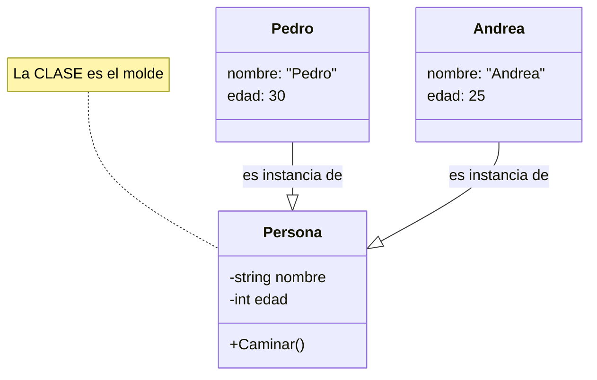
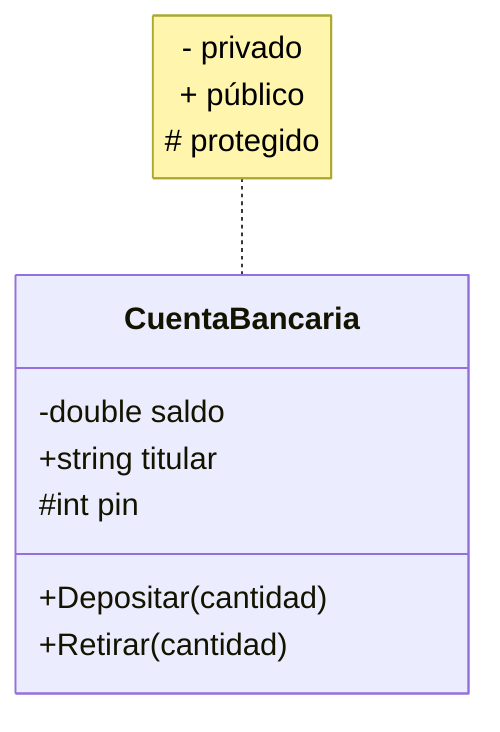
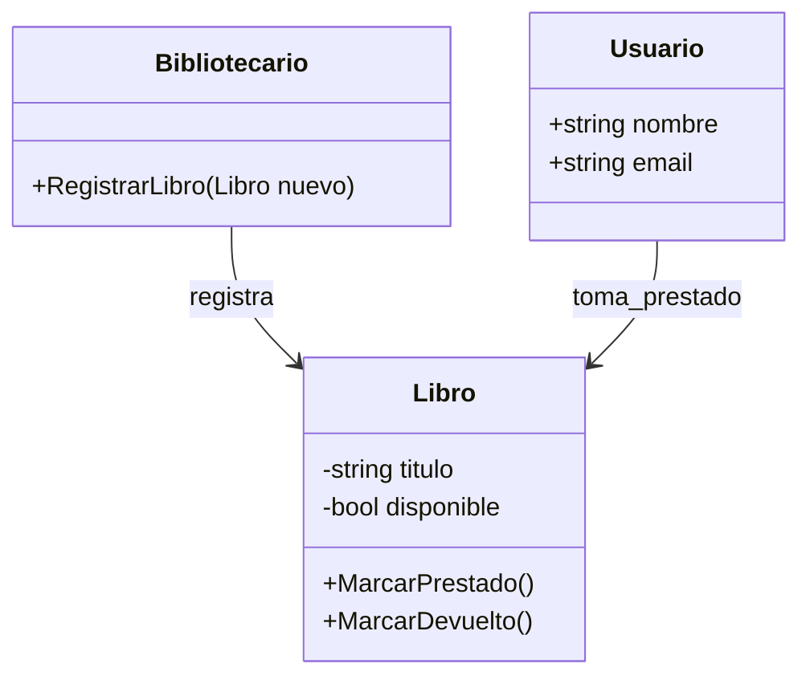
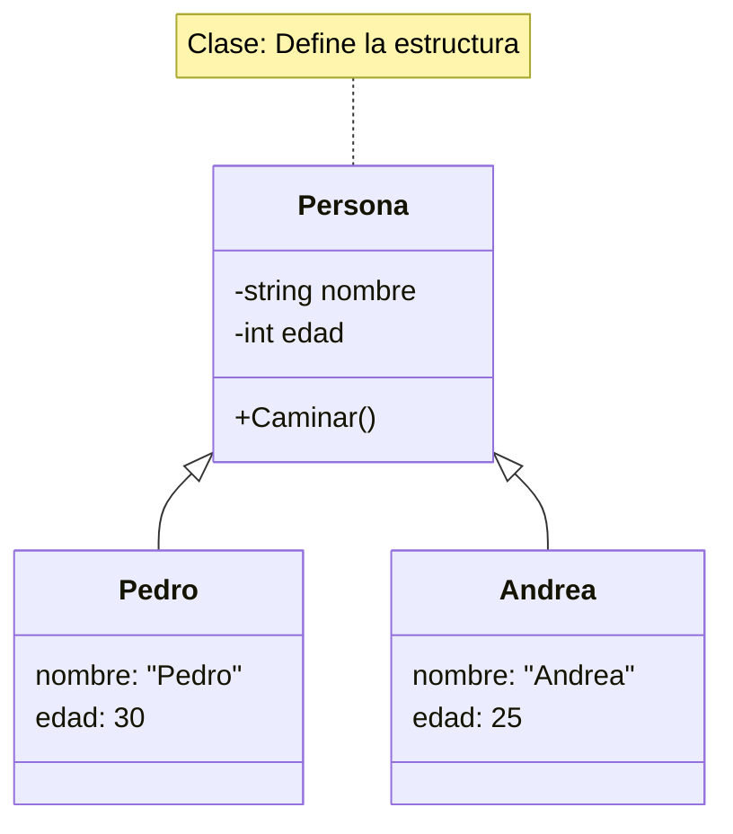
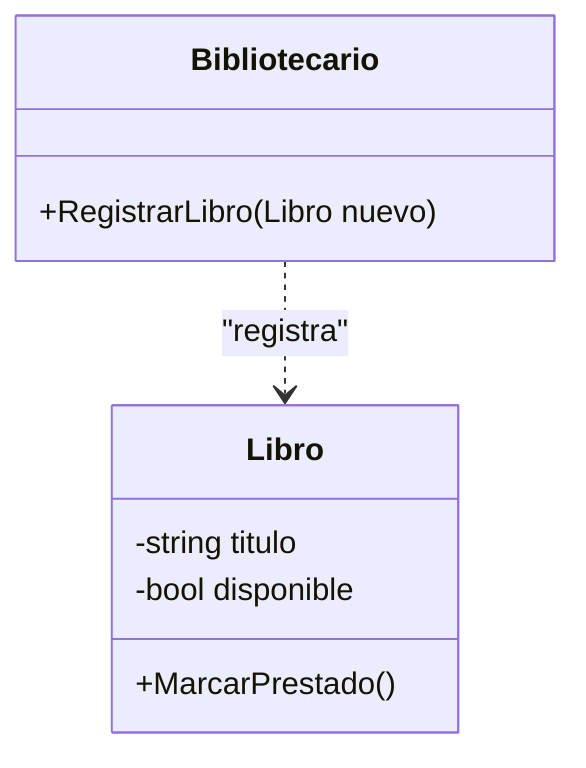

- [1. Introducción al Modelado con UML](#1-introducción-al-modelado-con-uml)
  - [1.1. Del enunciado al código: El papel del analista/programador](#11-del-enunciado-al-código-el-papel-del-analistaprogramador)
  - [1.2. El Lenguaje Unificado de Modelado (UML) como estándar](#12-el-lenguaje-unificado-de-modelado-uml-como-estándar)
  - [1.3. Conceptos clave de POO: Abstracción, Encapsulamiento y Ocultación](#13-conceptos-clave-de-poo-abstracción-encapsulamiento-y-ocultación)
    - [A. Abstracción y Clasificación](#a-abstracción-y-clasificación)
    - [B. Encapsulamiento y Ocultación de Datos](#b-encapsulamiento-y-ocultación-de-datos)
  - [Ejemplo Práctico: El Analista frente al "Caso de la Biblioteca"](#ejemplo-práctico-el-analista-frente-al-caso-de-la-biblioteca)
    - [Análisis del Error común (Contraejemplo)](#análisis-del-error-común-contraejemplo)
    - [Diseño Correcto (Buenas Prácticas)](#diseño-correcto-buenas-prácticas)


# 1. Introducción al Modelado con UML

El desarrollo de software moderno no comienza escribiendo código. Al igual que un ingeniero civil no coloca ladrillos sin un plano estructural, un desarrollador de software utiliza el **modelado** para comprender, documentar y comunicar la arquitectura del sistema antes de su implementación.

> 📝 **Nota del Profesor:** Muchos estudiantes quieren "ir al grano" y empezar a escribir código inmediatamente. Es normal, es lo más divertido. Pero sin un diseño previo, terminas reescribiendo el código tres o cuatro veces. El modelado parece lento al principio, pero es la forma más rápida de llegar a una solución estable.

> 💡 **Dato histórico:** UML (Unified Modeling Language) surgió en los años 90 como unificación de varios métodos de modelado. Fue creado por Grady Booch, Ivar Jacobson y James Rumbaugh (los "tres amigos"). Hoy es el estándar ISO/IEC 19505 para modelado de software.

## 1.1. Del enunciado al código: El papel del analista/programador

A menudo, el mayor desafío de un programador no es la sintaxis del lenguaje, sino la **traducción** de un problema del mundo real (expresado en lenguaje natural por un cliente) a una estructura lógica ejecutable. Aquí es donde entra en juego el **Analista**, cuya misión es extraer las abstracciones adecuadas del "Dominio del Problema".

* **El Dominio del Problema:** Es el entorno real donde ocurre el proceso que queremos automatizar (ej: un banco, un hospital, un sistema de gestión de motores).
  
* **La Tarea del Analista:** Identificar qué conceptos del dominio son relevantes (Clases) y cómo interactúan (Relaciones).

> **Reflexión de Diseño:** Un buen modelo de diseño no debe intentar copiar la realidad de forma exacta, sino representarla de la manera más eficiente para resolver el problema. No modelamos "una persona" en su totalidad, sino solo los atributos que nuestro software necesita (su DNI y su saldo, pero quizá no su color de ojos).

> 💡 **Analogía del Arquitecto:** Piensa en un arquitecto que diseña una casa. No necesita modelar el color de las paredes ni el tipo de cuadros que habrá en el salón. Solo necesita modelar lo esencial: dónde están las paredes, las puertas, las tuberías y el cableado eléctrico. Lo demás es decoración que se añade después.

## 1.2. El Lenguaje Unificado de Modelado (UML) como estándar

**UML (Unified Modeling Language)** no es un lenguaje de programación, sino un lenguaje visual estándar para especificar, visualizar y documentar sistemas de software.

El **Diagrama de Clases** es el corazón de UML. Su propósito es representar la **estructura estática** del sistema: los objetos fundamentales que el usuario percibe y cómo se organizan internamente. Es "independiente del tiempo", lo que significa que muestra lo que el sistema *es*, no lo que el sistema *hace* paso a paso (eso lo harían los diagramas de secuencia).

> 📝 **Nota del Profesor:** El diagrama de clases es como el plano de una casa. Muestra las habitaciones y cómo se conectan, pero no muestra cómo te mueves por ella a lo largo del día. Para eso estarían los diagramas de secuencia o los flujos de usuario.

**Diferencias clave que debes conocer:**

* **Modelo de Dominio:** Un diagrama conceptual, cercano al lenguaje del usuario, sin detalles técnicos.

* **Modelo de Diseño:** Un diagrama técnico, listo para ser traducido a C# u otro lenguaje, que incluye tipos de datos, modificadores de acceso y métodos.

> 💡 **Tipos de Diagramas UML:** Existen 14 tipos de diagramas UML. Para este curso nos centraremos en el **Diagrama de Clases**, pero es bueno conocer que también existen: Diagramas de Casos de Uso, Secuencia, Estados, Actividades, Componentes, Despliegue, etc.

## 1.3. Conceptos clave de POO: Abstracción, Encapsulamiento y Ocultación

Para diseñar diagramas de clases profesionales, debemos dominar tres pilares de la Programación Orientada a Objetos que se reflejan directamente en UML:

### A. Abstracción y Clasificación

La **Abstracción** consiste en aislar los elementos esenciales de un objeto para definir su "molde". Ese molde es la **Clase**.

* **Clase:** Definición estructural y de comportamiento compartida por un conjunto de objetos.

* **Objeto / Instancia:** Cada uno de los elementos concretos creados a partir de esa clase.

**Visualización de la relación Clase vs Objeto:**

**En Mermaid:**



> 📝 **Truco para el examen:** En el diagrama UML solo se dibujan las CLASES. Los OBJETOS (instancias concretas) no se representan. Si ves un rectángulo en UML, siempre es una clase.

**Código C# (Clase vs Objeto):**

```csharp
// CLASE: La plantilla o molde
public class Persona
{
    private string _nombre;  // Atributo privado
    private int _edad;        // Atributo privado
    
    public Persona(string nombre, int edad)  // Constructor
    {
        _nombre = nombre;
        _edad = edad;
    }
    
    public void Caminar()  // Método
    {
        Console.WriteLine($"{_nombre} está caminando");
    }
}

// OBJETOS: Instancias concretas de la clase
var pedro = new Persona("Pedro", 30);  // Objeto p1
var andrea = new Persona("Andrea", 25); // Objeto p2

pedro.Caminar();  // Salida: Pedro está caminando
andrea.Caminar(); // Salida: Andrea está caminando
```

### B. Encapsulamiento y Ocultación de Datos

El **Encapsulamiento** es el proceso de agrupar datos (atributos) y comportamientos (métodos) en una sola unidad, protegiendo el estado interno del objeto.

> 💡 **Analogía del cajero automático:** El usuario solo ve la pantalla y los botones (interfaz pública). No ve los mecanismos internos ni cómo se procesa el dinero (implementación privada). Esto protege el sistema de usos indebidos.

**Visibilidad en UML:**

| Símbolo | Modificador C# | Significado | Ejemplo en C# |
|---------|---------------|-------------|---------------|
| `+` | `public` | Accessible desde cualquier clase | `public string Nombre;` |
| `-` | `private` | Solo accesible dentro de la clase | `private int _edad;` |
| `#` | `protected` | Accesible desde la clase y sus subclases | `protected decimal _saldo;` |
| `~` | `internal` | Accesible dentro del mismo ensamblado | `internal bool _activo;` |

> 📝 **Nota del Profesor:** La visibilidad privada (`-`) es la más importante para el encapsulamiento. En diseño profesional, los atributos SIEMPRE deben ser privados o protegidos, nunca públicos.

**En Mermaid:**



**¿Por qué es vital el encapsulamiento?**

1. **Protección:** Evita que otros objetos pongan valores inválidos (ej: una edad negativa).
2. **Mantenimiento:** Si cambiamos cómo se guarda el dato internamente, el resto del sistema no se entera.
3. **Desacoplamiento:** Reduce la dependencia entre clases.

---

## Ejemplo Práctico: El Analista frente al "Caso de la Biblioteca"

**Enunciado del cliente:** *"Necesitamos un sistema donde los usuarios puedan tomar prestados libros. De cada libro queremos saber el título y si está disponible. El bibliotecario debe poder registrar nuevas adquisiciones."*

### Análisis del Error común (Contraejemplo)

Muchos alumnos intentan modelar la "acción" de prestar como una clase.

* **Error:** Clase `PrestarLibro`.
* **Por qué falla:** "Prestar" es una acción (método), no un objeto con identidad propia en este contexto.

### Diseño Correcto (Buenas Prácticas)

El analista identifica sustantivos (Libro, Usuario) y verbos (Prestar, Registrar).

**Diseño en Mermaid:**



> 💡 **Regla del pulgar del analista:** Si es un SUSTANTIVO importante → Clase. Si es una ACCIÓN que algo hace → Método. Si es una CARACTERÍSTICA de algo → Atributo.

**Código C# (Análisis Lingüístico):**

```csharp
// SUSTANTIVOS → Clases
public class Libro
{
    public string Titulo { get; set; }
    public bool Disponible { get; set; }
    
    public void MarcarPrestado() => Disponible = false;
    public void MarcarDevuelto() => Disponible = true;
}

public class Bibliotecario
{
    public void RegistrarLibro(Libro nuevo) { /* ... */ }
}

public class Usuario
{
    public string Nombre { get; set; }
    public string Email { get; set; }
}

// VERBOS → Métodos
// "El bibliotecario registra un libro" → Bibliotecario.RegistrarLibro(Libro)
// "El usuario toma prestado un libro" → relación Usuario → Libro
```

> 📝 **Ejercicio para casa:** Identifica las clases en este enunciado: *"Una empresa tiene empleados. Cada empleado tiene un nombre, un salario y un departamento. Los empleados pueden trabajar en proyectos. Cada proyecto tiene un nombre y una fecha de límite."*

**En Mermaid:**



### B. Encapsulamiento y Ocultación de Datos

El encapsulamiento es el proceso de agrupar datos (atributos) y comportamientos (métodos) en una sola unidad, protegiendo el estado interno del objeto de manipulaciones indebidas desde el exterior.

**¿Por qué es vital en el diseño?**

1. **Protección:** Evita que otros objetos pongan valores inválidos (ej: una edad negativa).


2. **Mantenimiento:** Si cambiamos cómo se guarda el dato internamente, el resto del sistema no se entera.


3. **Desacoplamiento:** Reduce la dependencia entre clases.


---

## Ejemplo Práctico: El Analista frente al "Caso de la Biblioteca"

**Enunciado del cliente:** *"Necesitamos un sistema donde los usuarios puedan tomar prestados libros. De cada libro queremos saber el título y si está disponible. El bibliotecario debe poder registrar nuevas adquisiciones."*

### Análisis del Error común (Contraejemplo)

Muchos alumnos intentan modelar la "acción" de prestar como una clase.

* **Error:** Clase `PrestarLibro`.
* **Por qué falla:** "Prestar" es una acción (método), no un objeto con identidad propia en este contexto.

### Diseño Correcto (Buenas Prácticas)

El analista identifica sustantivos (Libro, Usuario) y verbos (Prestar, Registrar).

**Código C# (Diseño Correcto):**

```csharp
public class Libro
{
    public string Titulo { get; set; }
    public bool Disponible { get; set; } = true;
    
    public void MarcarPrestado() => Disponible = false;
    public void MarcarDevuelto() => Disponible = true;
}

public class Bibliotecario
{
    public void RegistrarLibro(Libro nuevo)
    {
        Console.WriteLine($"Registrando: {nuevo.Titulo}");
    }
}

// Relación: Bibliotecario USA Libro (dependencia)
var libro = new Libro { Titulo = "Cien Años de Soledad" };
var bibliotecario = new Bibliotecario();
bibliotecario.RegistrarLibro(libro);
```

**Diseño en Mermaid:**



---