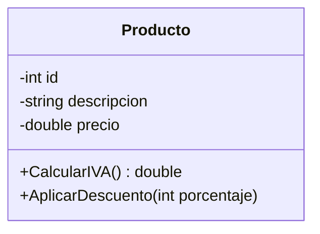
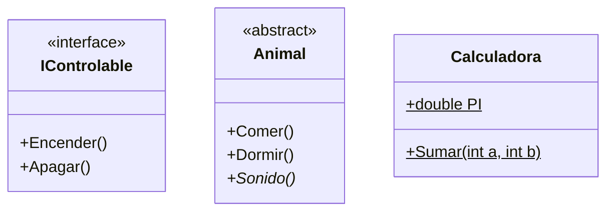

- [2. Anatomía de una Clase y Elementos Especiales](#2-anatomía-de-una-clase-y-elementos-especiales)
  - [2.1. Representación de Clases: Nombre, Atributos y Métodos](#21-representación-de-clases-nombre-atributos-y-métodos)
    - [Sintaxis de los Atributos y Métodos](#sintaxis-de-los-atributos-y-métodos)
  - [2.2. Visibilidad y Modificadores de Acceso](#22-visibilidad-y-modificadores-de-acceso)
    - [El "Contraejemplo" del Mal Encapsulamiento](#el-contraejemplo-del-mal-encapsulamiento)
  - [2.3. Elementos Avanzados: Estáticos, Abstractos e Interfaces](#23-elementos-avanzados-estáticos-abstractos-e-interfaces)
    - [A. Atributos y Métodos Estáticos (static)](#a-atributos-y-métodos-estáticos-static)
    - [B. Clases Abstractas e Interfaces](#b-clases-abstractas-e-interfaces)
  - [💡 El Truco del Analista: Cómo detectar visibilidad en el enunciado](#-el-truco-del-analista-cómo-detectar-visibilidad-en-el-enunciado)
  - [Práctica en Rider: Ingeniería Inversa](#práctica-en-rider-ingeniería-inversa)


# 2. Anatomía de una Clase y Elementos Especiales

Si el diagrama de clases es el plano estructural, la **clase** es el ladrillo fundamental. En este nivel de diseño, dejamos atrás las generalidades y empezamos a definir tipos de datos, niveles de seguridad y comportamientos específicos.

## 2.1. Representación de Clases: Nombre, Atributos y Métodos

En UML, una clase se representa como un rectángulo dividido en tres compartimentos claramente diferenciados. El orden es inalterable:

1. **Superior:** Nombre de la clase (en PascalCase, siguiendo las convenciones de C#).
2. **Medio:** Atributos (el "estado" o datos del objeto).
3. **Inferior:** Operaciones o Métodos (el "comportamiento").

### Sintaxis de los Atributos y Métodos

Para que un programador de C# pueda implementar tu diagrama, la sintaxis debe ser precisa:

* **Atributos:** `visibilidad nombreAtributo : tipoDato [= valorInicial]`
* **Métodos:** `visibilidad nombreMetodo(parámetro : tipo) : tipoRetorno`

**Código C# (Anatomía de una Clase):**

```csharp
public class Producto
{
    // Atributos privados (encapsulados)
    private int _id;
    private string _descripcion;
    private double _precio = 0.0;
    
    // Métodos públicos
    public double CalcularIVA()
    {
        return _precio * 1.21;  // IVA del 21%
    }
    
    public void AplicarDescuento(int porcentaje)
    {
        _precio -= _precio * porcentaje / 100.0;
    }
}
```

**Representación en Mermaid:**



---

## 2.2. Visibilidad y Modificadores de Acceso

La visibilidad es la aplicación práctica del **encapsulamiento**. En C#, esto determina si una variable o método es accesible desde otras clases del proyecto o si permanece oculto.

| Símbolo UML | Modificador C# | Alcance (Visibilidad)                                                     |
| ----------- | -------------- | ------------------------------------------------------------------------- |
| **`+`**     | `public`       | Universal. Cualquier clase puede acceder.                                 |
| **`-`**     | `private`      | Solo accesible dentro de la **misma clase**.                              |
| **`#`**     | `protected`    | Accesible por la clase y sus **clases hijas** (herencia).                 |
| **`~`**     | `internal`     | Accesible por cualquier clase dentro del **mismo ensamblado** (proyecto). |

### El "Contraejemplo" del Mal Encapsulamiento

**Error:** Declarar todos los atributos como públicos (`+`).

* **Consecuencia:** Cualquier parte del código podría poner un `precio = -500` a un producto, rompiendo la lógica de negocio.
* **Solución:** Atributos privados (`-`) y métodos públicos (`+`) para manipularlos de forma controlada.

---

## 2.3. Elementos Avanzados: Estáticos, Abstractos e Interfaces

Para sistemas complejos, C# nos ofrece herramientas que cambian la forma en que los objetos se comportan.

### A. Atributos y Métodos Estáticos (static)

Representan datos o acciones que pertenecen a la **clase en sí**, no a un objeto concreto. En UML se identifican **subrayando** el elemento (lo haremos usando `_` al final en estos apuntes).

* **Uso común:** Contadores de objetos, constantes físicas (PI), o métodos de utilidad (`Math.Sqrt`).

### B. Clases Abstractas e Interfaces

* **Clase Abstracta:** Una clase "a medio hacer" que no puede instanciar objetos. Se escribe en *cursiva*.
* **Interfaz:** Un contrato puro. Solo define "qué" debe hacer un objeto, no "cómo". Se etiqueta con `«interface»`.

**Código C# (Elementos Especiales):**

```csharp
// INTERFAZ: Contrato puro (solo firmas)
public interface IControlable
{
    void Encender();
    void Apagar();
}

// CLASE ABSTRATA: No se puede instanciar directamente
public abstract class Animal
{
    public abstract void Sonido();  // Debe implementarse en subclasses
    
    public void Comer() { /* comportamiento común */ }
    public void Dormir() { /* comportamiento común */ }
}

// Implementación de interfaz
public class Coche : IControlable
{
    private string _modelo;
    
    public void Encender() { /* ... */ }
    public void Apagar() { /* ... */ }
}

// Herencia de clase abstracta
public class Perro : Animal
{
    public override void Sonido() => Console.WriteLine("Guau!");
}

// Miembro estático (pertenece a la clase, no a la instancia)
public class Calculadora
{
    public static double PI { get; } = 3.14159;
    
    public static int Sumar(int a, int b) => a + b;
}

// Uso:
Calculadora.PI;        // Acceso sin instancia
Calculadora.Sumar(2, 3); // 5

// var animal = new Animal();  // ERROR: no se puede instanciar
var perro = new Perro();   // OK
perro.Sonar();            // Guau!
```

**Comparativa en Mermaid:**



---

## 💡 El Truco del Analista: Cómo detectar visibilidad en el enunciado

Para tus ejercicios, fíjate en estas frases clave:

* *"Los datos de la cuenta son estrictamente confidenciales"*  Atributos **Privados (-)**.
* *"Cualquier clase del sistema puede consultar el catálogo"*  Método **Público (+)**.
* *"Solo las subclases de Vehículo pueden acceder al número de chasis"*  Atributo **Protegido (#)**.
* *"Queremos saber en todo momento cuántas instancias se han creado de la clase Factura"*  Atributo **Estático subrayado**.

---

## Práctica en Rider: Ingeniería Inversa
¿Tienes código C# y quieres ver su diagrama UML automáticamente? ¡Rider lo hace por ti!

1. En **JetBrains Rider**, abre tu proyecto de C#.
2. Haz clic derecho sobre una clase o una carpeta.
3. Selecciona **Diagrams > Show Diagram**.
4. Rider generará un diagrama donde verás los candados (privado), llaves (protegido) y puntos (público) que coinciden con estos símbolos UML.

---