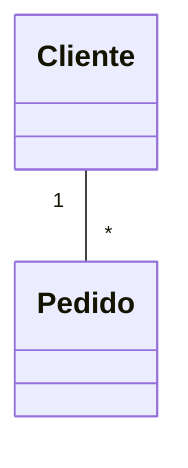
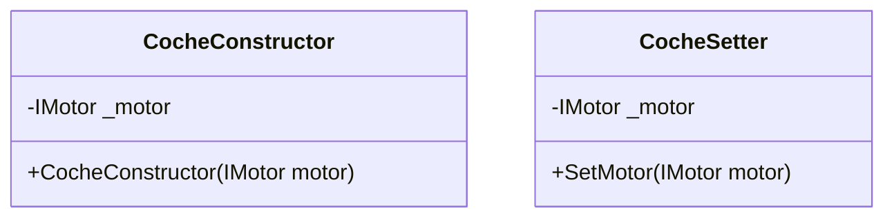
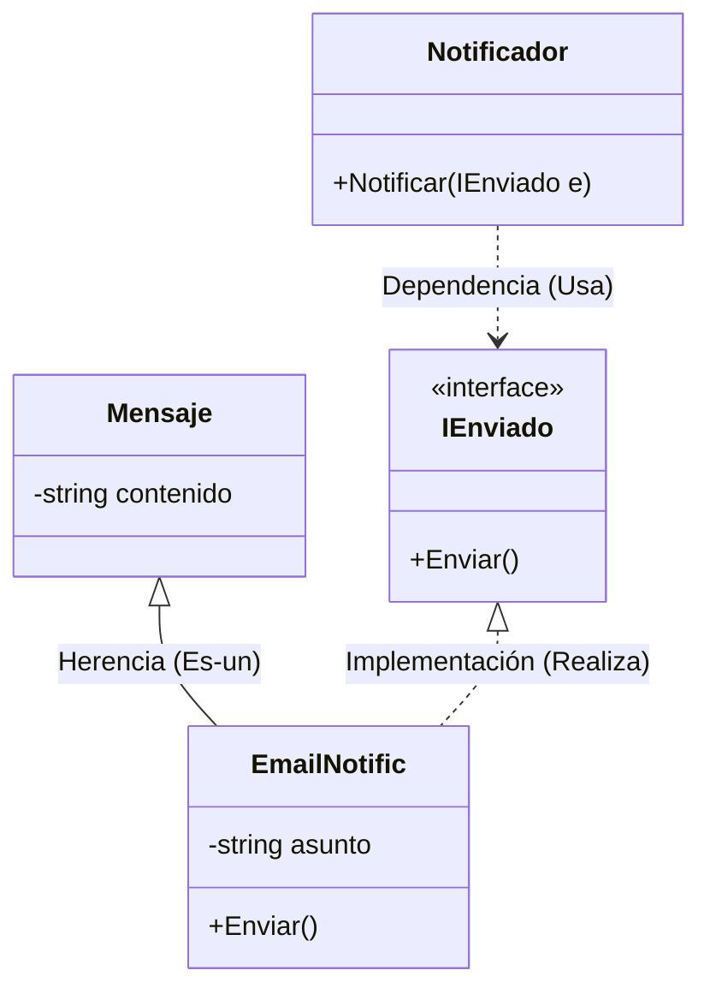

- [3. Relaciones, Estructura e Inyección de Dependencias](#3-relaciones-estructura-e-inyección-de-dependencias)
  - [3.1. Asociación y Multiplicidad](#31-asociación-y-multiplicidad)
  - [3.2. La Navegabilidad e Implementación en C#](#32-la-navegabilidad-e-implementación-en-c)
  - [3.3. Dependencias Fuertes y Débiles](#33-dependencias-fuertes-y-débiles)
    - [A. Dependencia Débil (Uso puntual)](#a-dependencia-débil-uso-puntual)
    - [B. Dependencia Fuerte (Estructural)](#b-dependencia-fuerte-estructural)
  - [3.4. Inyección de Dependencias (DI): Constructor vs Setter](#34-inyección-de-dependencias-di-constructor-vs-setter)
    - [1. Inyección por Constructor (Fuerte/Obligatoria)](#1-inyección-por-constructor-fuerteobligatoria)
    - [2. Inyección por Setter/Propiedad (Opcional/Flexible)](#2-inyección-por-setterpropiedad-opcionalflexible)
  - [3.5. Agregación vs. Composición (El Ciclo de Vida)](#35-agregación-vs-composición-el-ciclo-de-vida)
    - [A. Agregación (Rombo hueco `o--`)](#a-agregación-rombo-hueco-o--)
    - [B. Composición (Rombo lleno `*--`)](#b-composición-rombo-lleno---)
  - [⚠️ Contraejemplo: El error del "New" interno](#️-contraejemplo-el-error-del-new-interno)
  - [3.6. Herencia e Implementación: Jerarquías y Contratos](#36-herencia-e-implementación-jerarquías-y-contratos)
    - [A. Herencia (Generalización / Especialización)](#a-herencia-generalización--especialización)
    - [B. Implementación (Realización de Interfaz)](#b-implementación-realización-de-interfaz)
    - [Ejemplo Maestro: Sistema de Notificaciones](#ejemplo-maestro-sistema-de-notificaciones)
    - [💡 Análisis del Analista: ¿Herencia o Implementación?](#-análisis-del-analista-herencia-o-implementación)
    - [Ejemplo C# basado en tus apuntes (Atributos de Clase):](#ejemplo-c-basado-en-tus-apuntes-atributos-de-clase)


# 3. Relaciones, Estructura e Inyección de Dependencias

En el mundo real, los objetos no viven aislados; colaboran para realizar tareas. En UML, estas colaboraciones se representan mediante líneas que conectan las clases.

## 3.1. Asociación y Multiplicidad

La **Asociación** es la relación más común. Indica una conexión estructural entre dos clases: una clase "conoce" a otra.

* **Multiplicidad:** Indica cuántos objetos de una clase pueden estar vinculados a un objeto de la otra clase. Se anota en los extremos de la línea.
* `1`: Exactamente uno.
* `0..*` o `*`: Muchos (cero o más).
* `1..*`: Al menos uno.

**Código C# (Multiplicidad):**

```csharp
public class Cliente
{
    public int Id { get; set; }
    // Un cliente tiene MUCHOS pedidos (colección)
    public List<Pedido> Pedidos { get; set; } = new();
}

public class Pedido
{
    public int Id { get; set; }
    // Cada pedido tiene UN cliente (referencia)
    public Cliente Cliente { get; set; }
}

// Cliente "1" --> "*" Pedido
var cliente = new Cliente();
cliente.Pedidos.Add(new Pedido { Cliente = cliente });
```

**Ejemplo en Mermaid:**



## 3.2. La Navegabilidad e Implementación en C#

Este es un concepto crítico para vuestro futuro en **Rider**. La navegabilidad indica si una clase "sabe de la existencia" de la otra.

* **Bidireccional (Línea simple):** Ambas clases tienen una referencia de la otra.
* **Unidireccional (Flecha `-->`):** Solo la clase origen tiene una referencia de la destino.

**Impacto en el Código C#:**
Si un `Pedido` tiene una flecha hacia `Producto`, en C# la clase `Pedido` **debe** tener un campo o propiedad de tipo `Producto`.

```csharp
public class Pedido {
    private Producto _articulo; // Implementación de la flecha de navegabilidad
}

```

## 3.3. Dependencias Fuertes y Débiles

No todas las relaciones son permanentes. Debemos distinguir entre "conocer a alguien" y "usar a alguien puntualmente".

### A. Dependencia Débil (Uso puntual)

Ocurre cuando una clase usa a otra solo dentro de un método (como parámetro o variable local). En UML se usa una **línea discontinua con flecha**.

### B. Dependencia Fuerte (Estructural)

Ocurre cuando una clase necesita a otra para existir o como parte de su estado permanente. Aquí es donde entra la **Inyección de Dependencias (DI)**.

---

## 3.4. Inyección de Dependencias (DI): Constructor vs Setter

La DI es una técnica donde una clase recibe sus dependencias desde fuera, en lugar de crearlas ella misma con `new`. Esto es vital para el **desacoplamiento**.

### 1. Inyección por Constructor (Fuerte/Obligatoria)

Es la forma más recomendada. La clase no puede ser instanciada si no se le entrega su dependencia.

* **Pros:** El objeto siempre está en un estado válido. Permite usar campos `readonly` en C#.
* **Contras:** Poco flexible si queremos cambiar la dependencia tras crear el objeto.

### 2. Inyección por Setter/Propiedad (Opcional/Flexible)

La dependencia se pasa a través de un método o propiedad pública después de crear el objeto.

* **Pros:** Permite intercambiar la dependencia en "caliente" (tiempo de ejecución).
* **Contras:** **Peligro de NullReferenceException**. Si el programador olvida llamar al setter antes de usar el objeto, el programa fallará.

**Comparativa Visual:**

**Código C# (Tipos de Inyección):**

```csharp
// INTERFAZ
public interface IMotor
{
    void Encender();
}

// INYECCIÓN POR CONSTRUCTOR (más segura, obligatoria)
public class CocheConstructor
{
    private readonly IMotor _motor;  // readonly = inmutable
    
    public CocheConstructor(IMotor motor)  // Motor OBLIGATORIO
    {
        _motor = motor;
    }
    
    public void Arrancar()
    {
        _motor.Encender();
    }
}

// INYECCIÓN POR SETTER (más flexible, pero peligro de null)
public class CocheSetter
{
    private IMotor _motor;
    
    public CocheSetter()  // Coche puede existir sin motor
    {
        // _motor es null aquí!
    }
    
    public void SetMotor(IMotor motor)  // Motor se "inyecta" después
    {
        _motor = motor;
    }
    
    public void Arrancar()
    {
        _motor.Encender();  // NullReferenceException si no se llamó SetMotor!
    }
}

// Uso:
var motorElectrico = new MotorElectrico();
var coche1 = new CocheConstructor(motorElectrico);  // Seguro: siempre tiene motor

var coche2 = new CocheSetter();
coche2.SetMotor(motorElectrico);  // ¡Obligatorio llamar antes de usar!
coche2.Arrancar();
```

**En Mermaid:**



---

## 3.5. Agregación vs. Composición (El Ciclo de Vida)

Ambas son relaciones "Todo-Parte", pero se diferencian en la **dependencia de vida**.

### A. Agregación (Rombo hueco `o--`)

Relación débil. La parte puede existir sin el todo.

* **Ejemplo:** Una `Universidad` y sus `Profesores`. Si la universidad cierra, los profesores siguen existiendo y pueden irse a otra.

### B. Composición (Rombo lleno `*--`)

Relación fuerte. La parte no tiene sentido sin el todo y su vida está ligada a él.

* **Ejemplo:** Un `Libro` y sus `Paginas`. Si destruyes el libro, las páginas (como parte de ese libro) dejan de existir.

---

## ⚠️ Contraejemplo: El error del "New" interno

**Mal diseño (Acoplamiento fuerte):**

```csharp
public class Coche {
    private MotorGasolina _motor;
    public Coche() {
        _motor = new MotorGasolina(); // ERROR: Coche está atado para siempre a Gasolina
    }
}

```

**Buen diseño (Inyección de Dependencias):**

```csharp
public class Coche {
    private IMotor _motor;
    public Coche(IMotor motor) { // Recibe CUALQUIER motor que implemente la interfaz
        _motor = motor;
    }
}

```

---

**Truco para el examen:** Si el enunciado dice: *"Un pedido **consiste en** varias líneas de detalle que se eliminan si el pedido se cancela"*, dibuja una **Composición**.
Si dice: *"Un cliente **tiene** una lista de productos favoritos"*, dibuja una **Agregación** (porque el producto no desaparece si el cliente se da de baja).


---

## 3.6. Herencia e Implementación: Jerarquías y Contratos

En C#, la reutilización de código y el polimorfismo se gestionan mediante dos tipos de relaciones que, aunque se parecen visualmente, tienen propósitos radicalmente distintos.

### A. Herencia (Generalización / Especialización)

Representa una relación de **jerarquía estricta**. La clase hija (subclase) hereda todos los atributos y métodos de la clase padre (superclase).

* **Concepto:** "Es un" (Is-a).
* **Símbolo UML:** Línea continua con una **flecha de punta triangular vacía** apuntando al padre.
* **En C#:** Se usa el símbolo de dos puntos `:`.

### B. Implementación (Realización de Interfaz)

Representa un **compromiso de comportamiento**. Una clase no "es" la interfaz, sino que "cumple" con las funciones que la interfaz exige.

* **Concepto:** "Se comporta como" o "Tiene la capacidad de".
* **Símbolo UML:** Línea **discontinua** con una flecha de punta triangular vacía apuntando a la interfaz.
* **En C#:** También se usa `:`, pero la interfaz suele empezar por "I" (ej. `IEntidad`).

---

### Ejemplo Maestro: Sistema de Notificaciones

Imagina un sistema que envía mensajes. Tenemos una base común para todos los mensajes, pero distintas formas de enviarlos.

**Código C# (Sistema de Notificaciones):**

```csharp
// CONTRATO: Todas las notificaciones deben implementar Enviar()
public interface IEnviado
{
    void Enviar(string destinatario, string mensaje);
}

// Implementaciones concretas
public class EmailNotific : IEnviado
{
    private string _asunto;
    
    public EmailNotific(string asunto)
    {
        _asunto = asunto;
    }
    
    public void Enviar(string destinatario, string mensaje)
    {
        Console.WriteLine($"Enviando EMAIL a {destinatario}: [{_asunto}] {mensaje}");
    }
}

public class SMSNotific : IEnviado
{
    public void Enviar(string destinatario, string mensaje)
    {
        Console.WriteLine($"Enviando SMS a {destinatario}: {mensaje}");
    }
}

// Clase que USA el contrato (dependencia)
public class Notificador
{
    public void Notificar(string destinatario, string contenido, IEnviado canal)
    {
        canal.Enviar(destinatario, contenido);
    }
}

// Uso: Inyección de dependencia en tiempo de ejecución
var notificador = new Notificador();
var email = new EmailNotific("Alerta de Seguridad");
var sms = new SMSNotific();

notificador.Notificar("jose@email.com", "Tu contraseña expira hoy", email);
notificador.Notificar("+34600000000", "Tu contraseña expira hoy", sms);

// ¡El Notificador NO sabe ni le importa qué tipo de notificación usa!
```

**Representación en Mermaid:**



---

### 💡 Análisis del Analista: ¿Herencia o Implementación?

Un error crítico en 1º de DAW es usar herencia para todo. Como profesor, enséñales estas reglas de oro:

1. **¿Comparten datos y lógica interna?** Usa **Herencia**.
* *Ejemplo:* Un `Coche` y una `Moto` comparten `Matricula` y `Color`. Ambos heredan de `Vehiculo`.


2. **¿Solo comparten el nombre de un método pero lo hacen de forma totalmente distinta?** Usa **Interfaz**.
* *Ejemplo:* Un `Boton` y un `Enlace` pueden ser "Clicables", pero lo que ocurre al clicar es totalmente distinto. No heredan de nada común, solo implementan `IClicable`.


### Ejemplo C# basado en tus apuntes (Atributos de Clase):

Si tenemos una jerarquía de herencia, los **atributos estáticos** (como el `contadorPersonas` de tus documentos) se comparten en toda la jerarquía de la clase donde se definen.

```csharp
public abstract class Persona {
    protected static int Contador; // Estático: compartido por todos
    public Persona() { Contador++; }
}

public class Alumno : Persona { // Herencia (Línea continua)
    private string _expediente;
}

```

---