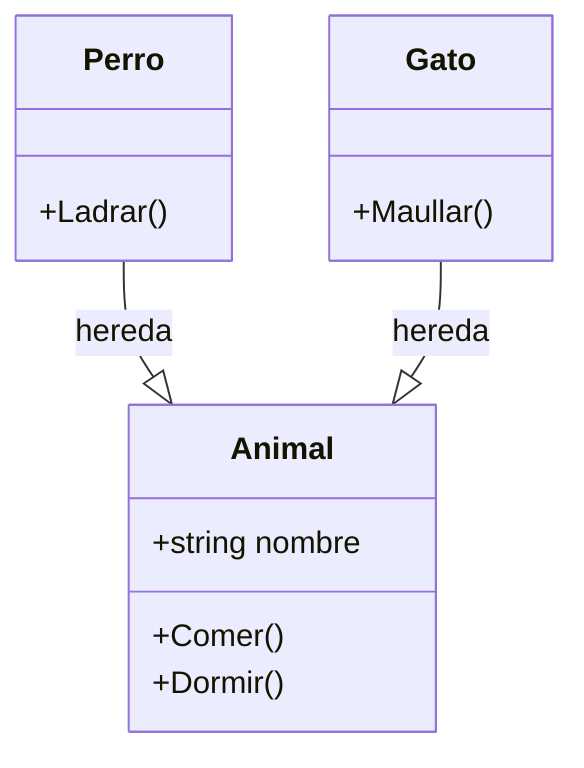
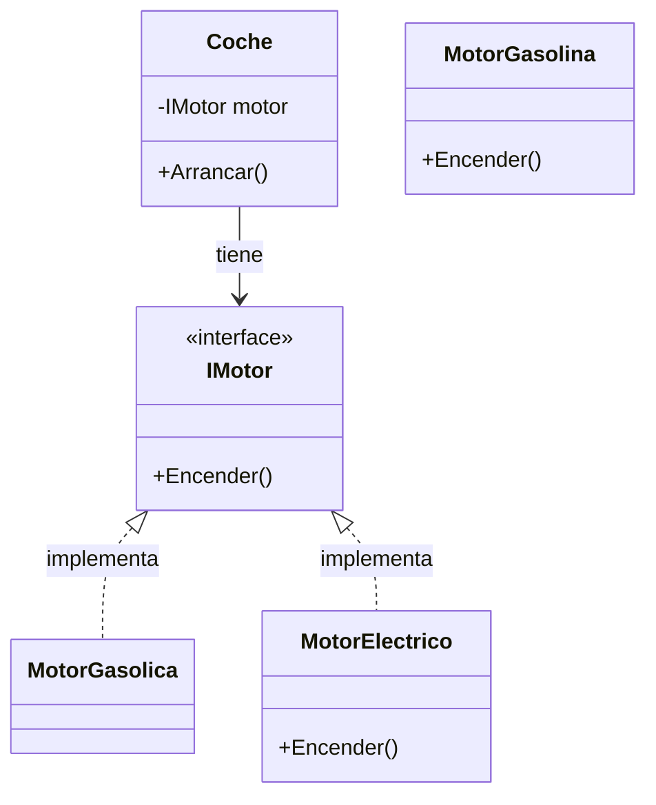
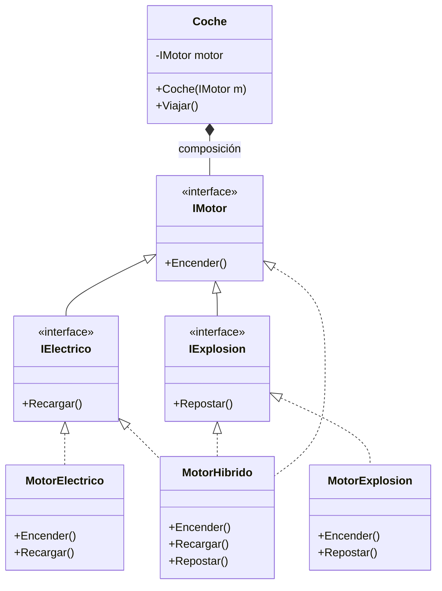
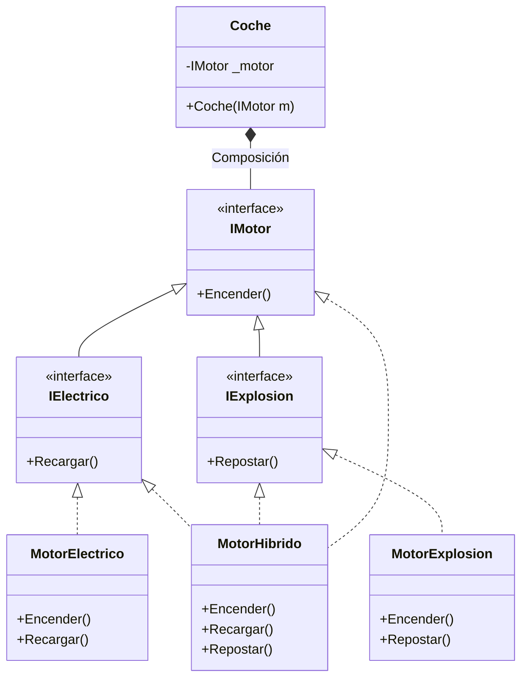

- [4. El Gran Dilema: Herencia vs. Composición](#4-el-gran-dilema-herencia-vs-composición)
  - [4.1. Herencia (Generalización): El concepto "Es-un"](#41-herencia-generalización-el-concepto-es-un)
  - [4.2. Composición/Asociación: El concepto "Tiene-un"](#42-composiciónasociación-el-concepto-tiene-un)
  - [4.3. Caso de Estudio: El Problema del Motor Híbrido](#43-caso-de-estudio-el-problema-del-motor-híbrido)
    - [El "Callejón sin salida" de la Herencia](#el-callejón-sin-salida-de-la-herencia)
    - [La Solución Maestra: Interfaces y Composición](#la-solución-maestra-interfaces-y-composición)
  - [4.4. Especialización vs. Especificación](#44-especialización-vs-especificación)
  - [💡 Truco de "Examen" para detectar este diseño:](#-truco-de-examen-para-detectar-este-diseño)
    - [Tabla Comparativa](#tabla-comparativa)
  - [4.4. Especialización vs. Especificación](#44-especialización-vs-especificación-1)
  - [💡 Truco de "Examen" para detectar este diseño:](#-truco-de-examen-para-detectar-este-diseño-1)


# 4. El Gran Dilema: Herencia vs. Composición

En el diseño de software, la forma en que estructuramos la reutilización de código determina si nuestro sistema será un bloque de hormigón (rígido) o un juego de LEGO (flexible).

> 💡 **Analogía del LEGO:** La composición es como construir con piezas de LEGO. Cada pieza cumple una función específica y puedes combinarlas de mil formas diferentes. La herencia es más como una figura de action man: si quieres cambiarla, tienes que reemplazar toda la figura.

## 4.1. Herencia (Generalización): El concepto "Es-un"

La herencia crea una jerarquía donde la subclase adquiere la esencia de la superclase.

* **Uso:** Cuando un objeto es una versión especializada de otro.
* **Riesgo:** Si la jerarquía crece, nos encontramos con comportamientos que no todas las hijas necesitan, pero que heredan por obligación.

**Ejemplo de Herencia:**



**Cuándo usar herencia:**
- Un `Perro` **ES UN** `Animal`
- Un `Coche` **ES UN** `Vehículo`
- Un `Circulo` **ES UNA** `Forma`

> 📝 **Nota del Profesor:** La herencia crea un ACOPLAMIENT0 FUERTE. Cuando usas herencia, estás diciendo que tu clase ES una versión especial de otra. Esto es muy rígido. Pregúntate: "¿Esto ES siempre esto otro, o TIENE esto otro?"

## 4.2. Composición/Asociación: El concepto "Tiene-un"

La composición construye funcionalidad mediante la suma de piezas. En lugar de "ser" algo, la clase **"tiene"** una referencia a un objeto que sabe hacer ese algo.

* **Uso:** Cuando queremos que una clase use funcionalidades de otras de forma flexible.
* **Principio:** Favorecer la composición permite cambiar piezas en tiempo de ejecución sin alterar la estructura del objeto principal.

**Ejemplo de Composición:**



**Cuándo usar composición:**
- Un `Coche` **TIENE UN** `Motor`
- Un `Ordenador` **TIENE UN** `Procesador`
- Un `Equipo` **TIENE** `Jugadores`

> 📝 **Regla de oro:** **"Favorecer composición sobre herencia"**. Este es uno de los principios más importantes del diseño orientado a objetos. El libro "Design Patterns" de 1994 ya lo establecía.

## 4.3. Caso de Estudio: El Problema del Motor Híbrido

Imagina que tenemos que modelar diferentes tipos de motores con comportamientos específicos:

1. **Motor Eléctrico:** Tiene `Encender()` y `Recargar()`.
2. **Motor de Explosión:** Tiene `Encender()` y `Repostar()`.
3. **Motor Híbrido:** ¡Necesita hacer las tres cosas!

### El "Callejón sin salida" de la Herencia

Si intentamos resolverlo con herencia pura en C#, chocamos contra un muro:

* Si `MotorHibrido` hereda de `MotorElectrico`, no puede heredar de `MotorExplosion` (C# solo permite heredar de **una** clase).
* Si creamos una clase base `Motor` con todo, el `MotorElectrico` heredaría por error un método `Repostar()` (gasolina) que no puede usar.

### La Solución Maestra: Interfaces y Composición

Dividimos las capacidades en **contratos (interfaces)** y componemos el motor híbrido.



> 💡 **La magia de la composición:** El `Coche` no sabe qué tipo de motor tiene. Solo sabe que tiene algo que implementa `IMotor`. Puedes inyectar cualquier motor y el código del `Coche` no cambia.

## 4.4. Especialización vs. Especificación

Este ejemplo nos enseña la diferencia real:

* **Especialización (Herencia):** El `MotorElectrico` es una especialización de `IMotor`.
* **Especificación (Inyección):** El `Coche` no sabe qué motor tiene, solo especifica que "necesita algo que se encienda" (`IMotor`).

## 💡 Truco de "Examen" para detectar este diseño:

Si en el enunciado lees:

> *"El sistema debe permitir combinar capacidades de distintos tipos..."*
> O:
> *"Existen elementos que comparten una base pero tienen funcionalidades cruzadas..."*

**No uses herencia.** Crea interfaces para cada capacidad (`IElectrico`, `IExplosion`) y haz que tus clases las implementen según necesiten. Luego, usa **Inyección de Dependencias** para pasarle el objeto resultante a la clase principal.

### Tabla Comparativa

| Aspecto | Herencia | Composición |
|---------|----------|-------------|
| **Relación** | "Es un" | "Tiene un" |
| **Acoplamiento** | Alto (rígido) | Bajo (flexible) |
| **Flexibilidad** | Baja | Alta |
| **Cambiar comportamiento** | Difícil | Fácil (inyectar otra implementación) |
| **Reutilización** | Por herencia | Por delegación |
| **UML** | Flecha triangular `<|--` | Flecha normal `-->`, composición `*--` |

> 📝 **Ejercicio de examen:** Dado este enunciado: *"Un pájaro puede volar. Un pingüino es un pájaro pero no puede volar."* ¿Cómo lo modelarías? La respuesta correcta sería usar interfaces: `IVolador` con método `Volar()`, y solo las clases que pueden volar lo implementan. `Pingüino` heredaría de `Ave` pero no implementaría `IVolador`.

**Representación en Mermaid:**



**Código C# (Composición con DIP):**

```csharp
// Interfaz base para todos los motores
public interface IMotor
{
    void Encender();
}

// Capacidades específicas como interfaces separadas
public interface IElectrico
{
    void Recargar();
}

public interface IExplosion
{
    void Repostar();
}

// Implementaciones concretas
public class MotorElectrico : IMotor, IElectrico
{
    public void Encender() { /* silencioso */ }
    public void Recargar() { /* carga batería */ }
}

public class MotorExplosion : IMotor, IExplosion
{
    public void Encender() { /* brum */ }
    public void Repostar() { /* gasolina */ }
}

public class MotorHibrido : IMotor, IElectrico, IExplosion
{
    public void Encender() { /* silencioso */ }
    public void Recargar() { /* carga batería */ }
    public void Repostar() { /* gasolina */ }
}

// El Coche solo sabe que necesita algo que implemente IMotor
// No sabe ni le importa qué tipo específico es
public class Coche
{
    private readonly IMotor _motor;
    
    // Inyección de dependencia: el motor se "inyecta" desde fuera
    public Coche(IMotor motor)
    {
        _motor = motor;
    }
    
    public void Arrancar()
    {
        _motor.Encender();
    }
}

// Uso flexible:
var cocheElectrico = new Coche(new MotorElectrico());
var cocheGasolina = new Coche(new MotorExplosion());
var cocheHibrido = new Coche(new MotorHibrido());
// ¡Sin cambiar la clase Coche, podemos cambiar su comportamiento!
```

---

## 4.4. Especialización vs. Especificación

Este ejemplo nos enseña la diferencia real:

* **Especialización (Herencia):** El `MotorElectrico` es una especialización de `IMotor`.
* **Especificación (Inyección):** El `Coche` no sabe qué motor tiene, solo especifica que "necesita algo que se encienda" (`IMotor`).

**Ventaja final para el alumno:**
Gracias a este diseño, si mañana inventamos un **Motor de Hidrógeno**, solo tenemos que crear la clase e inyectarla en el `Coche`. El código del `Coche` **no se toca**. Esto es cumplir el principio de "Abierto a la extensión, cerrado a la modificación".

---

## 💡 Truco de "Examen" para detectar este diseño:

Si en el enunciado lees:

> *"El sistema debe permitir combinar capacidades de distintos tipos..."*
> O:
> *"Existen elementos que comparten una base pero tienen funcionalidades cruzadas..."*

**No uses herencia.** Crea interfaces para cada capacidad (`IElectrico`, `IExplosion`) y haz que tus clases las implementen según necesiten. Luego, usa **Inyección de Dependencias** para pasarle el objeto resultante a la clase principal.


---