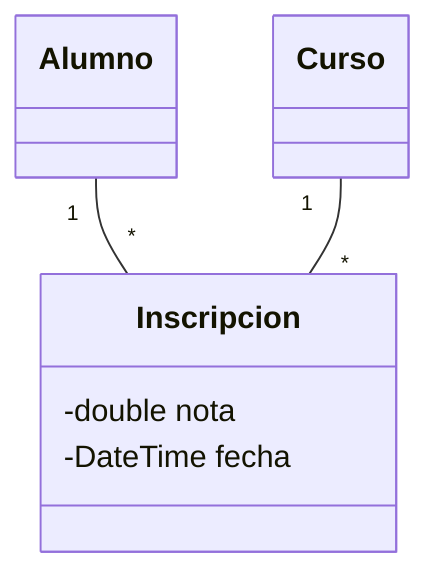
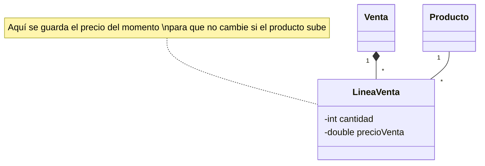
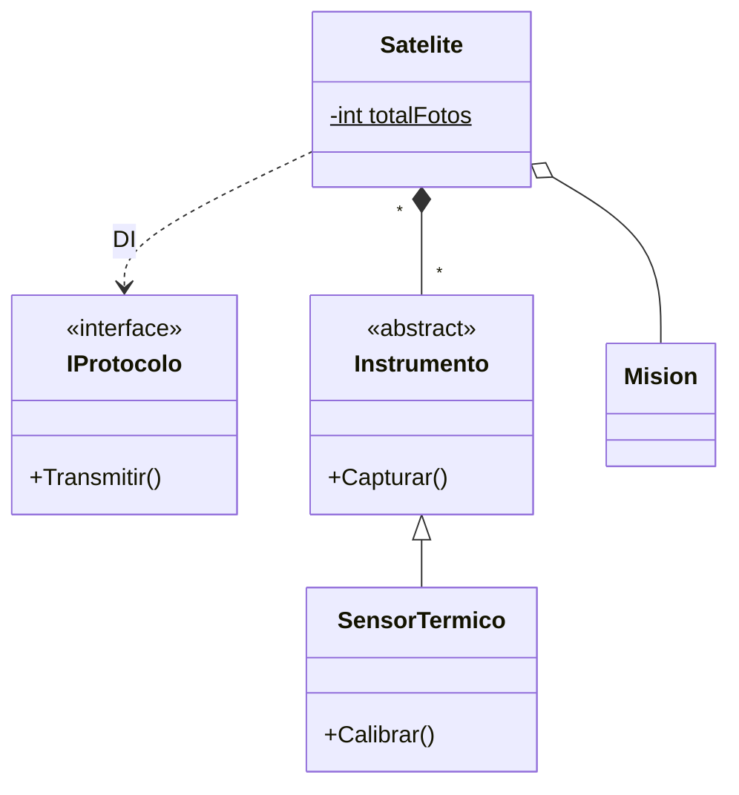

- [5. Técnicas de Análisis y Trucos (El Método del Analista)](#5-técnicas-de-análisis-y-trucos-el-método-del-analista)
  - [5.1. Análisis Lingüístico Profundo (La Gramática del Software)](#51-análisis-lingüístico-profundo-la-gramática-del-software)
  - [5.2. El Diagnóstico de la Herencia: ¿Identidad o Conveniencia?](#52-el-diagnóstico-de-la-herencia-identidad-o-conveniencia)
    - [A. La Prueba de Oro: El Ejemplo del Comercial](#a-la-prueba-de-oro-el-ejemplo-del-comercial)
    - [B. El Contraejemplo (Herencia por "vagancia" de código): Coche y Motor](#b-el-contraejemplo-herencia-por-vagancia-de-código-coche-y-motor)
  - [5.3. Composición vs. Agregación: El "Vínculo Vital"](#53-composición-vs-agregación-el-vínculo-vital)
  - [5.4. Rompiendo Relaciones N:M (La Clase Relación)](#54-rompiendo-relaciones-nm-la-clase-relación)
    - [Caso A: Inscripción en Cursos (Atributos de la relación)](#caso-a-inscripción-en-cursos-atributos-de-la-relación)
    - [Caso B: Venta, Producto y el "Precio Congelado"](#caso-b-venta-producto-y-el-precio-congelado)
  - [5.5. Miembros Estáticos y Visibilidad](#55-miembros-estáticos-y-visibilidad)
  - [5.6. Caso Final: El Sistema de Telemetría (Ejemplo de Examen)](#56-caso-final-el-sistema-de-telemetría-ejemplo-de-examen)


# 5. Técnicas de Análisis y Trucos (El Método del Analista)

El éxito de un modelo no depende de la herramienta de dibujo, sino de la capacidad del analista para "traducir" el lenguaje humano a una arquitectura técnica sólida.

## 5.1. Análisis Lingüístico Profundo (La Gramática del Software)

La gramática del enunciado es el mapa del software. Debemos categorizar cada palabra para saber dónde colocarla en Rider y cómo representarla en UML.

| Categoría Gramatical       | Traducción Técnica        | Implementación en C# / UML                                                      |
| -------------------------- | ------------------------- | ------------------------------------------------------------------------------- |
| **Sustantivo Común**       | **Clase**                 | `public class Libro { ... }`                                                    |
| **Sustantivo Propio**      | **Instancia (Objeto)**    | `var miLibro = new Libro();` (No se dibuja en el diagrama).                     |
| **Adjetivo / Pertenencia** | **Propiedades o Campos**  | `private string _color;` (Campo) / `public int Edad { get; set; }` (Propiedad). |
| **Adjetivo de Estado**     | **Enumeraciones (Enums)** | `public enum Estado { Pendiente, Pagado }`. Etiqueta `«enumeration»`.           |
| **Verbo de acción**        | **Método (Operación)**    | `public void CalcularIva() { ... }`.                                            |
| **Verbo de estado/unión**  | **Relación**              | Indica una línea de unión (Asociación, Agregación o Composición).               |

---

## 5.2. El Diagnóstico de la Herencia: ¿Identidad o Conveniencia?

La herencia es la relación más rígida. Un error aquí genera "código espagueti" imposible de mantener.

### A. La Prueba de Oro: El Ejemplo del Comercial

Para saber si la herencia es correcta, aplicamos la lógica: **"Un B es siempre un A"**.

* **Ejemplo Correcto:** `Empleado` (Padre)  `Comercial` (Hijo).
* **Razonamiento:** Un comercial **es un** empleado. Si la empresa decide que ya no existen los empleados, el concepto de "comercial" desaparece. El comercial hereda el sueldo base y añade la propiedad `Comision`.


### B. El Contraejemplo (Herencia por "vagancia" de código): Coche y Motor

* **❌ Mala Decisión:** Heredar `Coche` de `Motor`.
* **Error:** El alumno piensa: "Como el motor tiene el método `Arrancar()`, si el coche hereda de motor, el coche ya sabe arrancar".
* **Por qué falla:** Un coche **no es** un motor. Si heredas, el coche adquiere métodos internos del motor (como `InyectarCombustible()`) que no deberían ser accesibles desde el coche. Además, si quieres cambiar a un motor eléctrico, la herencia te obliga a reescribir toda la clase `Coche`.
* **✅ Solución:** El `Coche` **tiene** un `Motor` (Composición).


---

## 5.3. Composición vs. Agregación: El "Vínculo Vital"

1. **Composición (`*--` Rombo Lleno):** Relación de "Propiedad Total".
* **Pista:** "Las partes no tienen sentido sin el todo". Si el contenedor muere, el contenido muere.
* **Ejemplo:** `Casa` y `Habitacion`. Si derribas la casa, las habitaciones dejan de existir.


2. **Agregación (`o--` Rombo Vacío):** Relación de "Colección o Pertenencia".
* **Pista:** "Las partes pueden existir fuera del contenedor".
* **Ejemplo:** `Equipo` y `Jugador`. Si el equipo desaparece, el jugador sigue existiendo y puede irse a otro.


---

## 5.4. Rompiendo Relaciones N:M (La Clase Relación)

Las relaciones de muchos a muchos deben "romperse" en dos relaciones de uno a muchos usando una **Clase Intermedia**.

### Caso A: Inscripción en Cursos (Atributos de la relación)

Un `Alumno` tiene muchos `Cursos` y un `Curso` muchos `Alumnos`. ¿Dónde guardamos la **Nota Final**? No pertenece al alumno solo, ni al curso solo, sino a la **unión** de ambos.

**Código C# (Clase asociación):**

```csharp
public class Alumno
{
    public int Id { get; set; }
    public string Nombre { get; set; }
    // La Inscripción se crea para vincular Alumno con Curso
    public List<Inscripcion> Inscripciones { get; set; } = new();
}

public class Curso
{
    public int Id { get; set; }
    public string Nombre { get; set; }
    public List<Inscripcion> Inscripciones { get; set; } = new();
}

// CLASE ASOCIACIÓN: Representa la relación con atributos propios
public class Inscripcion
{
    public Alumno Alumno { get; set; }
    public Curso Curso { get; set; }
    public double Nota { get; set; }
    public DateTime Fecha { get; set; }
}

// Uso:
var alumno = new Alumno { Nombre = "Ana" };
var curso = new Curso { Nombre = "Programación" };
var inscripcion = new Inscripcion 
{ 
    Alumno = alumno, 
    Curso = curso, 
    Nota = 9.5, 
    Fecha = DateTime.Now 
};
```

**Diagrama en Mermaid:**



### Caso B: Venta, Producto y el "Precio Congelado"

Un `Producto` puede cambiar de precio con el tiempo. Para que las facturas antiguas no cambien su valor legal, la `LineaVenta` debe "congelar" el precio.

**Código C# (Precio congelado):**

```csharp
public class Producto
{
    public string Nombre { get; set; }
    private decimal _precio;  // El precio ACTUAL puede cambiar
    
    public decimal Precio
    {
        get => _precio;
        set { _precio = value; Console.WriteLine($"Nuevo precio: {value}"); }
    }
}

public class LineaVenta
{
    public Producto Producto { get; set; }
    public int Cantidad { get; set; }
    public decimal PrecioVenta { get; set; }  // ¡PRECIO CONGELADO!
    public decimal Subtotal => Cantidad * PrecioVenta;
}

public class Venta
{
    public DateTime Fecha { get; set; } = DateTime.Now;
    public List<LineaVenta> Lineas { get; set; } = new();
    public decimal Total => Lineas.Sum(l => l.Subtotal);
}

// Uso:
var producto = new Producto { Nombre = "Laptop", Precio = 999 };
var linea = new LineaVenta 
{ 
    Producto = producto, 
    Cantidad = 1,
    PrecioVenta = producto.Precio  // Se congela el precio actual
};

producto.Precio = 899;  // Bajamos el precio
// La línea de venta sigue valiendo 999 (precio congelado)
Console.WriteLine(linea.Subtotal);  // 999
```

**Diagrama en Mermaid:**



---

## 5.5. Miembros Estáticos y Visibilidad

Basándonos en tus documentos sobre **Atributos de Clase**:

* **Pista de ID Autoincremental:** *"Contar cuántos objetos se han creado"*. El objeto no sabe el total, la **Clase** sí. Usamos `static int contador` (**Subrayado** en UML).
* **Visibilidad:**
* **Privado (-):** Campos donde guardamos el dato (encapsulamiento).
* **Público (+):** Propiedades y métodos de servicio.
* **Protegido (#):** Solo para que las clases hijas vean el dato.


---

## 5.6. Caso Final: El Sistema de Telemetría (Ejemplo de Examen)

**Enunciado:** *"Un Satélite tiene varios Instrumentos. El Sensor Térmico es un tipo de instrumento que permite Calibrar. El Satélite cuenta cuántas fotos ha hecho en total. Recibe un Protocolo de Transmisión al construirse. El Satélite pertenece a una Misión, pero si el satélite falla, la misión continúa."*


**Representación en Mermaid:**




**Código C# (Sistema de Satélites):**

```csharp
// CONTRATO: Protocolo de transmisión (inyectado en constructor)
public interface IProtocolo
{
    void Transmitir(string datos);
}

public class SateliteProtocolo : IProtocolo
{
    public void Transmitir(string datos) => Console.WriteLine($"Transmitiendo: {datos}");
}

// AGREGACIÓN: Satélite tiene una Misión, pero两者 pueden existir independientemente
public class Mision
{
    public string Nombre { get; set; }
}

// CLASE ABSTRACT Instrumento: clase base para todos los instrumentos
public abstract class Instrumento
{
    public abstract void Capturar();
}

// Herencia: SensorTermico ES-UN Instrumento
public class SensorTermico : Instrumento
{
    public override void Capturar() => Console.WriteLine("Capturando temperatura");
    
    public void Calibrar() => Console.WriteLine("Calibrando sensor");
}

// COMPOSICIÓN: Instrumentos no tienen sentido sin Satélite
public class Satelite
{
    // Atributo estático: pertenece a la CLASE, no a la instancia
    private static int _totalFotos;
    
    public Mision Mision { get; set; }  // Agregación (referencia)
    private List<Instrumento> _instrumentos = new();  // Composición (posee)
    
    private readonly IProtocolo _protocolo;  // DI por constructor
    
    public Satelite(IProtocolo protocolo, Mision mision)
    {
        _protocolo = protocolo;
        Mision = mision;
    }
    
    public void AgregarInstrumento(Instrumento inst)
    {
        _instrumentos.Add(inst);
    }
    
    public void HacerFoto()
    {
        _totalFotos++;
        Console.WriteLine($"Foto #{_totalFotos}");
    }
}

// Uso:
var protocolo = new SateliteProtocolo();
var mision = new Mision { Nombre = "Exploración Marte" };
var satelite = new Satelite(protocolo, mision);

var sensor = new SensorTermico();
satelite.AgregarInstrumento(sensor);

satelite.HacerFoto();  // Foto #1
sensor.Calibrar();      // Calibrando sensor
```
---