- [6. Herramientas de Representación: Del Dibujo al Código](#6-herramientas-de-representación-del-dibujo-al-código)
  - [6.1. El Estándar Mermaid.js: "Diagram as Code"](#61-el-estándar-mermaidjs-diagram-as-code)
  - [6.2. Sintaxis Detallada de Mermaid (Class Diagram)](#62-sintaxis-detallada-de-mermaid-class-diagram)
    - [A. Declaración de Clases y Miembros](#a-declaración-de-clases-y-miembros)
    - [B. Tipos de Relaciones (Flechas)](#b-tipos-de-relaciones-flechas)
      - [B.1. Navegabilidad: Unidireccional vs Bidireccional](#b1-navegabilidad-unidireccional-vs-bidireccional)
      - [B.2. Multiplicidad](#b2-multiplicidad)
      - [B.3. Ejemplos Combinados (Relación + Multiplicidad)](#b3-ejemplos-combinados-relación--multiplicidad)
    - [C. Multiplicidad y Etiquetas](#c-multiplicidad-y-etiquetas)
  - [6.3. Anotaciones y Estereotipos (Metadata)](#63-anotaciones-y-estereotipos-metadata)
  - [6.4. Tipos Genéricos (Templates)](#64-tipos-genéricos-templates)
  - [6.5. Potencia Máxima: Ejemplo de Aplicación Total](#65-potencia-máxima-ejemplo-de-aplicación-total)
  - [6.6. Herramientas y Extensiones Profesionales](#66-herramientas-y-extensiones-profesionales)
    - [Para Visual Studio Code:](#para-visual-studio-code)
    - [Herramientas Visuales (No Code):](#herramientas-visuales-no-code)
  - [6.7. Ejemplo Corregido: Sistema de Telemetría SmartCity](#67-ejemplo-corregido-sistema-de-telemetría-smartcity)
    - [El Enunciado](#el-enunciado)
    - [Diagrama de Clases (Mermaid)](#diagrama-de-clases-mermaid)
    - [Cambios Clave Realizados:](#cambios-clave-realizados)
    - [Código C# Correspondiente](#código-c-correspondiente)


# 6. Herramientas de Representación: Del Dibujo al Código

## 6.1. El Estándar Mermaid.js: "Diagram as Code"

[Mermaid](https://mermaid.js.org/syntax/classDiagram.html) no es solo una herramienta de dibujo, es un motor de renderizado que sigue el principio de **Diagram as Code**.

* **Por qué es estándar:** Al ser texto plano, se puede versionar en Git. Si dos desarrolladores cambian el diagrama, Git puede hacer un "merge". Con una imagen o un binario (como Photoshop), esto es imposible.
* **Flujo de trabajo:** El analista escribe el esquema en Markdown, el sistema lo renderiza y el desarrollador lo implementa en Rider.

---

## 6.2. Sintaxis Detallada de Mermaid (Class Diagram)

Para usar Mermaid con éxito, hay que conocer sus reglas de declaración y anotación.

### A. Declaración de Clases y Miembros

Existen dos formas de definir una clase:

1. **Explícita:** Usando la palabra clave `class`.
2. **Implícita:** Mermaid crea la clase automáticamente al detectar una relación.

**Definición de Miembros (Atributos y Métodos):**
Para definir el contenido, usamos llaves `{}` o el símbolo `:` seguido del nombre.

* **Visibilidad:**
* `+` Público
* `-` Privado
* `#` Protegido
* `~` Package/Internal


* **Miembros Estáticos y Abstractos:**
* `$`: Se añade al final para **Métodos o Atributos Estáticos** (aparecerán subrayados).
* `*`: Se añade al final para **Métodos Abstractos** (aparecerán en cursiva).


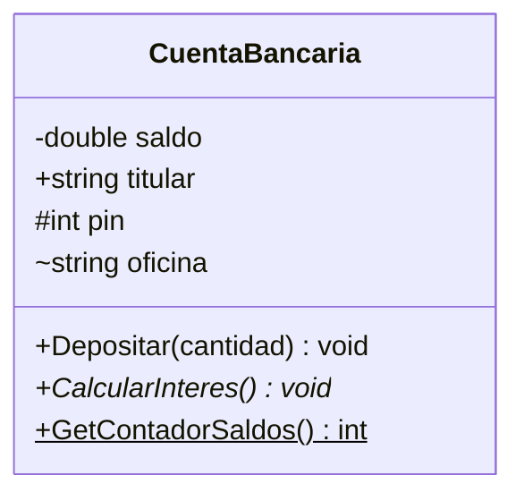

### B. Tipos de Relaciones (Flechas)

Mermaid utiliza una sintaxis de "guiones" para definir la fuerza, el tipo y la navegabilidad de la conexión:

- **`Herencia`**: `` `<|--` `` → Una clase hereda de otra (B ES-UN A).
- **`Composición`**: `` `*--` `` → "Todo-Parte" fuerte. El parte no existe sin el todo.
- **`Agregación`**: `` `o--` `` → "Todo-Parte" débil. El parte puede existir sin el todo.
- **`Asociación`**: `` `-->` `` o `` `<-->` `` → Conexión simple. Puede ser unidireccional o bidireccional.
- **`Dependencia`**: `` `..>` `` → Uso puntual (normalmente en un método).
- **`Realización`**: `` `<|..` `` → Implementación de interfaz.

> 💡 **Navegabilidad:** Una flecha `--> ` significa que la clase origen conoce a la destino. Si usas `<-->` ambas clases se conocen mutuamente. En diseño profesional, prefiere relaciones unidireccionales para reducir acoplamiento.

#### B.1. Navegabilidad: Unidireccional vs Bidireccional

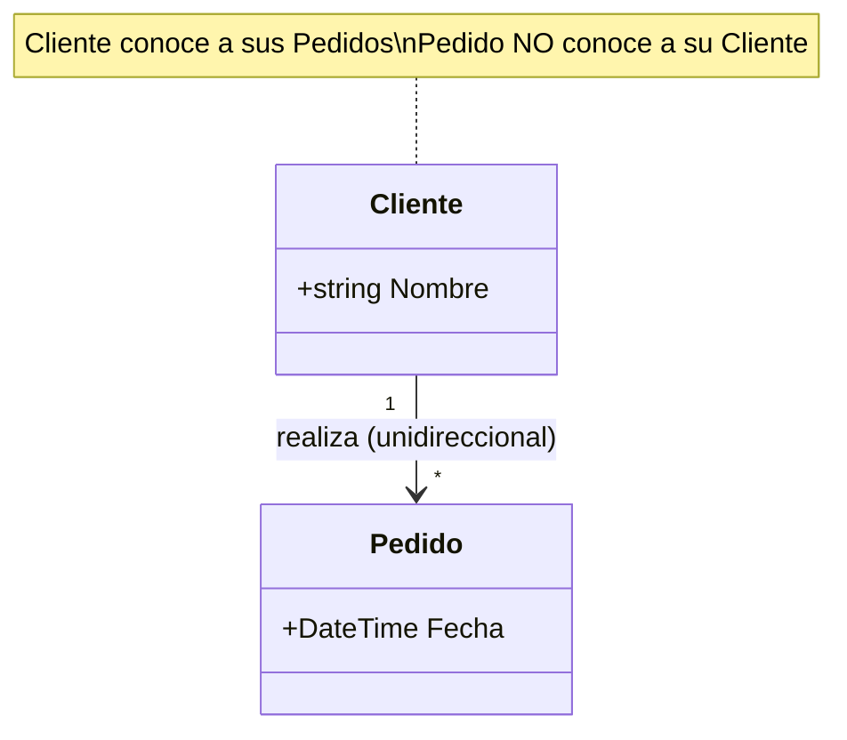

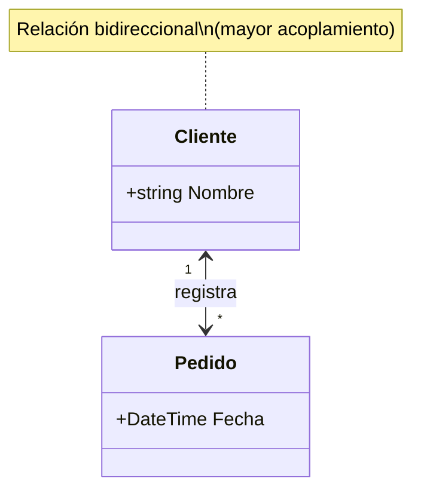

#### B.2. Multiplicidad

La multiplicidad indica cuántas instancias (cardinalidad mínima y máxima) participan en la relación:

- **`1`**: Exactamente uno. Ejemplo: `` Coche "1" *-- "4" Rueda ``
- **`0..1`**: Cero o uno (opcional). Ejemplo: `` Persona "0..1" -- "1" Permiso : tiene ``
- **`*`**: Cero o más (muchos). Ejemplo: `` Cliente "*" --> "*" Pedido : realiza ``
- **`1..*`**: Uno o más (al menos uno). Ejemplo: `` Equipo "1" o-- "1..*" Jugador : tiene ``
- **`0..*`**: Cero o más (igual que `*`, más explícito). Ejemplo: `` Cliente "0..*" --> "*" Direccion : tiene ``

> 📝 **Cardinalidad mínima y máxima:** El formato `m..n` permite definir ambos extremos:
> - Mínima: cuántas relaciones debe haber como mínimo (0 = opcional, 1 = obligatorio)
> - Máxima: cuántas relaciones puede haber como máximo (* = ilimitado)

#### B.3. Ejemplos Combinados (Relación + Multiplicidad)

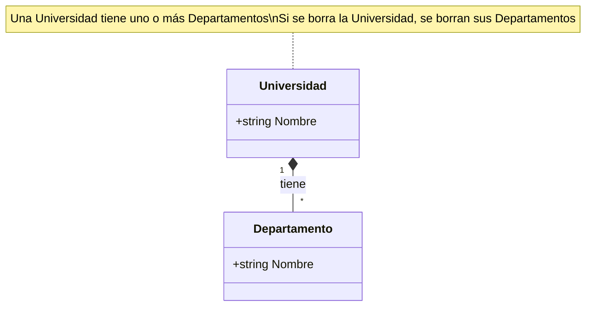

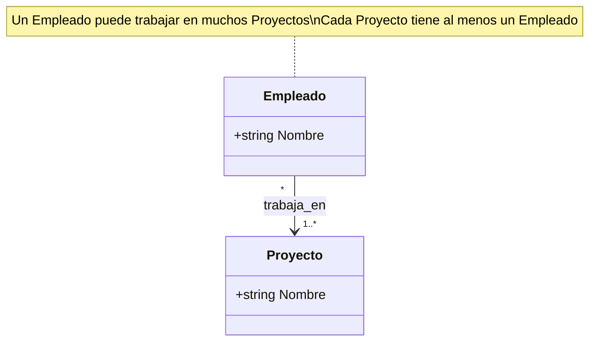

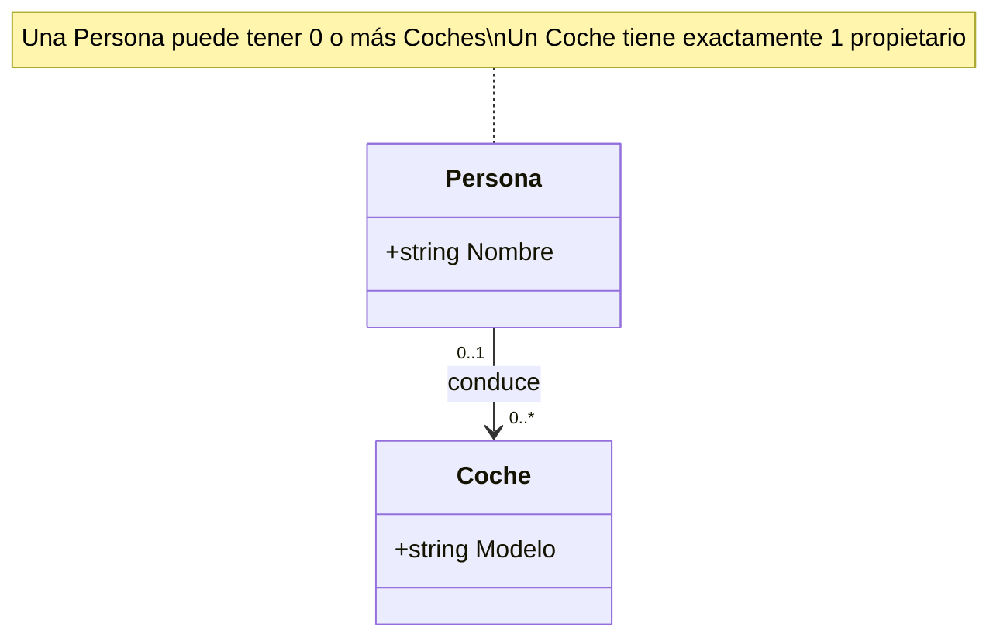

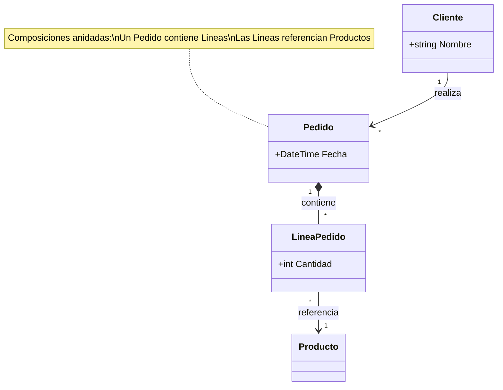

### C. Multiplicidad y Etiquetas

Se colocan entre comillas dobles al principio y al final de la relación:

```
ClaseA "1" *-- "many" ClaseB : etiqueta
```

**Ejemplo completo con etiquetas:**

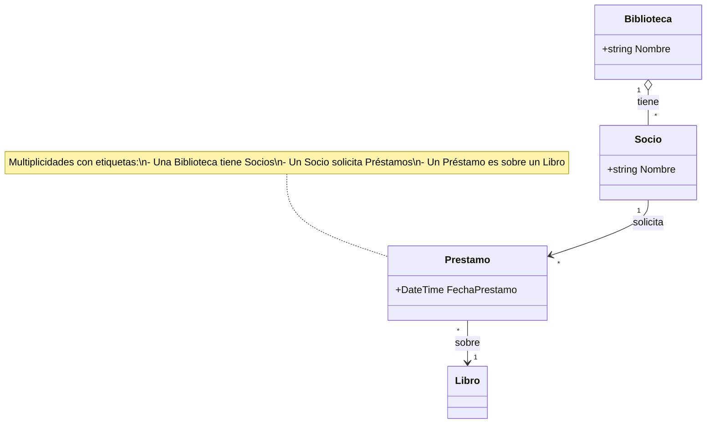

> 📝 **Regla nemotécnica:** "El número va donde miras". Si pones `"1"` en el origen y `"*"` en el destino, significa "1 origen puede tener muchos destinos".

> 💡 **Consejo del Examinador:** En el examen, dibuja primero las multiplicidades más restrictivas (los `1`) y luego las opcionales (`0..1`). Si una relación es "posee" o "contiene", piensa en composición (`*--`). Si es "agrupa" o "reúne", piensa en agregación (`o--`). Si es "usa" o "necesita temporalmente", piensa en dependencia (`..>`).

---

## 6.3. Anotaciones y Estereotipos (Metadata)

Para indicar que algo no es una clase normal (sino una interfaz o un enum), usamos los **Labels**:

* `<<interface>>`: Para contratos de métodos.
* `<<abstract>>`: Para clases que no se pueden instanciar.
* `<<enumeration>>`: Para listas de constantes.

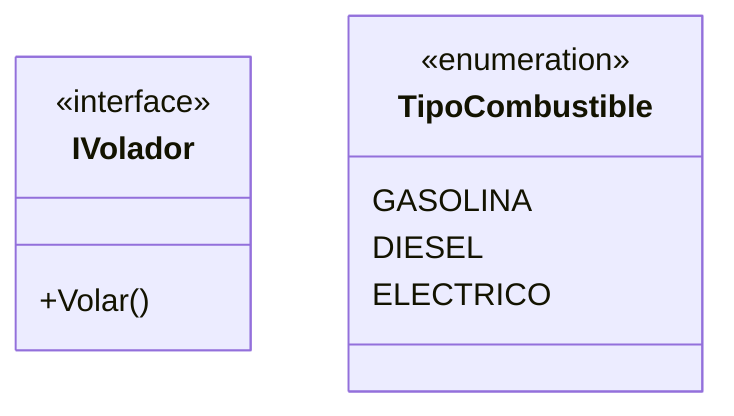

---

## 6.4. Tipos Genéricos (Templates)

En C#, usamos mucho las listas genéricas `List<T>`. Mermaid las representa usando tildes `~`:
`List~Alumno~ alumnos` se renderizará como `List<Alumno>`.

---

## 6.5. Potencia Máxima: Ejemplo de Aplicación Total

Este diagrama incluye **Direccionalidad**, **Genéricos**, **Navegabilidad** y **Clases Relación**.

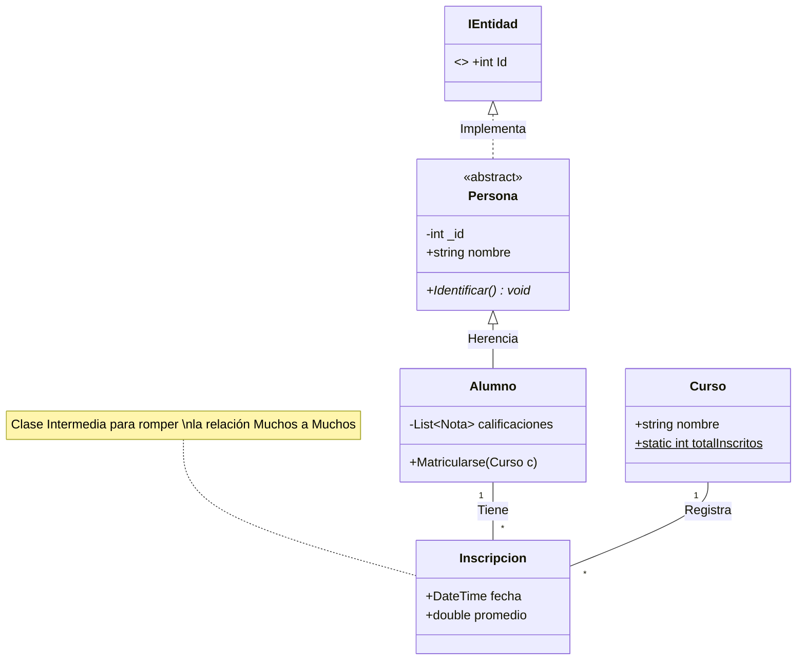

---

## 6.6. Herramientas y Extensiones Profesionales

### Para Visual Studio Code:

1. **Mermaid Chart:** La extensión oficial. Permite editar visualmente y sincronizar con su plataforma. Puedes exportar a PNG, SVG, PDF.
2. **Markdown Preview Mermaid Support:** Imprescindible para ver los diagramas dentro de tus apuntes `.md`.
3. **Draw.io Integration:** Permite usar el motor de Draw.io (manual) dentro de VS Code.
4. **PlantUML:** Extensión para el lenguaje competidor (usa archivos `.puml`).

### Herramientas Visuales (No Code):

* **Draw.io (diagrams.net):** Herramienta gratuita perfecta para bocetos rápidos. Permite exportar en XML. Puedes integrarla en VS Code, GitHub y otras plataformas. https://app.diagrams.net/
* **StarUML.io:** Herramienta **CASE** (Computer Aided Software Engineering). No solo dibuja, genera código C# real a partir de tus diagramas. Es la herramienta que se usa cuando el diseño debe ser 100% riguroso. https://staruml.io/

---

Tienes toda la razón. El diseño original tiene una incoherencia grave: intenta usar una interfaz de "Sensor" para conectar el `CentroControl`, pero luego dice que el centro de control gestiona `NodosRed`. Además, el `SensorContaminacion` no hereda de `NodoRed`, por lo que no podría comunicarse con el centro si este solo espera nodos de red.

Para que el diseño sea coherente, **el Centro de Control debe interactuar con Nodos de Red**, y los **Nodos de Red deben ser los que contienen o actúan como sensores**.

Aquí tienes la propuesta corregida y unificada:

---

## 6.7. Ejemplo Corregido: Sistema de Telemetría SmartCity

### El Enunciado

Diseña un sistema de telemetría para una ciudad inteligente donde diferentes dispositivos urbanos reportan datos a una central.

1. **Interfaz `ISensor**`: Define el contrato `LeerDatos()`, que devuelve un string con la información capturada.
2. **Clase Abstracta `NodoRed**`: Posee un atributo `ip` y un método `EnviarDatos()`. Esta clase es la base de todo dispositivo conectado.
3. **Clase `SensorContaminacion**`: Hereda de `NodoRed` e implementa `ISensor`. Mide niveles de partículas.
4. **Clase `SemaforoInteligente**`: Hereda de `NodoRed`. Tiene un estado (`ROJO`, `AMBAR`, `VERDE`) y, además, **contiene un sensor de tráfico** (composición) para decidir cuándo cambiar de fase.
5. **Clase `CentroControl**`: Recibe y gestiona una lista de objetos `NodoRed`. Utiliza el polimorfismo para invocar `EnviarDatos()` de cada nodo sin importar si es un semáforo o un sensor ambiental.

### Diagrama de Clases (Mermaid)

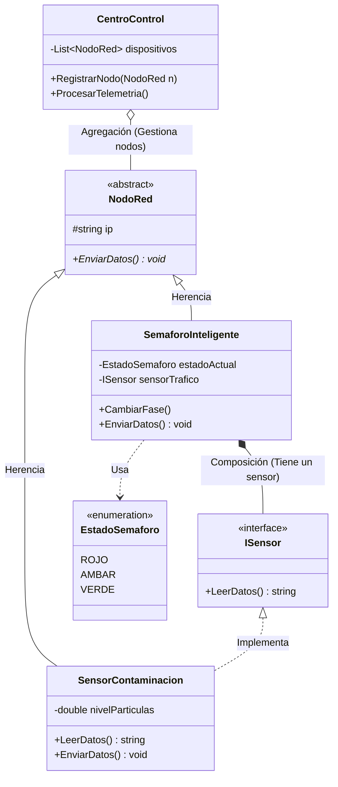

---

### Cambios Clave Realizados:

* **Jerarquía Lógica**: Ahora tanto el `SemaforoInteligente` como el `SensorContaminacion` son `NodoRed`. Esto permite que el `CentroControl` los trate de forma uniforme.
* **Interfaz `ISensor**`: Se ha movido a donde corresponde. El `SensorContaminacion` **es** un sensor, mientras que el `SemaforoInteligente` **tiene** un sensor internamente para su lógica de tráfico.
* **Inyección de Dependencias**: El `CentroControl` ahora depende de la abstracción `NodoRed`, permitiendo añadir nuevos tipos de dispositivos (cámaras, sensores de parking) sin modificar el código del centro.

### Código C# Correspondiente

```csharp
using System;
using System.Collections.Generic;

// --- TOP-LEVEL STATEMENTS ---

var centro = new CentroControl();

var sensorAmbiental = new SensorContaminacion("192.168.1.50", 42.5);
var sensorTrafico = new SensorTraficoSimple();
var semaforoA1 = new SemaforoInteligente("192.168.1.100", sensorTrafico);

centro.RegistrarNodo(sensorAmbiental);
centro.RegistrarNodo(semaforoA1);

semaforoA1.CambiarFase(EstadoSemaforo.VERDE);
centro.ProcesarTelemetria();

// --- DEFINICIÓN DE CLASES ---

public interface ISensor
{
    string LeerDatos();
}

public enum EstadoSemaforo { ROJO, AMBAR, VERDE }

public abstract class NodoRed(string ip)
{
    public string Ip { get; } = ip;
    public abstract void EnviarDatos();
}

public class SensorContaminacion(string ip, double nivelParticulas) : NodoRed(ip), ISensor
{
    public string LeerDatos() => $"Nivel de partículas: {nivelParticulas} µg/m3";

    public override void EnviarDatos() 
        => Console.WriteLine($"[IP: {Ip}] Enviando telemetría ambiental: {LeerDatos()}");
}

public class SemaforoInteligente(string ip, ISensor sensorTrafico) : NodoRed(ip)
{
    public EstadoSemaforo EstadoActual { get; private set; } = EstadoSemaforo.ROJO;

    public void CambiarFase(EstadoSemaforo nuevoEstado)
    {
        EstadoActual = nuevoEstado;
        Console.WriteLine($"Semáforo en {Ip} cambió a {EstadoActual}");
    }

    public override void EnviarDatos() 
        => Console.WriteLine($"[IP: {Ip}] Estado: {EstadoActual}. Tráfico: {sensorTrafico.LeerDatos()}");
}

public class CentroControl
{
    private readonly List<NodoRed> _nodos = [];

    public void RegistrarNodo(NodoRed nodo) => _nodos.Add(nodo);

    public void ProcesarTelemetria()
    {
        Console.WriteLine("\n--- Reporte de SmartCity ---");
        
        // Bucle for clásico con índice
        for (int i = 0; i < _nodos.Count; i++)
        {
            _nodos[i].EnviarDatos();
        }
    }
}

public class SensorTraficoSimple : ISensor
{
    public string LeerDatos() => "Fluido (15 vehículos/min)";
}
```


---