- [6. Herramientas de Representación: Del Dibujo al Código](#6-herramientas-de-representación-del-dibujo-al-código)
  - [6.1. El Estándar Mermaid.js: "Diagram as Code"](#61-el-estándar-mermaidjs-diagram-as-code)
  - [6.2. Sintaxis Detallada de Mermaid (Class Diagram)](#62-sintaxis-detallada-de-mermaid-class-diagram)
    - [A. Declaración de Clases y Miembros](#a-declaración-de-clases-y-miembros)
    - [B. Tipos de Relaciones (Flechas)](#b-tipos-de-relaciones-flechas)
    - [C. Multiplicidad y Etiquetas](#c-multiplicidad-y-etiquetas)
  - [6.3. Anotaciones y Estereotipos (Metadata)](#63-anotaciones-y-estereotipos-metadata)
  - [6.4. Tipos Genéricos (Templates)](#64-tipos-genéricos-templates)
  - [6.5. Potencia Máxima: Ejemplo de Aplicación Total](#65-potencia-máxima-ejemplo-de-aplicación-total)
  - [6.6. Herramientas y Extensiones Profesionales](#66-herramientas-y-extensiones-profesionales)
    - [Para Visual Studio Code:](#para-visual-studio-code)
    - [Herramientas Visuales (No Code):](#herramientas-visuales-no-code)
  - [6.7. Ejemplo: Sistema de Telemetría Avanzado (SmartCity)](#67-ejemplo-sistema-de-telemetría-avanzado-smartcity)


# 6. Herramientas de Representación: Del Dibujo al Código

## 6.1. El Estándar Mermaid.js: "Diagram as Code"

[Mermaid](https://mermaid.js.org/syntax/classDiagram.html) no es solo una herramienta de dibujo, es un motor de renderizado que sigue el principio de **Diagram as Code**.

* **Por qué es estándar:** Al ser texto plano, se puede versionar en Git. Si dos desarrolladores cambian el diagrama, Git puede hacer un "merge". Con una imagen o un binario (como Photoshop), esto es imposible.
* **Flujo de trabajo:** El analista escribe el esquema en Markdown, el sistema lo renderiza y el desarrollador lo implementa en Rider.

---

## 6.2. Sintaxis Detallada de Mermaid (Class Diagram)

Para usar Mermaid con éxito, hay que conocer sus reglas de declaración y anotación.

### A. Declaración de Clases y Miembros

Existen dos formas de definir una clase:

1. **Explícita:** Usando la palabra clave `class`.
2. **Implícita:** Mermaid crea la clase automáticamente al detectar una relación.

**Definición de Miembros (Atributos y Métodos):**
Para definir el contenido, usamos llaves `{}` o el símbolo `:` seguido del nombre.

* **Visibilidad:**
* `+` Público
* `-` Privado
* `#` Protegido
* `~` Package/Internal


* **Miembros Estáticos y Abstractos:**
* `$`: Se añade al final para **Métodos o Atributos Estáticos** (aparecerán subrayados).
* `*`: Se añade al final para **Métodos Abstractos** (aparecerán en cursiva).


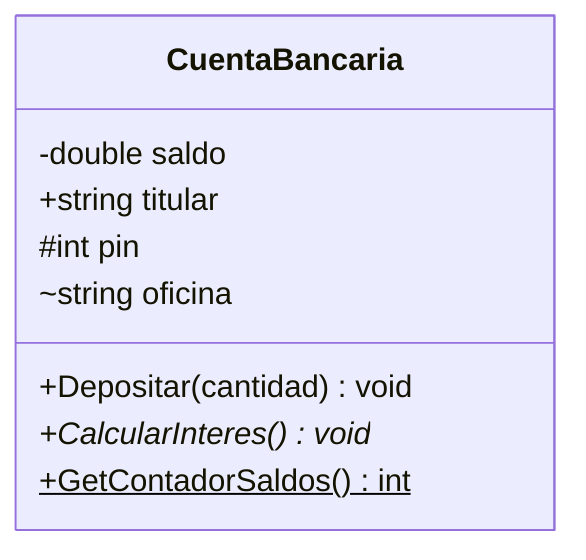
```mermaid
classDiagram
    class CuentaBancaria {
        -double saldo
        +string titular
        #int pin
        ~string oficina
        +Depositar(cantidad) void
        +CalcularInteres()* void
        +GetContadorSaldos()$ int
    }

```

### B. Tipos de Relaciones (Flechas)

Mermaid utiliza una sintaxis de "guiones" para definir la fuerza, el tipo y la navegabilidad de la conexión:

- **`Herencia`**: `` `<|--` `` → Una clase hereda de otra (B ES-UN A).
- **`Composición`**: `` `*--` `` → "Todo-Parte" fuerte. El parte no existe sin el todo.
- **`Agregación`**: `` `o--` `` → "Todo-Parte" débil. El parte puede existir sin el todo.
- **`Asociación`**: `` `-->` `` o `` `<-->` `` → Conexión simple. Puede ser unidireccional o bidireccional.
- **`Dependencia`**: `` `..>` `` → Uso puntual (normalmente en un método).
- **`Realización`**: `` `<|..` `` → Implementación de interfaz.

> 💡 **Navegabilidad:** Una flecha `--> ` significa que la clase origen conoce a la destino. Si usas `<-->` ambas clases se conocen mutuamente. En diseño profesional, prefiere relaciones unidireccionales para reducir acoplamiento.

#### B.1. Navegabilidad: Unidireccional vs Bidireccional

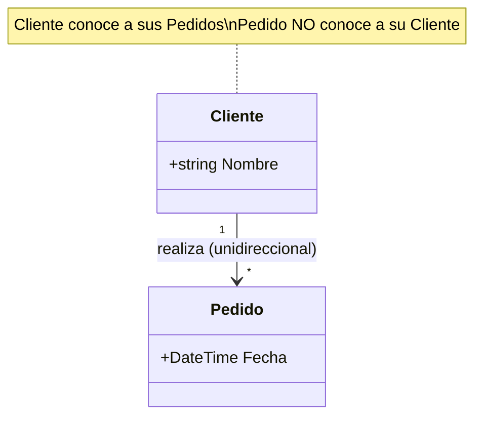
```mermaid
classDiagram
    class Cliente {
        +string Nombre
    }
    class Pedido {
        +DateTime Fecha
    }
    Cliente "1" --> "*" Pedido : realiza (unidireccional)
    note for Cliente "Cliente conoce a sus Pedidos\nPedido NO conoce a su Cliente"
```

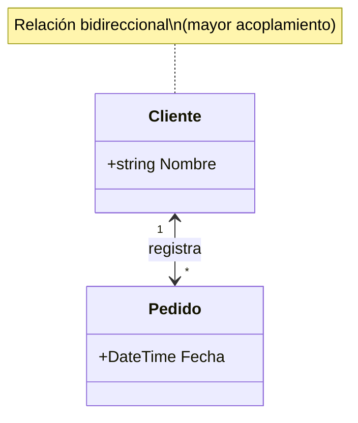
```mermaid
classDiagram
    class Cliente {
        +string Nombre
    }
    class Pedido {
        +DateTime Fecha
    }
    Cliente "1" <--> "*" Pedido : registra
    note for Cliente "Relación bidireccional\n(mayor acoplamiento)"
```

#### B.2. Multiplicidad

La multiplicidad indica cuántas instancias (cardinalidad mínima y máxima) participan en la relación:

- **`1`**: Exactamente uno. Ejemplo: `` Coche "1" *-- "4" Rueda ``
- **`0..1`**: Cero o uno (opcional). Ejemplo: `` Persona "0..1" -- "1" Permiso : tiene ``
- **`*`**: Cero o más (muchos). Ejemplo: `` Cliente "*" --> "*" Pedido : realiza ``
- **`1..*`**: Uno o más (al menos uno). Ejemplo: `` Equipo "1" o-- "1..*" Jugador : tiene ``
- **`0..*`**: Cero o más (igual que `*`, más explícito). Ejemplo: `` Cliente "0..*" --> "*" Direccion : tiene ``

> 📝 **Cardinalidad mínima y máxima:** El formato `m..n` permite definir ambos extremos:
> - Mínima: cuántas relaciones debe haber como mínimo (0 = opcional, 1 = obligatorio)
> - Máxima: cuántas relaciones puede haber como máximo (* = ilimitado)

#### B.3. Ejemplos Combinados (Relación + Multiplicidad)

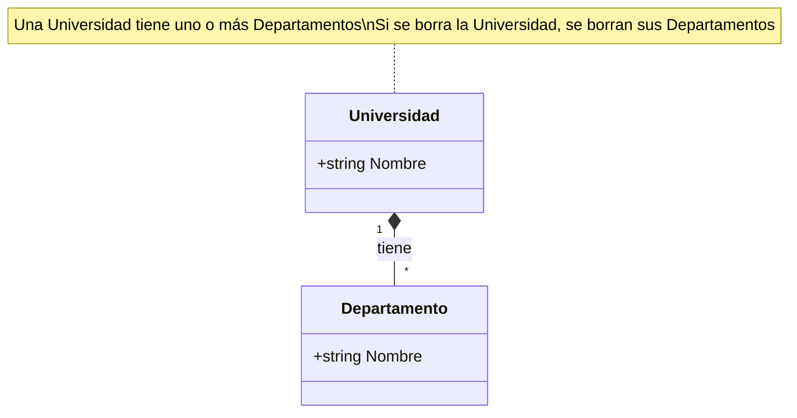
```mermaid
classDiagram
    class Universidad {
        +string Nombre
    }
    class Departamento {
        +string Nombre
    }
    Universidad "1" *-- "*" Departamento : tiene
    note for Universidad "Una Universidad tiene uno o más Departamentos\nSi se borra la Universidad, se borran sus Departamentos"
```

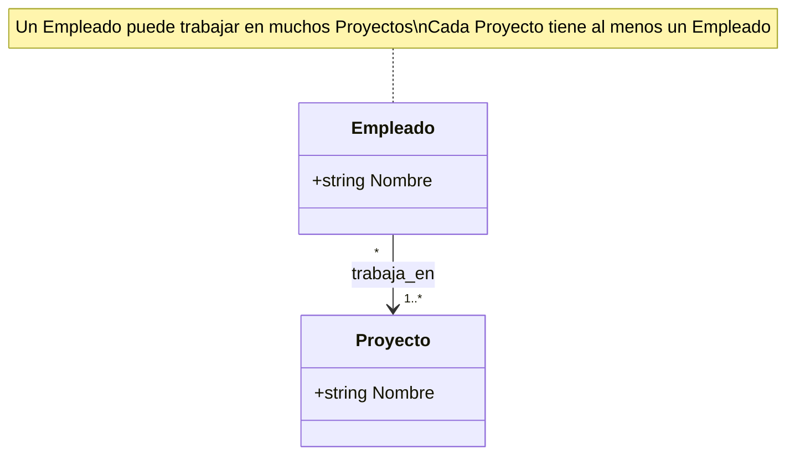
```mermaid
classDiagram
    class Empleado {
        +string Nombre
    }
    class Proyecto {
        +string Nombre
    }
    Empleado "*" --> "1..*" Proyecto : trabaja_en
    note for Empleado "Un Empleado puede trabajar en muchos Proyectos\nCada Proyecto tiene al menos un Empleado"
```

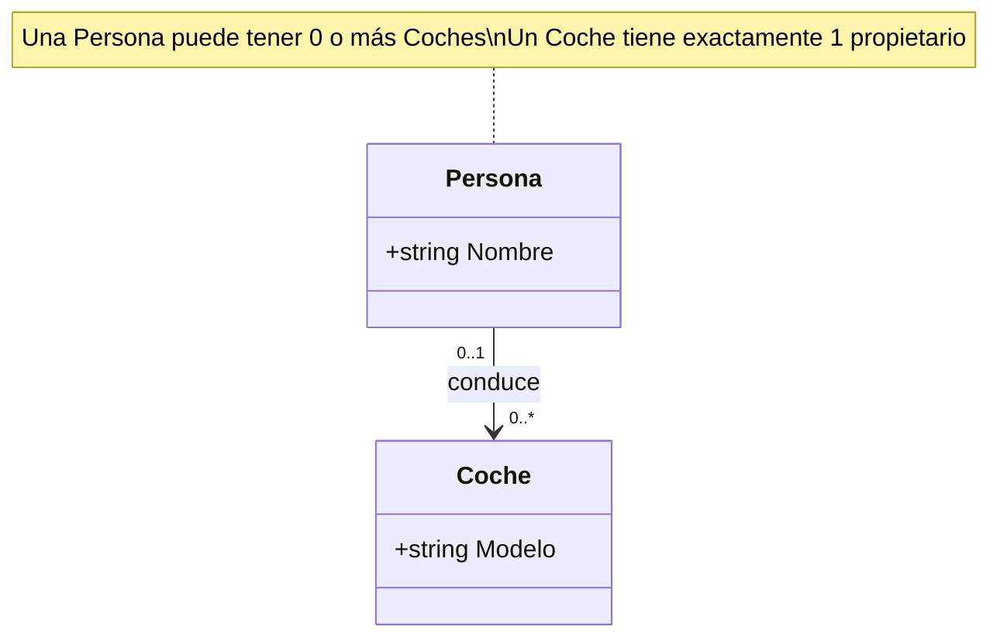
```mermaid
classDiagram
    class Persona {
        +string Nombre
    }
    class Coche {
        +string Modelo
    }
    Persona "0..1" --> "0..*" Coche : conduce
    note for Persona "Una Persona puede tener 0 o más Coches\nUn Coche tiene exactamente 1 propietario"
```

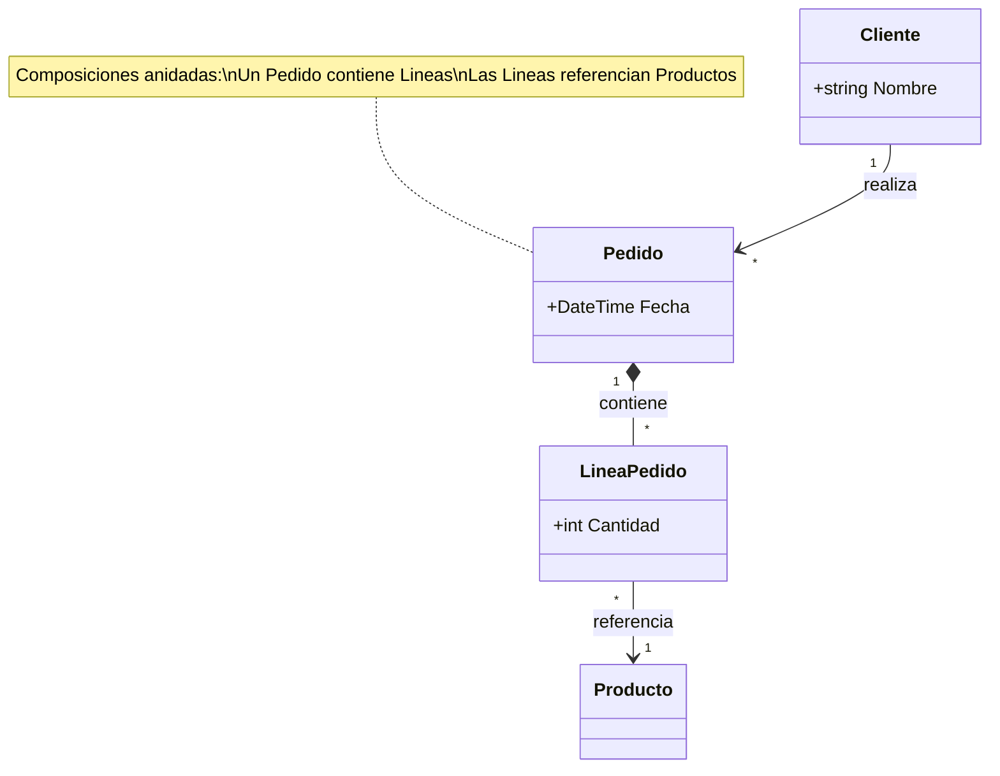
```mermaid
classDiagram
    class Cliente {
        +string Nombre
    }
    class Pedido {
        +DateTime Fecha
    }
    class LineaPedido {
        +int Cantidad
    }
    Cliente "1" --> "*" Pedido : realiza
    Pedido "1" *-- "*" LineaPedido : contiene
    LineaPedido "*" --> "1" Producto : referencia
    note for Pedido "Composiciones anidadas:\nUn Pedido contiene Lineas\nLas Lineas referencian Productos"
```

### C. Multiplicidad y Etiquetas

Se colocan entre comillas dobles al principio y al final de la relación:

```
ClaseA "1" *-- "many" ClaseB : etiqueta
```

**Ejemplo completo con etiquetas:**

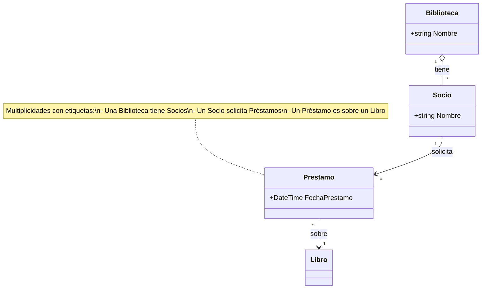
```mermaid
classDiagram
    class Biblioteca {
        +string Nombre
    }
    class Socio {
        +string Nombre
    }
    class Prestamo {
        +DateTime FechaPrestamo
    }
    Biblioteca "1" o-- "*" Socio : tiene
    Socio "1" --> "*" Prestamo : solicita
    Prestamo "*" --> "1" Libro : sobre
    note for Prestamo "Multiplicidades con etiquetas:\n- Una Biblioteca tiene Socios\n- Un Socio solicita Préstamos\n- Un Préstamo es sobre un Libro"
```

> 📝 **Regla nemotécnica:** "El número va donde miras". Si pones `"1"` en el origen y `"*"` en el destino, significa "1 origen puede tener muchos destinos".

> 💡 **Consejo del Examinador:** En el examen, dibuja primero las multiplicidades más restrictivas (los `1`) y luego las opcionales (`0..1`). Si una relación es "posee" o "contiene", piensa en composición (`*--`). Si es "agrupa" o "reúne", piensa en agregación (`o--`). Si es "usa" o "necesita temporalmente", piensa en dependencia (`..>`).

---

## 6.3. Anotaciones y Estereotipos (Metadata)

Para indicar que algo no es una clase normal (sino una interfaz o un enum), usamos los **Labels**:

* `<<interface>>`: Para contratos de métodos.
* `<<abstract>>`: Para clases que no se pueden instanciar.
* `<<enumeration>>`: Para listas de constantes.

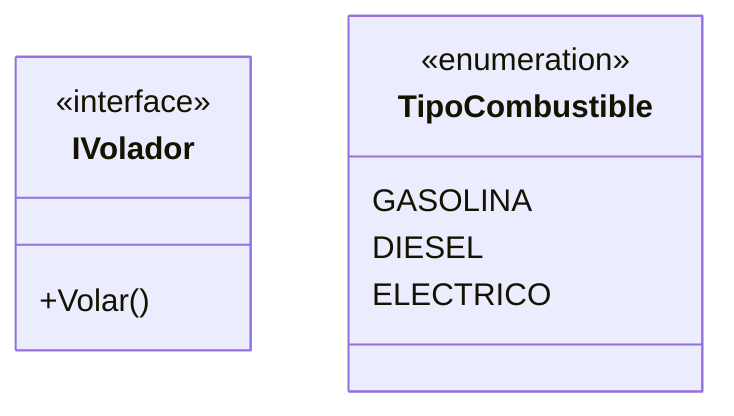
```mermaid
classDiagram
    class IVolador {
        <<interface>>
        +Volar()
    }
    class TipoCombustible {
        <<enumeration>>
        GASOLINA
        DIESEL
        ELECTRICO
    }

```

---

## 6.4. Tipos Genéricos (Templates)

En C#, usamos mucho las listas genéricas `List<T>`. Mermaid las representa usando tildes `~`:
`List~Alumno~ alumnos` se renderizará como `List<Alumno>`.

---

## 6.5. Potencia Máxima: Ejemplo de Aplicación Total

Este diagrama incluye **Direccionalidad**, **Genéricos**, **Navegabilidad** y **Clases Relación**.

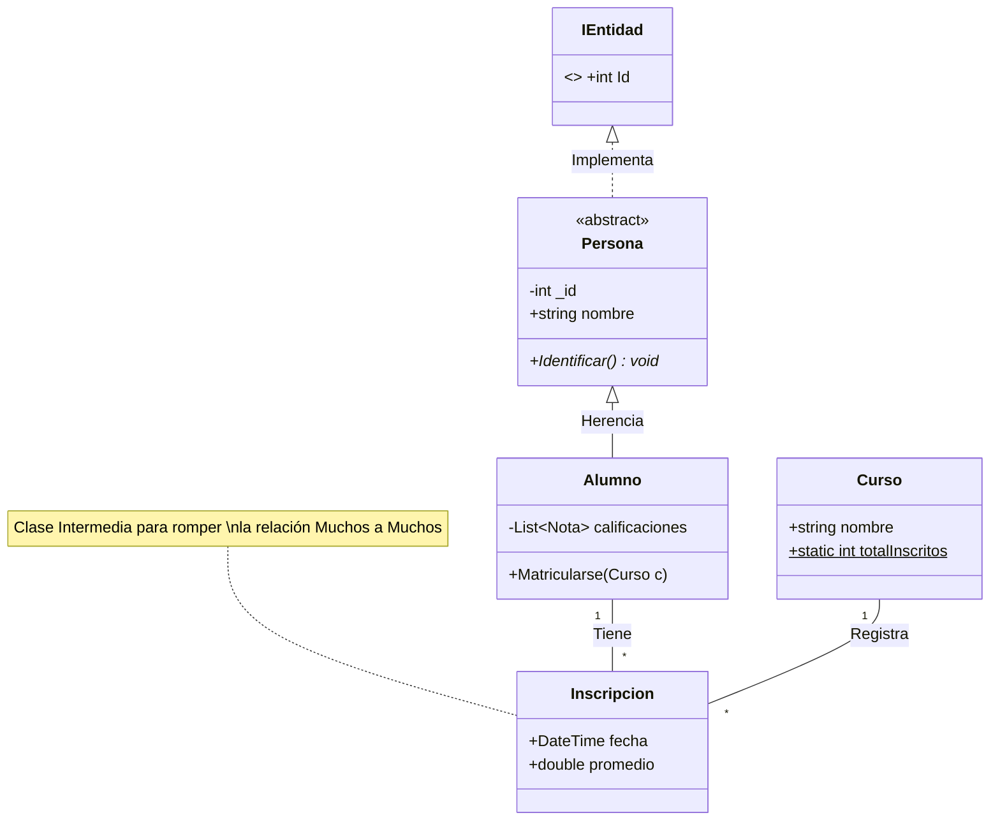
```mermaid
classDiagram
    direction TR %% Dirección de arriba a abajo
    
    class IEntidad { <<interface>> +int Id }

    class Persona {
        <<abstract>>
        -int _id
        +string nombre
        +Identificar()* void
    }

    class Alumno {
        -List~Nota~ calificaciones
        +Matricularse(Curso c)
    }

    class Curso {
        +string nombre
        +static int totalInscritos$
    }

    class Inscripcion {
        +DateTime fecha
        +double promedio
    }

    %% Relaciones complejas
    IEntidad <|.. Persona : Implementa
    Persona <|-- Alumno : Herencia
    Alumno "1" -- "*" Inscripcion : Tiene
    Curso "1" -- "*" Inscripcion : Registra
    
    note for Inscripcion "Clase Intermedia para romper \nla relación Muchos a Muchos"

```

---

## 6.6. Herramientas y Extensiones Profesionales

### Para Visual Studio Code:

1. **Mermaid Chart:** La extensión oficial. Permite editar visualmente y sincronizar con su plataforma. Puedes exportar a PNG, SVG, PDF.
2. **Markdown Preview Mermaid Support:** Imprescindible para ver los diagramas dentro de tus apuntes `.md`.
3. **Draw.io Integration:** Permite usar el motor de Draw.io (manual) dentro de VS Code.
4. **PlantUML:** Extensión para el lenguaje competidor (usa archivos `.puml`).

### Herramientas Visuales (No Code):

* **Draw.io (diagrams.net):** Herramienta gratuita perfecta para bocetos rápidos. Permite exportar en XML. Puedes integrarla en VS Code, GitHub y otras plataformas. https://app.diagrams.net/
* **StarUML.io:** Herramienta **CASE** (Computer Aided Software Engineering). No solo dibuja, genera código C# real a partir de tus diagramas. Es la herramienta que se usa cuando el diseño debe ser 100% riguroso. https://staruml.io/

---

## 6.7. Ejemplo: Sistema de Telemetría Avanzado (SmartCity)

Para cerrar, aplicamos todo en un sistema de sensores urbanos. El enunciado es el siguiente:
Si fuera como una historia de usuario:

> Tengo que  diseñar un sistema de telemetría para una ciudad inteligente. El sistema esta formado por varios nodos de red que pueden ser semáforos inteligentes o sensores de contaminación. Cada nodo debe poder enviar muchos datos a un centro de control. Los semáforos tienen diferentes estados (rojo, ámbar, verde) y los sensores deben poder leer valores de contaminación. El centro de control recibe datos de los nodos y puede procesarlos.


> Diseña un sistema de telemetría para una ciudad inteligente. El sistema debe incluir:
> - Una interfaz `ISensor` que defina un método `LeerValor()` para obtener datos del sensor.
> - Un `enum` llamado `EstadoSemaforo` con los valores `ROJO`, `AMBAR` y `VERDE`.
> - Una clase abstracta `NodoRed` que tenga un atributo `ip` y un método abstracto `EnviarDatos(data: string)`.
> - Una clase `SemaforoInteligente` que herede de `NodoRed` y tenga un atributo `estadoActual` de tipo `EstadoSemaforo`. Debe implementar el método `EnviarDatos`.
> - Una clase `SensorContaminacion` que implemente la interfaz `ISensor` y tenga un atributo `particulas` para almacenar el nivel de contaminación.
> - Una clase `CentroControl` que tenga un atributo `_entrada` de tipo `ISensor` y un constructor que reciba un objeto de tipo `ISensor` para la inyección de dependencias.

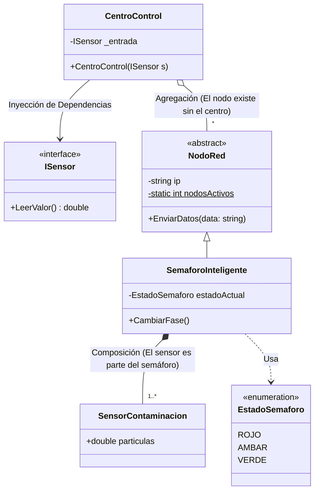
```mermaid
classDiagram
    class ISensor {
        <<interface>>
        +LeerValor() double
    }

    class EstadoSemaforo {
        <<enumeration>>
        ROJO
        AMBAR
        VERDE
    }

    class NodoRed {
        <<abstract>>
        -string ip
        -static int nodosActivos$
        +EnviarDatos(data: string)
    }

    class SemaforoInteligente {
        -EstadoSemaforo estadoActual
        +CambiarFase()
    }

    class SensorContaminacion {
        +double particulas
    }

    class CentroControl {
        -ISensor _entrada
        +CentroControl(ISensor s)
    }

    %% Estructura
    NodoRed <|-- SemaforoInteligente
    SemaforoInteligente *-- "1..*" SensorContaminacion : Composición (El sensor es parte del semáforo)
    CentroControl o-- "*" NodoRed : Agregación (El nodo existe sin el centro)
    CentroControl --> ISensor : Inyección de Dependencias
    SemaforoInteligente ..> EstadoSemaforo : Usa

```

---