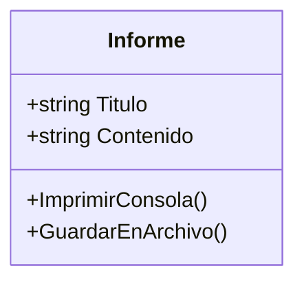
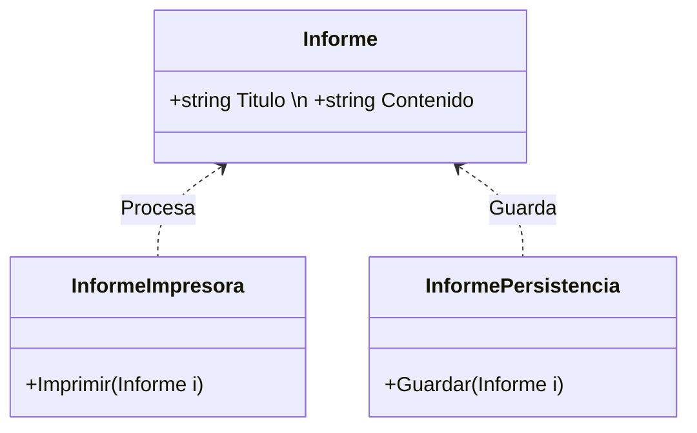
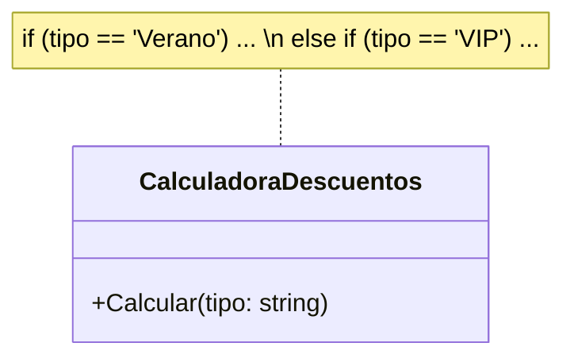
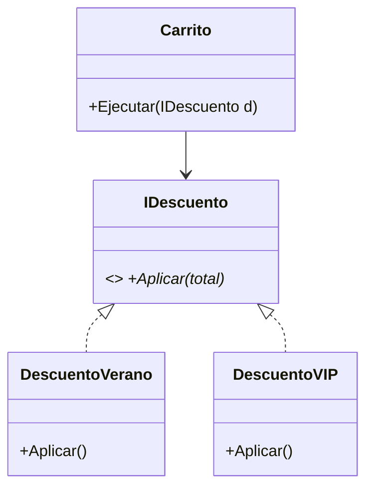
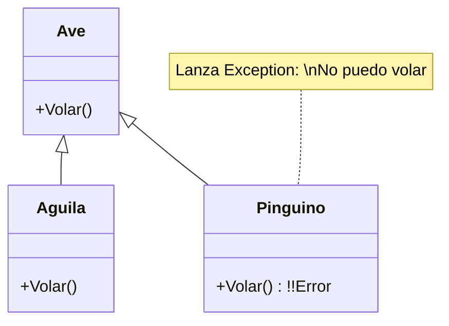
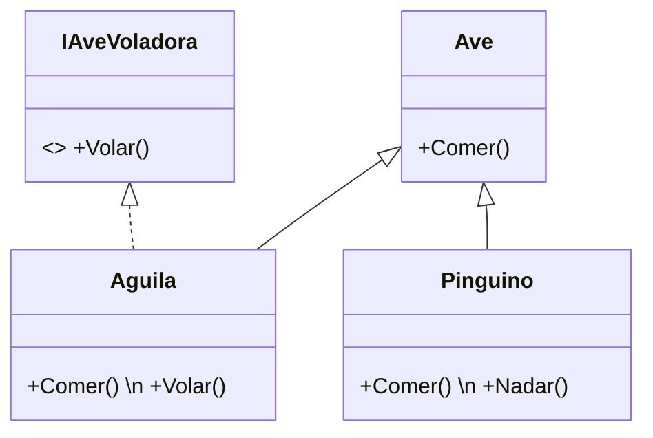
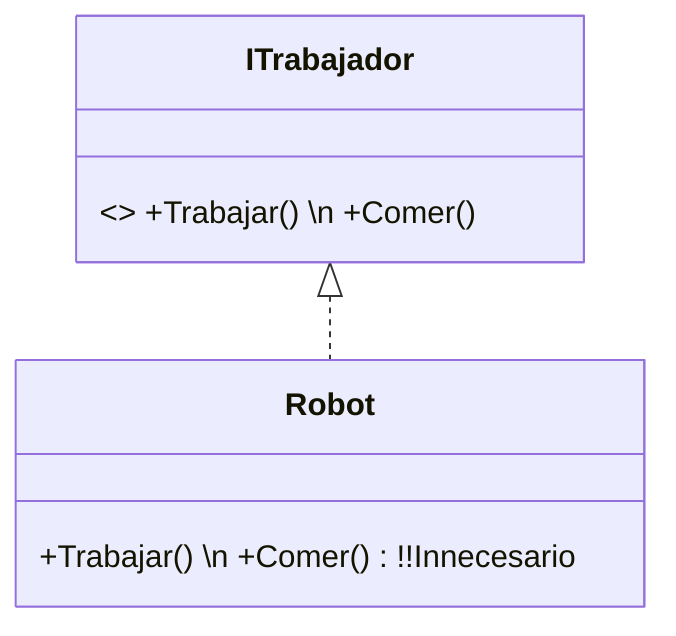
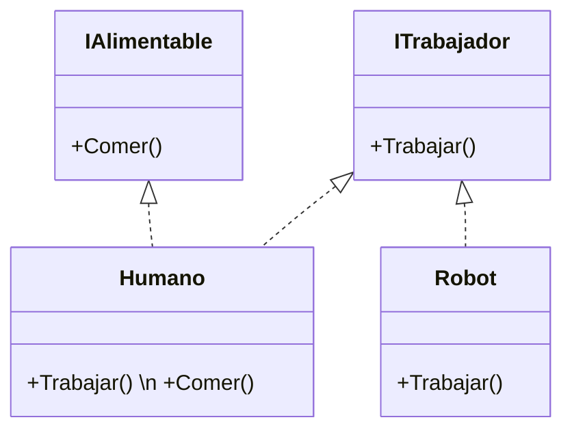
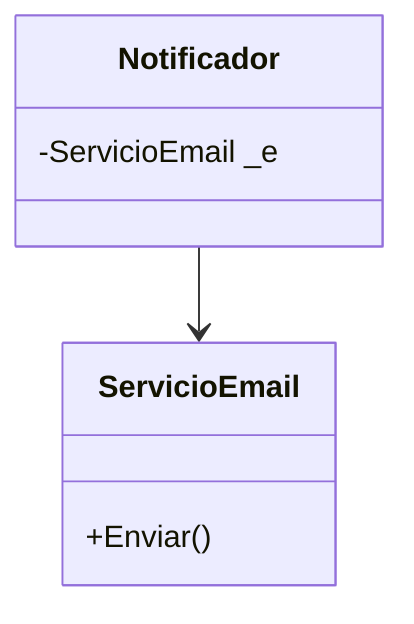
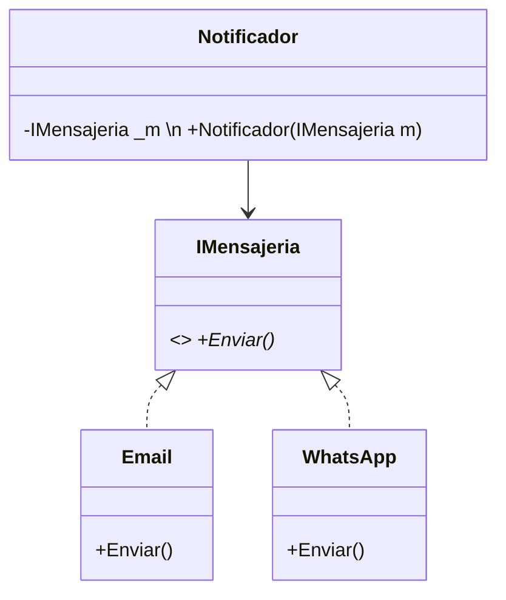

- [8. Principios SOLID: Contraejemplos y Soluciones](#8-principios-solid-contraejemplos-y-soluciones)
  - [8.1. S: Single Responsibility (Responsabilidad Única)](#81-s-single-responsibility-responsabilidad-única)
    - [❌ El Error (Clase Dios)](#-el-error-clase-dios)
    - [✅ La Solución (Especialización)](#-la-solución-especialización)
  - [8.2. O: Open/Closed (Abierto/Cerrado)](#82-o-openclosed-abiertocerrado)
    - [❌ El Error (El "if" infinito)](#-el-error-el-if-infinito)
    - [✅ La Solución (Abstracción)](#-la-solución-abstracción)
  - [8.3. L: Liskov Substitution (Sustitución de Liskov)](#83-l-liskov-substitution-sustitución-de-liskov)
    - [❌ El Error (El Pingüino que no vuela)](#-el-error-el-pingüino-que-no-vuela)
    - [✅ La Solución (Jerarquía por Capacidades)](#-la-solución-jerarquía-por-capacidades)
  - [8.4. I: Interface Segregation (Segregación de Interfaces)](#84-i-interface-segregation-segregación-de-interfaces)
    - [❌ El Error (Interfaz Gorda)](#-el-error-interfaz-gorda)
    - [✅ La Solución (Interfaces Atómicas)](#-la-solución-interfaces-atómicas)
  - [8.5. D: Dependency Inversion (Inversión de Dependencias)](#85-d-dependency-inversion-inversión-de-dependencias)
    - [❌ El Error (Soldado a la tecnología)](#-el-error-soldado-a-la-tecnología)
    - [✅ La Solución (Inyección de Dependencia)](#-la-solución-inyección-de-dependencia)
  - [📝 Resumen y Checklist de Supervivencia SOLID](#-resumen-y-checklist-de-supervivencia-solid)
    - [Checklist Antes de Entregar](#checklist-antes-de-entregar)


# 8. Principios SOLID: Contraejemplos y Soluciones

> 📝 **Nota del Profesor:** SOLID no es solo una lista de reglas para memorizar. Es una forma de pensar sobre el diseño. Cuando termines este tema, cada vez que escribas una clase pregúntate: "¿Esta clase tiene una sola responsabilidad? ¿Se puede extender sin modificar? ¿Sus subclases son intercambiables?" Si la respuesta es sí, estás diseñando bien.

El diseño orientado a objetos profesional se basa en identificar "olores de código" (malas prácticas) y aplicar refactorizaciones basadas en estos cinco principios.

Los principios **SOLID** nos ayudan a crear sistemas más mantenibles, escalables, robustos y limpios. Además, facilitan el trabajo en equipo y la comprensión del código a largo plazo.

Los principios son:
- **S:** Single Responsibility Principle (Responsabilidad Única)
- **O:** Open/Closed Principle (Abierto/Cerrado)
- **L:** Liskov Substitution Principle (Sustitución de Liskov)
- **I:** Interface Segregation Principle (Segregación de Interfaces)
- **D:** Dependency Inversion Principle (Inversión de Dependencias)

---

## 8.1. S: Single Responsibility (Responsabilidad Única)

> 💡 **Truco del Analista:** Cuando revises tu código, cuenta las razones por las que una clase podría cambiar. Si puedes pensar en más de una, probablemente viola SRP. Por ejemplo: una clase `Usuario` que guarda datos Y envía emails Y genera informes = 3 responsabilidades = 3 clases distintas.

**"Una clase debe tener una sola razón para cambiar"**. Esto significa que cada clase debe encargarse de una única funcionalidad o responsabilidad dentro del sistema.

### ❌ El Error (Clase Dios)

Una clase que gestiona los datos de un `Informe`, pero también sabe cómo formatearlo para pantalla y cómo guardarlo en un archivo. Si el formato de guardado cambia, la clase `Informe` se ve afectada innecesariamente.

* **Mermaid (Mal):**



* **Código C# (Mal):**

```csharp
// VIOLACIÓN DE SRP: Esta clase hace TODO
public class Informe
{
    public string Titulo { get; set; }
    public string Contenido { get; set; }
    
    // Responsabilidad 1: Datos
    public void ImprimirConsola() { /* ... */ }
    
    // Responsabilidad 2: Persistencia
    public void GuardarEnArchivo() { /* ... */ }
    
    // Problema: Si cambia el formato de impresión, esta clase cambia
    // Si cambia la BD, esta clase cambia
}
```

### ✅ La Solución (Especialización)

Separamos la lógica de datos de la lógica de servicios.

* **Mermaid (Bien):**



* **Código C# (Bien):**

```csharp
// Clase con UNA responsabilidad: solo datos
public class Informe
{
    public string Titulo { get; set; }
    public string Contenido { get; set; }
}

// Nueva clase: solo impresión
public class InformeImpresora
{
    public void Imprimir(Informe informe) { /* ... */ }
}

// Nueva clase: solo persistencia
public class InformePersistencia
{
    public void Guardar(Informe informe) { /* ... */ }
}

// Ahora cada clase tiene UNA razón para cambiar
```

> 📝 **Regla nemotécnica:** "S de Solo Una Cosa". Piensa en las clases como trabajadores especializados. Un fontanero no electricista. Un profesor no administrativo. Cada uno tiene su trabajo específico.

---

## 8.2. O: Open/Closed (Abierto/Cerrado)

> 💡 **La trampa del programador junior:** El código con muchos `if` o `switch` para determinar el comportamiento parece rápido de escribir, pero es el peor enemigo de la mantenibilidad. Cada vez que necesitas un nuevo tipo, tienes que abrir el código existente y arriesgarte a romper algo que ya funcionaba.

**"Abierto para extensión, cerrado para modificación"**. Significa que una clase debe permitir la adición de nuevas funcionalidades sin necesidad de modificar su código fuente existente o romper su comportamiento actual.

### ❌ El Error (El "if" infinito)

Si queremos añadir un nuevo tipo de descuento, tenemos que entrar en la clase `CalculadoraDescuentos` y añadir otro `else if`. Esto rompe el código cada vez que el negocio crece.

* **Mermaid (Mal):**



* **Código C# (Mal):**

```csharp
// VIOLACIÓN DE OCP: Cada nuevo tipo require modificar esta clase
public class CalculadoraDescuentos
{
    public decimal Calcular(string tipo, decimal total)
    {
        if (tipo == "Verano")
            return total * 0.10m;
        else if (tipo == "VIP")
            return total * 0.20m;
        else if (tipo == "Navidad")  // ¡NUEVO TIPO = NUEVO IF!
            return total * 0.15m;
        
        return 0;
    }
}
// Problema: Esta clase está ABIERTA a modificación (debes cambiarla)
```

### ✅ La Solución (Abstracción)

Creamos una interfaz o clase abstracta. Para un nuevo descuento, solo creamos una nueva clase.

* **Mermaid (Bien):**



* **Código C# (Bien):**

```csharp
// Interfaz: contrato abierto a extensión
public interface IDescuento
{
    decimal Aplicar(decimal total);
}

// Nuevos descuentos: crean nuevas clases, NO modifican existentes
public class DescuentoVerano : IDescuento
{
    public decimal Aplicar(decimal total) => total * 0.10m;
}

public class DescuentoVIP : IDescuento
{
    public decimal Aplicar(decimal total) => total * 0.20m;
}

// Para añadir Navidad, ¡creas DescuentoNavidad sin tocar esta clase!
public class Carrito
{
    private readonly IDescuento _descuento;
    
    public Carrito(IDescuento descuento)  // Inyección de dependencia
    {
        _descuento = descuento;
    }
    
    public decimal Ejecutar(decimal total)
    {
        return total - _descuento.Aplicar(total);
    }
}
// Esta clase está CERRADA a modificación, ABIERTA a extensión
```

> 📝 **Ejercicio de examen:**cómo crearías un sistema de notificaciones donde puedas añadir nuevos canales (Email, SMS, Slack, Push) sin modificar la clase `Notificador` existente.

---

## 8.3. L: Liskov Substitution (Sustitución de Liskov)

> 💡 **El problema del pingüino:** Este es EL ejemplo más famoso de violación de LSP. Si tu diagrama tiene un `Pinguino` que hereda de `Ave` pero lanza una excepción en `Volar()`, tienes un problema de diseño. LSP te obliga a pensar: "¿Puedo usar esta subclase en cualquier lugar donde se espere la clase padre?" Si la respuesta es "a veces sí, a veces no", estás violando Liskov.

**"Las clases hijas deben poder sustituir a sus padres sin romper el sistema"**. Esto significa que cualquier instancia de una clase base debe poder ser reemplazada por una instancia de una clase derivada sin alterar el correcto funcionamiento del programa.

### ❌ El Error (El Pingüino que no vuela)

Si heredas `Pinguino` de `Ave`, y el padre tiene el método `Volar()`, el programa fallará cuando intentes hacer volar a todos los pájaros de una lista.

* **Mermaid (Mal):**



* **Código C# (Mal):**

```csharp
// VIOLACIÓN DE LSP: Pinguino NO puede sustituir a Ave
public class Ave
{
    public virtual void Volar() { /* ... */ }
}

public class Aguila : Ave
{
    public override void Volar() { /* vuela */ }
}

public class Pinguino : Ave
{
    public override void Volar()
    {
        throw new NotImplementedException("No puedo volar");
    }
}

// En algún lugar del código:
var aves = new List<Ave> { new Aguila(), new Pinguino() };
foreach (var ave in aves)
{
    ave.Volar();  // CRASH con Pinguino!
}
```

> 📝 **Pregunta de examen:** ¿Qué principio está violando este diseño? ¿Cómo lo corregirías usando interfaces?

### ✅ La Solución (Jerarquía por Capacidades)

Separamos las aves por sus capacidades reales mediante interfaces o subclases intermedias.

* **Mermaid (Bien):**



* **Código C# (Bien):**

```csharp
// Clase base con comportamiento común
public class Ave
{
    public void Comer() { /* ... */ }
}

// Interfaz para capacidad específica
public interface IAveVoladora
{
    void Volar();
}

// Ahora Pinguino NO está obligado a implementar Volar()
public class Pinguino : Ave
{
    public void Nadar() { /* ... */ }
}

public class Aguila : Ave, IAveVoladora  // Solo las que pueden volar implementan
{
    public void Volar() { /* vuela */ }
}

// Ahora el código es seguro:
var aves = new List<Ave> { new Aguila(), new Pinguino() };
foreach (var ave in aves)
    ave.Comer();  // ¡Todos pueden Comer()!

var voladores = new List<IAveVoladora> { new Aguila() };  // Solo AGUILA
```

> 📝 **Nota del Profesor:** La solución con interfaces es más flexible que crear subclases intermedias como `AveVoladora` y `AveNoVoladora`. ¿Por qué? Porque una misma ave podría implementar múltiples capacidades en el futuro (por ejemplo, `IAveVoladora` + `IAveNadadora`).

---

## 8.4. I: Interface Segregation (Segregación de Interfaces)

> 💡 **Analogía del cliente exigente:** Es mejor pedirle a un restaurante "una pizza + una ensalada" que pedirle "un menú completo que incluye pizza, ensalada, bebida Y postre cuando solo quieres pizza". Interfaces pequeñas = clientes felices.

**"Mejor muchas interfaces pequeñas que una sola muy grande"**. Significa que los clientes no deben verse obligados a depender de interfaces que no utilizan. En lugar de una interfaz monolítica, es preferible tener varias interfaces específicas para cada conjunto de funcionalidades. De hecho podemos componer interfaces, creando nuevas interfaces a partir de otras ya existentes o que un clase implemente varias interfaces pequeñas.

### ❌ El Error (Interfaz Gorda)

Una interfaz `ITrabajador` que obliga a un `Robot` a implementar el método `Comer()`.

* **Mermaid (Mal):**



* **Código C# (Mal):**

```csharp
// VIOLACIÓN DE ISP: Interfaz "gorda" con métodos innecesarios
public interface ITrabajador
{
    void Trabajar();
    void Comer();  // ¡Los robots NO comen!
}

public class Robot : ITrabajador
{
    public void Trabajar() { /* trabaja */ }
    
    public void Comer()  // Método inútil
    {
        throw new NotImplementedException("Soy un robot, no como");
    }
}
```

### ✅ La Solución (Interfaces Atómicas)

Dividimos las responsabilidades. El robot solo implementa lo que realmente hace.

* **Mermaid (Bien):**



* **Código C# (Bien):**

```csharp
// Interfaces pequeñas y específicas
public interface ITrabajador
{
    void Trabajar();
}

public interface IAlimentable
{
    void Comer();
}

// Humano implementa ambas
public class Humano : ITrabajador, IAlimentable
{
    public void Trabajar() { /* ... */ }
    public void Comer() { /* ... */ }
}

// Robot solo implementa lo que necesita
public class Robot : ITrabajador
{
    public void Trabajar() { /* ... */ }
    // ¡No tiene método Comer() inútil!
}
```

> 📝 **Regla de oro:** Si al implementar una interfaz tienes métodos que lanzan `NotImplementedException` o están vacíos, probablemente esa interfaz es demasiado grande y necesita segregarse.

---

## 8.5. D: Dependency Inversion (Inversión de Dependencias)

> 💡 **El acoplador silencioso:** Cuando haces `new MiClaseConcreta()` dentro de otra clase, estás creando un acoplamiento fuerte. El código queda "soldado" a esa implementación. Invertir la dependencia es como usar un enchufe: puedes cambiar la电器 (implementación) sin tirar del cableado (el resto del sistema).

**"Depende de interfaces, no de clases concretas"**. Significa que los módulos de alto nivel no deben depender de módulos de bajo nivel; ambos deben depender de abstracciones (interfaces o clases abstractas). Además, las abstracciones no deben depender de detalles concretos; los detalles concretos deben depender de abstracciones.

### ❌ El Error (Soldado a la tecnología)

Un `SistemaNotificacion` que instancia directamente un `ServicioEmail`. Si queremos cambiar a WhatsApp, tenemos que modificar el sistema entero.

* **Mermaid (Mal):**



* **Código C# (Mal):**

```csharp
// VIOLACIÓN DE DIP: Acoplado a una implementación concreta
public class ServicioEmail
{
    public void Enviar(string mensaje) { /* envía email */ }
}

// Notificador está "soldado" a ServicioEmail
public class Notificador
{
    private readonly ServicioEmail _emailService;
    
    public Notificador()
    {
        _emailService = new ServicioEmail();  // ¡ACOPLAMIENTO FUERTE!
    }
    
    public void Notify(string mensaje)
    {
        _emailService.Enviar(mensaje);
    }
}

// Problema: Si queremos usar WhatsApp, hay que reescribir Notificador
```

### ✅ La Solución (Inyección de Dependencia)

El notificador pide "algo que sepa enviar mensajes", sin importar qué sea.

* **Mermaid (Bien):**



* **Código C# (Bien):**

```csharp
// Abstracción: depende de interface, no de concreción
public interface IMensajeria
{
    void Enviar(string mensaje);
}

// Implementaciones concretas
public class Email : IMensajeria
{
    public void Enviar(string mensaje) { /* envía email */ }
}

public class WhatsApp : IMensajeria
{
    public void Enviar(string mensaje) { /* envía WhatsApp */ }
}

// Notificador depende de abstracción, puede usar CUALQUIER implementación
public class Notificador
{
    private readonly IMensajeria _mensajeria;
    
    // Inyección por constructor: la dependencia se "inyecta" desde fuera
    public Notificador(IMensajeria mensajeria)
    {
        _mensajeria = mensajeria;
    }
    
    public void Notify(string mensaje)
    {
        _mensajeria.Enviar(mensaje);
    }
}

// Uso flexible:
// var notificador = new Notificador(new Email());
// var notificador = new Notificador(new WhatsApp());
// Sin cambiar Notificador, cambio el comportamiento
```

> 📝 **Truco del Examinador:** En el examen, si ves que una clase crea directamente `new` de otra clase concreta, probablemente estés ante una violación de DIP. La solución es usar inyección de dependencias (constructor o setter).

---

## 📝 Resumen y Checklist de Supervivencia SOLID

| Principio | Pregunta Clave | Violación Común |
|-----------|----------------|-----------------|
| **S** (SRP) | ¿Esta clase tiene una sola razón para cambiar? | God Class que lo hace todo |
| **O** (OCP) | ¿Puedo añadir nuevos comportamientos sin tocar código existente? | Cadena infinita de `if/else` o `switch` |
| **L** (LSP) | ¿Puedo usar cualquier subclase donde se espere la clase padre? | Pingüino que no puede volar |
| **I** (ISP) | ¿Tienen las clases métodos innecesarios de sus interfaces? | Interfaz "gorda" con métodos vacíos |
| **D** (DIP) | ¿Dependo de abstracciones, no de concreciones? | `new MiClaseConcreta()` por todas partes |

### Checklist Antes de Entregar

- [ ] Cada clase hace UNA cosa (SRP)
- [ ] Si necesito un nuevo tipo, creo una nueva clase, no modifico código (OCP)
- [ ] Las subclases son verdaderamente intercambiables (LSP)
- [ ] Las interfaces son pequeñas y específicas (ISP)
- [ ] Las dependencias se inyectan, no se instancian (DIP)

> 💡 **Consejo Final:** SOLID no son reglas absolutas, son guías. A veces, sobre-diseñar con interfaces puede ser contraproducente. Usa el sentido común y el contexto del proyecto.