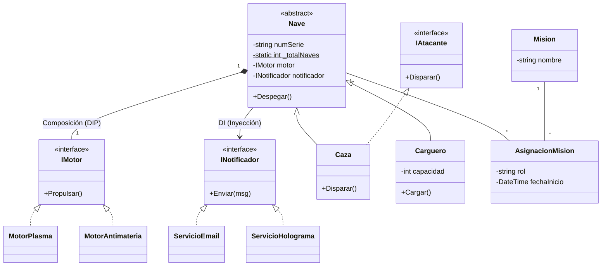
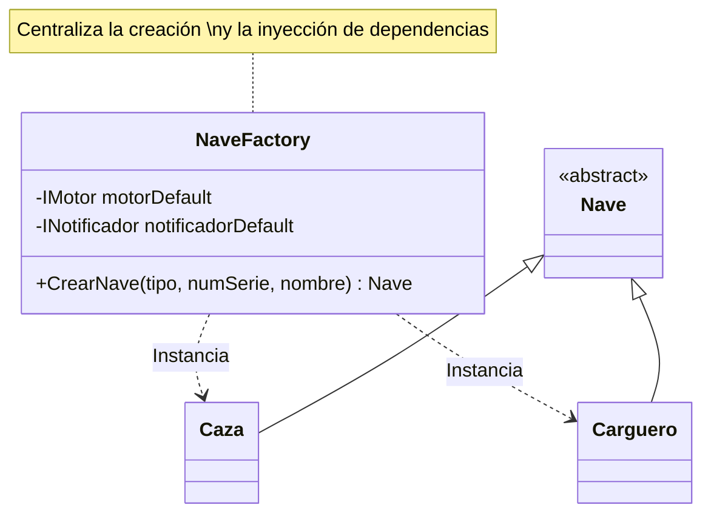

- [9. El Sistema de Gestión de Flotas Intergalácticas (StarFleet Manager)](#9-el-sistema-de-gestión-de-flotas-intergalácticas-starfleet-manager)
  - [9.1. El Enunciado](#91-el-enunciado)
  - [9.2. Análisis Párrafo por Párrafo (Detección de Errores y Soluciones)](#92-análisis-párrafo-por-párrafo-detección-de-errores-y-soluciones)
    - [Párrafo 1: Las Naves (Herencia y Miembros Estáticos)](#párrafo-1-las-naves-herencia-y-miembros-estáticos)
    - [Párrafo 2: Comportamientos Específicos (Liskov e Interfaces)](#párrafo-2-comportamientos-específicos-liskov-e-interfaces)
    - [Párrafo 3: El Motor (Composición e Inyección de Dependencias)](#párrafo-3-el-motor-composición-e-inyección-de-dependencias)
    - [Párrafo 4: Misiones (Muchos a Muchos)](#párrafo-4-misiones-muchos-a-muchos)
    - [Párrafo 5: Notificaciones (DIP y OCP)](#párrafo-5-notificaciones-dip-y-ocp)
  - [9.3. Diagrama de Clases Final (Propuesta Correcta)](#93-diagrama-de-clases-final-propuesta-correcta)
    - [Representación en Mermaid](#representación-en-mermaid)
  - [9.4. Análisis de Aplicación SOLID en la Solución](#94-análisis-de-aplicación-solid-en-la-solución)
  - [9.5. Implementación StarFleet Manager](#95-implementación-starfleet-manager)
    - [Análisis técnico de la sintaxis C#](#análisis-técnico-de-la-sintaxis-c)
    - [¿Cómo ver esto en el Diagrama UML?](#cómo-ver-esto-en-el-diagrama-uml)
  - [9.6. Aplicando Factory](#96-aplicando-factory)
    - [1. ¿Por qué usar un Factory en nuestro sistema?](#1-por-qué-usar-un-factory-en-nuestro-sistema)
    - [2. Implementación en C#](#2-implementación-en-c)
    - [3. Representación en Mermaid](#3-representación-en-mermaid)
    - [5. Análisis SOLID del Factory](#5-análisis-solid-del-factory)


# 9. El Sistema de Gestión de Flotas Intergalácticas (StarFleet Manager)

## 9.1. El Enunciado

"La Flota necesita un sistema para gestionar sus **Naves**. Existen dos tipos de naves: **Cazas de Combate** y **Cargueros**. Todas las naves tienen un número de serie único, un nombre y una función para `Despegar()`.

Los **Cazas** pueden además `Disparar()`, mientras que los **Cargueros** tienen una capacidad de carga y pueden `CargarMercancía()`. Se sabe que el sistema debe contar en todo momento cuántas naves totales hay en la flota.

Para funcionar, cada Nave debe tener un **Motor**. El motor es una pieza crítica: si la nave se destruye, el motor también. Existen motores de **Plasma** y de **Antimateria**. Al construir la nave, se le debe asignar un tipo de motor, pero el sistema debe permitir cambiar el modelo de motor en el futuro sin rediseñar la nave.

Las Naves realizan **Misiones**. Una Nave puede participar en muchas Misiones, y una Misión puede tener muchas Naves asignadas. De cada participación, nos interesa saber el **Rol** de la nave en esa misión (ej. 'Explorador', 'Escolta') y la **Fecha de Inicio**.

Por último, el sistema debe enviar **Notificaciones** al Almirantazgo cada vez que una nave despega. Actualmente se usa Email, pero en el futuro se usará Holograma."

---

## 9.2. Análisis Párrafo por Párrafo (Detección de Errores y Soluciones)

### Párrafo 1: Las Naves (Herencia y Miembros Estáticos)

* **Análisis:** "Cazas y Cargueros son tipos de Naves".
* **❌ Error común:** Hacer `Nave` como clase normal.
* **✅ Solución:** `Nave` debe ser **Abstracta** (no existe una nave "genérica" en el aire). El contador de naves totales debe ser un atributo **Estático** (`static int _totalNaves$`).
* **SOLID:** Cumplimos **OCP** (Abierto/Cerrado) al permitir crear nuevos tipos de naves (ej. 'Explorador') heredando de `Nave`.

### Párrafo 2: Comportamientos Específicos (Liskov e Interfaces)

* **Análisis:** "Cazas disparan, Cargueros cargan".
* **❌ Error común:** Poner `Disparar()` en la clase padre `Nave` y que el Carguero lance una excepción.
* **✅ Solución (Liskov):** Creamos una interfaz `IAtacante` para el método `Disparar()`. Solo el Caza la implementa.

### Párrafo 3: El Motor (Composición e Inyección de Dependencias)

* **Análisis:** "Si la nave muere, el motor muere" + "Cambiar motor sin rediseñar".
* **❌ Error común:** Que la `Nave` herede de `Motor` o que instancie el motor dentro del constructor (`_motor = new MotorPlasma()`).
* **✅ Solución (DIP):** Usar **Composición** (rombo negro) y **Inyección de Dependencias**. La `Nave` depende de una interfaz `IMotor`. El motor se pasa por constructor.

### Párrafo 4: Misiones (Muchos a Muchos)

* **Análisis:** "Nave - Misión (N:M) con atributos adicionales (Rol, Fecha)".
* **❌ Error común:** Listas directas de Misiones en Nave y Naves en Misión.
* **✅ Solución:** Crear la clase intermedia **AsignacionMision** que rompa la relación y guarde el `Rol` y la `Fecha`.

### Párrafo 5: Notificaciones (DIP y OCP)

* **Análisis:** "Hoy Email, mañana Holograma".
* **❌ Error común:** Escribir `EmailService.Send()` dentro del método `Despegar()`.
* **✅ Solución:** La Nave recibe un `INotificador` por inyección de dependencias.

---

## 9.3. Diagrama de Clases Final (Propuesta Correcta)

### Representación en Mermaid



**Código C# (Diseño completo):**

```csharp
using System;
using System.Collections.Generic;

// CONTRATOS (Interfaces)
public interface IMotor
{
    void Encender();
    void Apagar();
}

public interface INotificador
{
    void Notificar(string mensaje);
}

public interface IAtacante
{
    void Disparar();
}

// IMPLEMENTACIONES DE MOTOR
public class MotorPlasma : IMotor
{
    public void Encender() => Console.WriteLine("Motor Plasma: ¡BRUUUM!");
    public void Apagar() => Console.WriteLine("Motor Plasma: Apagado");
}

public class MotorAntimateria : IMotor
{
    public void Encender() => Console.WriteLine("Motor Antimateria: ¡WWWWHHHOOOOOSH!");
    public void Apagar() => Console.WriteLine("Motor Antimateria: Silencio");
}

// IMPLEMENTACIONES DE NOTIFICADOR
public class ServicioEmail : INotificador
{
    public void Notificar(string msg) => Console.WriteLine($"EMAIL: {msg}");
}

public class ServicioHolograma : INotificador
{
    public void Notificar(string msg) => Console.WriteLine($"HOLOGRAMA: {msg}");
}

// CLASE ABSTRACTA NAVE
public abstract class Nave
{
    protected string _codigo;
    protected string _nombre;
    protected IMotor _motor;
    protected INotificador _notificador;
    
    protected Nave(string codigo, string nombre, IMotor motor, INotificador notificador)
    {
        _codigo = codigo;
        _nombre = nombre;
        _motor = motor;
        _notificador = notificador;
    }
    
    public void Despegar()
    {
        _motor.Encender();
        _notificador.Notificar($"{_nombre} ({_codigo}) ha despegado");
    }
    
    public void Aterrizar()
    {
        _motor.Apagar();
    }
}

// ESPECIALIZACIÓN: Caza (implementa IAtacante)
public class Caza : Nave, IAtacante
{
    public Caza(string cod, string nom, IMotor m, INotificador n) 
        : base(cod, nom, m, n) { }
    
    public void Disparar() => Console.WriteLine("¡PUM! Misiles lanzados");
}

// ESPECIALIZACIÓN: Carguero (NO implementa IAtacante)
public class Carguero : Nave
{
    public int Capacidad { get; }
    
    public Carguero(string cod, string nom, IMotor m, INotificador n, int cap) 
        : base(cod, nom, m, n) { Capacidad = cap; }
    
    public void CargarMercancia() => Console.WriteLine("Cargando mercancia...");
}

// USO:
var motor = new MotorPlasma();
var notify = new ServicioHolograma();

var caza = new Caza("X-WING-01", "Red Five", motor, notify);
var carguero = new Carguero("MILL-FALC", "Millennium Falcon", motor, notify, 500);

caza.Despegar();
caza.Disparar();
carguero.CargarMercancia();
```

---

## 9.4. Análisis de Aplicación SOLID en la Solución

1. **S (Responsabilidad Única):** La `Nave` solo se encarga de su lógica de vuelo. El envío de mensajes lo delega a `INotificador` y la propulsión a `IMotor`.
2. **O (Abierto/Cerrado):** Podemos añadir un `MotorElectrico` simplemente implementando la interfaz `IMotor`, sin tocar una sola línea de la clase `Nave`.
3. **L (Sustitución de Liskov):** No forzamos al `Carguero` a tener un método `Disparar()`. La capacidad de ataque está segregada.
4. **I (Segregación de Interfaces):** `IAtacante` es una interfaz específica. Si hubiera naves que solo reparan, crearíamos `IReparador`.
5. **D (Inversión de Dependencias):** La `Nave` no sabe qué motor tiene (Plasma o Antimateria), solo sabe que tiene "algo" que cumple el contrato `IMotor`.

---

## 9.5. Implementación StarFleet Manager 

```csharp
using System;
using System.Collections.Generic;

// ==========================================
// TOP-LEVEL STATEMENTS (Lógica de ejecución)
// ==========================================

// 1. Configuración de dependencias (Instanciación)
IMotor motorPlasma = new MotorPlasma();
INotificador servicioHolograma = new ServicioHolograma();

// 2. Creación de naves usando inyección de dependencias
var miCaza = new Caza("X-WING-01", "Rojo 5", motorPlasma, servicioHolograma);
var miCarguero = new Carguero("MILL-FALC", "Halcón Milenario", motorPlasma, servicioHolograma, 500);

// 3. Uso de funcionalidades
miCaza.Despegar();
miCaza.Disparar();

miCarguero.CargarMercancia();

// 4. Gestión de Misiones (Muchos a Muchos)
Mision yavin = new() { Nombre = "Batalla de Yavin" };
AsignacionMision asignacion = new(miCaza, yavin, "Escolta");

Console.WriteLine($"\nAsignación: {asignacion.NaveAsignada.Nombre} como {asignacion.Rol} en {asignacion.MisionAsignada.Nombre}");
Console.WriteLine($"Naves totales registradas: {Nave.TotalNaves}");

// ==========================================
// DEFINICIÓN DE CLASES Y CONTRATOS
// ==========================================

public interface INotificador { 
    void Enviar(string m); 
}
public interface IMotor { 
    void Propulsar(); 
}
public interface IAtacante { 
    void Disparar(); 
}

// NAVE: Ejemplo de Primary Constructor vs Constructor Tradicional
// El Primary Constructor (string numSerie, ...) inyecta los parámetros en toda la clase.
public abstract class Nave(string numSerie, string nombre, IMotor motor, INotificador notificador)
{
    /* --- FORMA TRADICIONAL (C# 11 hacia atrás) ---
       private readonly IMotor _motor;
       private readonly INotificador _notificador;
       public string NumSerie { get; }
       public string Nombre { get; set; }

       public Nave(string numSerie, string nombre, IMotor motor, INotificador notificador) {
           NumSerie = numSerie;
           Nombre = nombre;
           _motor = motor;
           _notificador = notificador;
           _totalNaves++;
       }
    */

    // --- FORMA MODERNA (C# 12+) ---
    // Los campos se pueden inicializar directamente desde los parámetros del Primary Constructor
    public string NumSerie { get; } = numSerie;
    public string Nombre { get; set; } = nombre;
    
    private static int _totalNaves = 0;
    public static int TotalNaves => _totalNaves;

    // Bloque de inicialización para miembros estáticos
    static Nave() { } 
    
    // Al no tener un constructor explícito, usamos un truco de C# para contar:
    // En este caso, el contador se incrementa en las clases hijas o mediante un inicializador.
    private bool _counted = IncrementCounter();
    private static bool IncrementCounter() { 
        _totalNaves++; return true; 
    }

    public virtual void Despegar()
    {
        motor.Propulsar(); // 'motor' viene directamente del Primary Constructor
        notificador.Enviar($"Nave {Nombre} iniciando ignición.");
    }
}

// CAZA: Hereda y pasa parámetros al constructor base
public class Caza(string ns, string nom, IMotor m, INotificador n) 
    : Nave(ns, nom, m, n), IAtacante
{
    public void Disparar() => Console.WriteLine($"{Nombre} disparando ráfagas de láser.");
}

// CARGUERO: Añade parámetros propios al Primary Constructor
public class Carguero(string ns, string nom, IMotor m, INotificador n, int capacidad) 
    : Nave(ns, nom, m, n)
{
    public int Capacidad { get; } = capacidad;
    public void CargarMercancia() => Console.WriteLine($"{Nombre} cargando {Capacidad} toneladas.");
}

// IMPLEMENTACIONES CONCRETAS (MOTORES Y NOTIFICACIONES)
public class MotorPlasma : IMotor { 
    public void Propulsar() => Console.WriteLine(">>> Motor de Plasma zumbando."); 
}
public class ServicioHolograma : INotificador { 
    public void Enviar(string m) => Console.WriteLine($"[PROYECCIÓN 3D]: {m}"); 
}

// MUCHOS A MUCHOS: Clase Relación
public class Mision { 
    public string Nombre { get; init; } = ""; 
}

public class AsignacionMision(Nave nave, Mision mision, string rol)
{
    public Nave NaveAsignada { get; } = nave;
    public Mision MisionAsignada { get; } = mision;
    public string Rol { get; } = rol;
    public DateTime FechaInicio { get; } = DateTime.Now;
}

```

---

### Análisis técnico de la sintaxis C#

1. **Primary Constructors (Constructores Primarios):** Fíjate en `public class Caza(string ns, ...)`. Ya no necesitamos declarar campos privados `_motor` y asignar `this._motor = motor`. El parámetro `motor` está disponible en toda la clase automáticamente.
2. **Top-Level Statements:** El código empieza directamente con la lógica (instanciar el motor, crear la nave). No hay `class Program { static void Main() }`. Esto es el estándar en aplicaciones de consola modernas.
3. **Target-typed new (`new()`):** En la línea `Mision yavin = new()`, el compilador ya sabe que es una misión por el tipo de la izquierda.
4. **Read-only auto-properties:** Al usar `public string NumSerie { get; } = numSerie;`, la propiedad es de solo lectura y se asigna en el momento de la construcción.

### ¿Cómo ver esto en el Diagrama UML?

Aunque el código sea más corto, **el diagrama de clases resultante en Rider o Mermaid es el mismo**. El lenguaje cambia (es más eficiente), pero la arquitectura (la relación entre las cajas) permanece igual.

## 9.6. Aplicando Factory 
El patrón **Factory (Fábrica)** es un patrón de diseño creacional que soluciona el problema de instanciar objetos concretos sin tener que especificar la clase exacta en el código cliente. Es especialmente útil cuando la creación de objetos es compleja o cuando queremos abstraer el proceso de creación.

En lugar de hacer `new Caza(...)` por todo nuestro programa, le pedimos a una "Fábrica" que cree la nave por nosotros.

### 1. ¿Por qué usar un Factory en nuestro sistema?

1. **Desacoplamiento:** El programa principal no necesita saber cómo se construye un Caza o un Carguero, ni qué dependencias (motores, notuladores) requiere.
2. **Abstracción:** Si mañana el `Caza` necesita un tercer parámetro en su constructor, solo lo cambiamos en la Fábrica, no en 50 sitios del código.
3. **Control:** La fábrica puede decidir, según un parámetro, qué tipo de objeto devolver.

---

### 2. Implementación en C#

Vamos a crear una `NaveFactory` que centralice la creación. Usaremos un `enum` para evitar errores de escritura al pedir naves.

```csharp
using System;

// ==========================================
// TOP-LEVEL STATEMENTS
// ==========================================

// 1. Configuramos la fábrica con los servicios que usarán todas las naves
// Centralizamos aquí las dependencias (DIP)
IMotor motorComun = new MotorPlasma();
INotificador notificadorComun = new ServicioHolograma();
NaveFactory fabrica = new(motorComun, notificadorComun);

// 2. ¡Ya no usamos 'new Caza' o 'new Carguero'! 
// Delegamos la responsabilidad a la fábrica.
var miCaza = fabrica.CrearNave(TipoNave.Caza, "X-WING-PRO", "Líder Rojo");
var miCarguero = fabrica.CrearNave(TipoNave.Carguero, "HEAVY-SHIP", "Transporte Alpha", 1000);

miCaza?.Despegar();
miCarguero?.Despegar();

// ==========================================
// DEFINICIÓN DEL PATRÓN FACTORY
// ==========================================

public enum TipoNave { Caza, Carguero }

// La fábrica usa un Primary Constructor para recibir las dependencias comunes
public class NaveFactory(IMotor motorDefault, INotificador notificadorDefault)
{
    /* --- COMENTARIO PARA EL ALUMNO: Constructor Tradicional ---
    private readonly IMotor _motor;
    private readonly INotificador _notificador;
    public NaveFactory(IMotor m, INotificador n) {
        _motor = m; _notificador = n;
    }
    */

    public Nave? CrearNave(TipoNave tipo, string numSerie, string nombre, int capacidad = 0)
    {
        return tipo switch
        {
            TipoNave.Caza => new Caza(numSerie, nombre, motorDefault, notificadorDefault),
            TipoNave.Carguero => new Carguero(numSerie, nombre, motorDefault, notificadorDefault, capacidad),
            _ => throw new ArgumentException("Tipo de nave no reconocido")
        };
    }
}

```

---

### 3. Representación en Mermaid

El patrón Factory añade una nueva clase que "conoce" a todas las demás para poder crearlas. En UML se representa con una flecha de **Dependencia** (línea discontinua) hacia las clases que instancia.



---

### 5. Análisis SOLID del Factory

* **S (Responsabilidad Única):** Hemos quitado al `Program` (cliente) la responsabilidad de saber configurar naves. Ahora solo la tiene la `NaveFactory`.
* **D (Inversión de Dependencias):** La fábrica inyecta el motor y el notificador automáticamente. El cliente ni siquiera sabe que las naves necesitan un motor para ser creadas.
* **Encapsulamiento:** Si el día de mañana queremos que todos los `Cazas` salgan con un `MotorAntimateria` por defecto, solo cambiamos una línea dentro de la fábrica.

