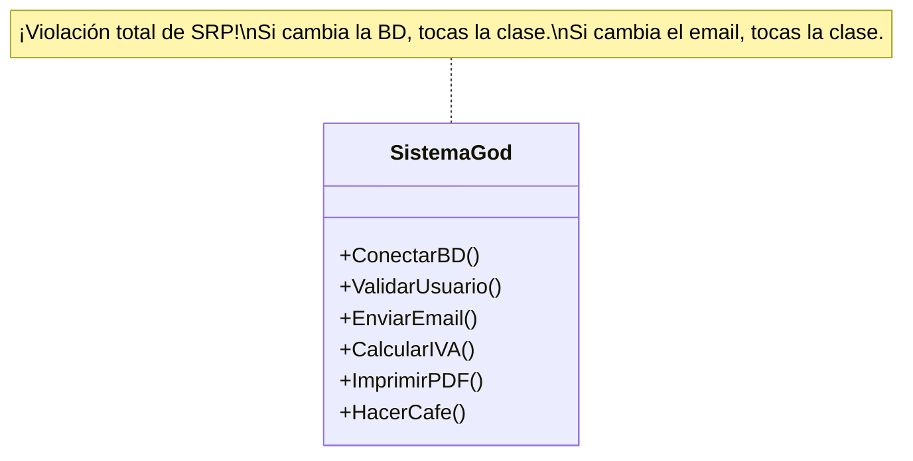
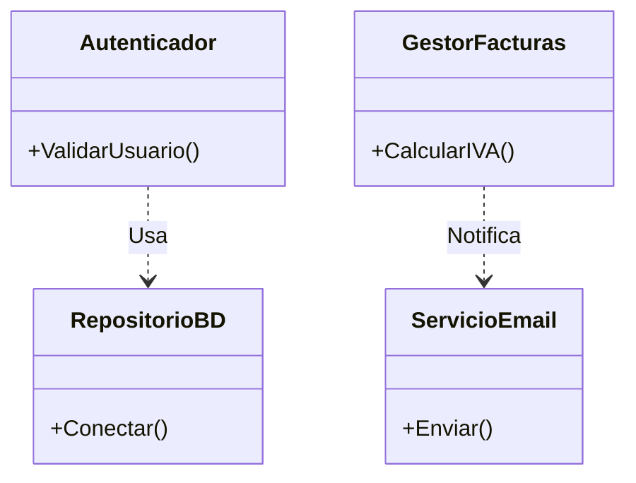
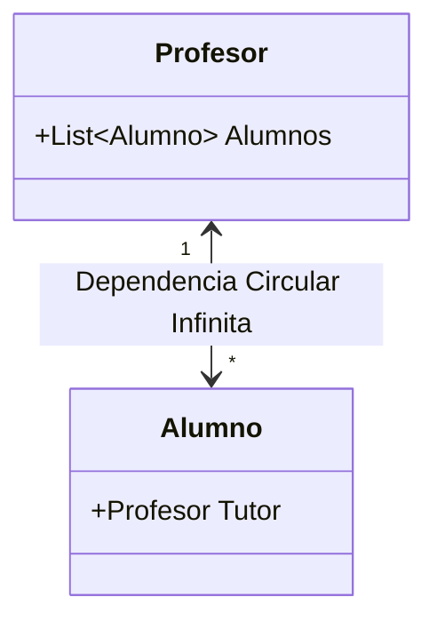
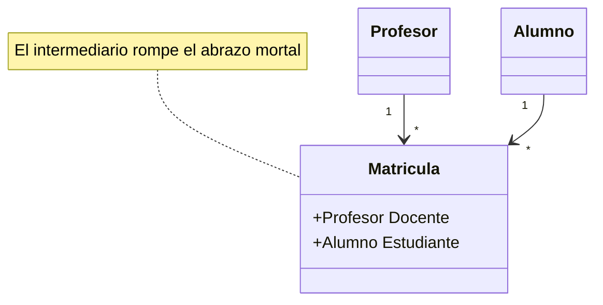
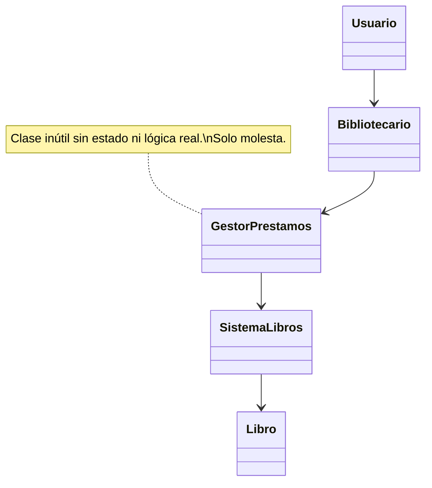
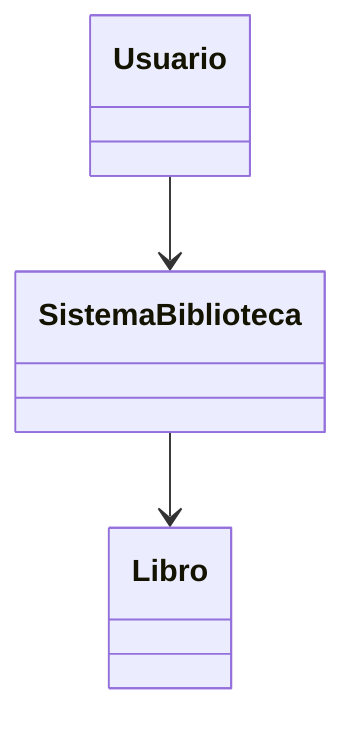
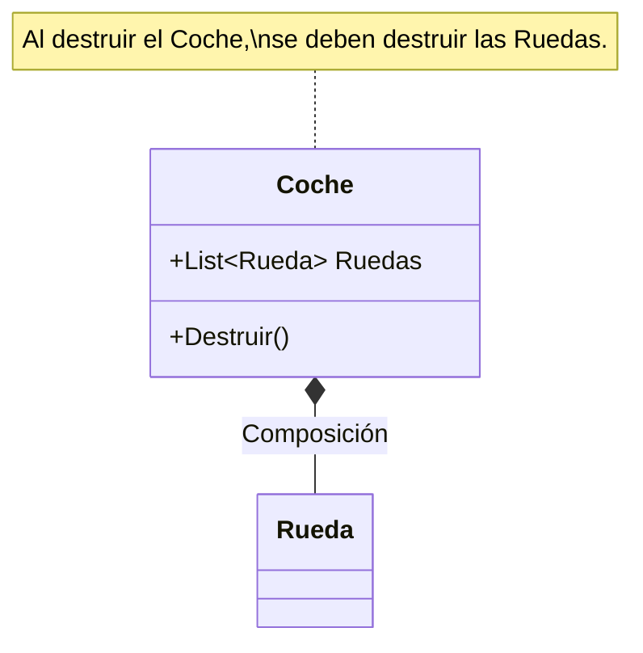

- [10. Museo de los Horrores: Anti-Patrones y Errores Comunes](#10-museo-de-los-horrores-anti-patrones-y-errores-comunes)
  - [1. 👹 The God Class (La Clase Dios)](#1--the-god-class-la-clase-dios)
    - [💀 El Mal Diseño](#-el-mal-diseño)
    - [✅ La Solución (Divide y Vencerás)](#-la-solución-divide-y-vencerás)
  - [2. 🕸️ El Espagueti Relacional (Dependencias Circulares)](#2-️-el-espagueti-relacional-dependencias-circulares)
    - [💀 El Mal Diseño](#-el-mal-diseño-1)
    - [✅ La Solución (Romper el Ciclo)](#-la-solución-romper-el-ciclo)
  - [3. 🏚️ Obsesión Primitiva (Arrays Paralelos)](#3-️-obsesión-primitiva-arrays-paralelos)
    - [💀 El Mal Código](#-el-mal-código)
    - [✅ La Solución (Encapsulamiento)](#-la-solución-encapsulamiento)
  - [4. 👻 El Poltergeist (Clases Fantasma)](#4--el-poltergeist-clases-fantasma)
    - [💀 El Mal Diseño](#-el-mal-diseño-2)
    - [✅ La Solución (Kiss - Keep It Simple)](#-la-solución-kiss---keep-it-simple)
  - [5. 🧟 El Muerto Viviente (Datos Zombis)](#5--el-muerto-viviente-datos-zombis)
    - [💀 El Mal Diseño (Mala Agregación)](#-el-mal-diseño-mala-agregación)
    - [✅ La Solución (Composición Correcta)](#-la-solución-composición-correcta)
  - [💡 Cómo Evitar Caer en el Museo](#-cómo-evitar-caer-en-el-museo)


# 10. Museo de los Horrores: Anti-Patrones y Errores Comunes


> 📝 **Nota del Profesor:** Estos errores son "clásicos" porque todos los desarrolladores principiantes los cometen. La diferencia entre un programador junior y uno senior no es no cometer errores, sino saber detectarlos y corregirlos rápidamente. Memoriza estos anti-patrones y tu código mejorará dramáticamente. Esta guía recopila los errores de diseño más frecuentes en estudiantes de desarrollo de software. Si ves tu diagrama reflejado aquí... ¡corrígelo antes de entregar!

> **"Aprender de los errores de otros es de sabios; aprender de los propios es de inteligentes... pero es mejor ser sabio y no romper la producción."**

---

## 1. 👹 The God Class (La Clase Dios)

**El Horror:** Una sola clase que lo sabe todo, lo hace todo y lo controla todo. Es el anti-patrón más común.

### 💀 El Mal Diseño
Una clase `Sistema` que gestiona usuarios, conecta a la base de datos, envía emails e imprime facturas.



### ✅ La Solución (Divide y Vencerás)
Aplicar **SRP (Single Responsibility Principle)**. Cada clase tiene una única responsabilidad.



---

## 2. 🕸️ El Espagueti Relacional (Dependencias Circulares)

**El Horror:** El problema del "Huevo y la Gallina". A necesita a B para existir, pero B necesita a A.

### 💀 El Mal Diseño
El `Profesor` tiene una lista de `Alumnos`, y el `Alumno` tiene una propiedad `Tutor` de tipo `Profesor`.
*   **Problema:** No puedes serializar a JSON (bucle infinito). Es difícil de testear. Acoplamiento máximo.



### ✅ La Solución (Romper el Ciclo)
1.  **Opción A (Jerarquía):** El padre conoce a los hijos, pero los hijos no necesitan conocer al padre (o usan un ID).
2.  **Opción B (Intermediario):** Usar una clase `Asignatura` o `Matricula` que los vincule.



> 💡 **Diagnóstico clínico:** Si al serializar a JSON tu sistema explota con "Circular reference detected", tienes dependencias circulares. El intermediario es el tratamiento definitivo.

---

## 3. 🏚️ Obsesión Primitiva (Arrays Paralelos)

**El Horror:** Miedo a crear clases. El alumno intenta resolverlo todo con listas de tipos básicos (`string`, `int`).

### 💀 El Mal Código
```csharp
public class Tienda {
    // ¡ERROR! Si ordenas una lista y la otra no, los datos se desalinean.
    public List<string> NombresProductos = new();
    public List<double> PreciosProductos = new();
    public List<int> StockProductos = new();
}
```

### ✅ La Solución (Encapsulamiento)
Crea una clase (o `record`) que agrupe los datos que viajan juntos. Cohesión.

```csharp
public class Producto { // ¡Mucho mejor!
    public string Nombre { get; set; }
    public double Precio { get; set; }
    public int Stock { get; set; }
}

public class Tienda {
    public List<Producto> Inventario = new();
}
```

> 📝 **La ley de la abstracción:** Si dos o más variables primitives están relacionadas (nombre + precio + stock), nace una clase. Es como la química: cuando los átomos se combinan, forman moléculas. Los `string` y `int` son átomos; las clases son moléculas.

---

## 4. 👻 El Poltergeist (Clases Fantasma)

**El Horror:** Clases que no hacen nada, solo pasan la pelota. Tienen nombres como `GestorDeDatos`, `ControladorDeManager`, `AdminInfo`.

### 💀 El Mal Diseño
Para pedir un libro, el `Usuario` llama al `Bibliotecario`, que llama al `GestorPrestamos`, que llama al `SistemaLibros`, que finalmente accede al `Libro`.



### ✅ La Solución (Kiss - Keep It Simple)
Elimina los intermediarios innecesarios. Si una clase no tiene responsabilidad real, bórrala.



> 💡 **La navaja de Occam del diseño:** Si dos clases tienen una relación, preguntarte: "¿Puedo eliminar una sin que la otra pierda funcionalidad?" Si la respuesta es "la intermedia sí", elimínala.

---

## 5. 🧟 El Muerto Viviente (Datos Zombis)

**El Horror:** Eliminar un objeto padre pero dejar "vivos" a sus hijos dependientes en memoria, provocando fugas de memoria o inconsistencias.

### 💀 El Mal Diseño (Mala Agregación)
Un `Coche` crea sus `Ruedas` fuera y no se responsabiliza de ellas. Si borras el coche de la base de datos, las ruedas quedan huérfanas ocupando espacio.

### ✅ La Solución (Composición Correcta)
Si el hijo **NO TIENE SENTIDO** sin el padre (ej: Ruedas de un coche, Páginas de un libro, Líneas de un pedido), usa **Composición**.



> 📝 **Pregunta de examen:** ¿Qué tipo de relación UML usarías para representar: (a) Un `Departamento` que contiene `Empleados` que pueden existir en otros departamentos, (b) Un `Pedido` que contiene `LíneasDePedido` que no tienen sentido sin el pedido?

---

## 💡 Cómo Evitar Caer en el Museo

1. **Refactoriza pronto:** Si detectas un "olor" (smell), corrígelo antes de que huela peor.
2. **Principio KISS:** Keep It Simple, Stupid. Menos clases = menos problemas.
3. **Cohesión alta, acoplamiento bajo:** Cada clase debe tener una responsabilidad clara y mínima dependencia de otras.
4. **Nombrado significativo:** Si tu clase se llama `Gestor`, probablemente esté haciendo demasiado.
5. **Usa herramientas:** Rider tiene analizadores que detectan muchos de estos problemas automáticamente.

> 📝 **Consejo del Examinador:** En el examen, si detectas un anti-patrón y lo corriges en tu diseño, menciónalo explícitamente. "Aquí uso composición en lugar de agregación porque..." demuestra que entiendes POR QUÉ, no solo el QUÉ.
