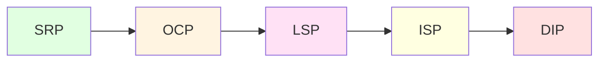

- [11. Resumen de la Unidad](#11-resumen-de-la-unidad)
    - [Mapa Conceptual de la Unidad](#mapa-conceptual-de-la-unidad)
    - [Puntos Clave del Módulo](#puntos-clave-del-módulo)
    - [Comparativa: Herencia vs Composición](#comparativa-herencia-vs-composición)
    - [Principios SOLID](#principios-solid)
    - [Anti-patrones a Evitar](#anti-patrones-a-evitar)
    - [Checklist de Supervivencia](#checklist-de-supervivencia)
    - [Consejos Finales](#consejos-finales)

# 11. Resumen de la Unidad

Hemos recorrido un largo camino desde los conceptos básicos de objetos hasta patrones de diseño arquitectónico. Aquí tienes los puntos clave para llevarte:

> 💡 **Consejo del Profesor:** El diseño orientado a objetos es como aprender a tocar un instrumento. Al principio todo cuesta, pero con la práctica los patrones se vuelven naturales.

### Mapa Conceptual de la Unidad

```mermaid
graph TD
    UD04[UD04: Diseño OO y UML] --> CB[Conceptos Base]
    UD04 --> REL[Relaciones]
    UD04 --> AVZ[POO Avanzada]
    UD04 --> SL[SOLID]
    UD04 --> HR[Herramientas]
    UD04 --> BP[Buenas Prácticas]

    CB --> CB1[Clase vs Objeto]
    CB --> CB2[Encapsulamiento]
    CB --> CB3[Abstracción]
    CB -->     CB4[Visibilidad]

    REL --> ASO[Asociación]
    REL --> AGR[Agregación]
    REL --> COM[Composición]
    REL --> DEP[Dependencia]
    REL --> INT[Interfaces]

    AVZ --> HER2[Herencia]
    AVZ --> INT2[Interfaces]
    AVZ --> POL[Polimorfismo]
    AVZ --> ABS[Clases Abstractas]
    AVZ --> EST[Estáticos]

    SL --> S[SRP: Responsabilidad Única]
    SL --> O[OCP: Abierto/Cerrado]
    SL --> L[LSP: Sustitución Liskov]
    SL --> I[ISP: Segregación Interfaces]
    SL --> D[DIP: Inversión Dependencias]

    HR --> MER[Mermaid]
    HR --> RID[JetBrains Rider]
    HR --> IR[Ingeniería Inversa]

    BP --> ID[Inyección Dependencias]
    BP --> FP[Factory Pattern]
    BP --> GC[Evitar God Class]

    style UD04 fill:#e1f5ff
    style CB fill:#e1ffe1
    style REL fill:#fff4e1
    style AVZ fill:#ffe1f5
    style SL fill:#ffffe1
    style HR fill:#ffe1e1
    style BP fill:#e1ffff
```

### Puntos Clave del Módulo

| Concepto | Descripción | UML |
|----------|-------------|-----|
| **Clase** | El molde o plantilla | Rectángulo con 3 compartments |
| **Objeto** | Instancia concreta de una clase | No se dibuja en diagrama |
| **Encapsulamiento** | Proteger datos con visibilidad | `+` público, `-` privado, `#` protegido |
| **Abstracción** | Esencializar lo importante | Clases y métodos |
| **Asociación** | "Conoce a" otra clase | Línea simple |
| **Agregación** | "Tiene un" pero sobrevive solo | Rombo hueco `o--` |
| **Composición** | "Es parte de" y muere con el todo | Rombo lleno `*--` |
| **Herencia** | "Es un" tipo de | Flecha triangular `<|--` |
| **Interfaz** | Contrato de comportamiento | `«interface`» |

### Comparativa: Herencia vs Composición

| Aspecto | Herencia | Composición |
|---------|----------|-------------|
| **Relación** | "Es un" | "Tiene un" |
| **Acoplamiento** | Alto (rígido) | Bajo (flexible) |
| **Cambios** | Afecta a todas las subclases | Solo afecta al objeto |
| **Polimorfismo** | Sí (clases) | Sí (interfaces) |
| **Recomendación** | Usar con cuidado | **Favorecer composición** |

### Principios SOLID

| Principio | Significado | Ejemplo Práctico |
|-----------|-------------|------------------|
| **S** | Una clase, una responsabilidad | Separar `Factura` de `ImpresoraFactura` |
| **O** | Abierto para extensión, cerrado para modificación | Usar herencia/interfaces |
| **L** | Las subclases deben cumplir el contrato del padre | Un `Pato` que no vuela no hereda de `AveVoladora` |
| **I** | Interfaces pequeñas y específicas | `IActualizar` + `IGuardar` en lugar de `IPersistencia` |
| **D** | Depender de abstracciones, no de concreciones | `Coche` depende de `IMotor`, no de `MotorGasolina` |

### Anti-patrones a Evitar

| Anti-patrón | Problema | Solución |
|-------------|----------|----------|
| **God Class** | Clase que lo sabe todo y hace todo | Dividir responsabilidades |
| **Dependencia Circular** | A necesita B, B necesita A | Usar interfaces, romper ciclo |
| **Obsesión Primitiva** | Arrays paralelos en lugar de clases | Crear clase con propiedades |
| **Poltergeist** | Clases que solo pasan la pelota | Eliminar intermediarios inútiles |

### Checklist de Supervivencia

Antes de dar por cerrado el tema, asegúrate de poder responder **SÍ**:

- [ ] ¿Entiendo la diferencia entre Clase y Objeto?
- [ ] ¿Puedo dibujar una clase UML con sus 3 compartments?
- [ ] ¿Sé usar correctamente `+`, `-`, `#` para visibilidad?
- [ ] ¿Distinguo entre Asociación, Agregación y Composición?
- [ ] ¿Sé cuándo usar Herencia y cuándo Composición?
- [ ] ¿Puedo dibujar una interfaz en UML?
- [ ] ¿Entiendo qué es la Inyección de Dependencias?
- [ ] ¿Conozco los 5 principios SOLID?
- [ ] ¿Puedo identificar un "God Class"?
- [ ] ¿Sé usar Mermaid para diagramas de clases?
- [ ] ¿Puedo usar la ingeniería inversa de Rider?

### Consejos Finales

- **Analiza primero, programa después:** Usa el análisis lingüístico (Sustantivos → Clases, Verbos → Métodos)
- **Usa Mermaid:** Es el estándar "Diagram as Code". Intégralo en tu flujo de trabajo diario
- **Favorece composición sobre herencia:** El principio Composition over Inheritance
- **Refactoriza:** No tengas miedo de cambiar tu diseño si detectas un "olor" (smell) en el código
- **Rider es tu amigo:** Usa sus herramientas de diagramas para verificar que lo que programas coincide con tu diseño
- **¡Practica!** La teoría de objetos se asienta diseñando y equivocándose

> 📝 **Truco:** En el examen, si dudas entre herencia y composición, elige composición. Es más fácil defender una composición bien diseñada que una herencia mal usada.
