# Entornos de Desarrollo - 04 Diseño OO y UML: Diagrama de Clases

Tema 04. Diseño OO y UML: Diagrama de Clases. 1DAW. Curso 2025/2026.


- [Entornos de Desarrollo - 04 Diseño OO y UML: Diagrama de Clases](#entornos-de-desarrollo---04-diseño-oo-y-uml-diagrama-de-clases)
- [Contenido en Youtube](#contenido-en-youtube)
- [1. Introducción al Modelado con UML](#1-introducción-al-modelado-con-uml)
  - [1.1. Del enunciado al código: El papel del analista/programador](#11-del-enunciado-al-código-el-papel-del-analistaprogramador)
  - [1.2. El Lenguaje Unificado de Modelado (UML) como estándar](#12-el-lenguaje-unificado-de-modelado-uml-como-estándar)
  - [1.3. Conceptos clave de POO: Abstracción, Encapsulamiento y Ocultación](#13-conceptos-clave-de-poo-abstracción-encapsulamiento-y-ocultación)
    - [A. Abstracción y Clasificación](#a-abstracción-y-clasificación)
    - [B. Encapsulamiento y Ocultación de Datos](#b-encapsulamiento-y-ocultación-de-datos)
  - [Ejemplo Práctico: El Analista frente al "Caso de la Biblioteca"](#ejemplo-práctico-el-analista-frente-al-caso-de-la-biblioteca)
    - [Análisis del Error común (Contraejemplo)](#análisis-del-error-común-contraejemplo)
    - [Diseño Correcto (Buenas Prácticas)](#diseño-correcto-buenas-prácticas)
- [2. Anatomía de una Clase y Elementos Especiales](#2-anatomía-de-una-clase-y-elementos-especiales)
  - [2.1. Representación de Clases: Nombre, Atributos y Métodos](#21-representación-de-clases-nombre-atributos-y-métodos)
    - [Sintaxis de los Atributos y Métodos](#sintaxis-de-los-atributos-y-métodos)
  - [2.2. Visibilidad y Modificadores de Acceso](#22-visibilidad-y-modificadores-de-acceso)
    - [El "Contraejemplo" del Mal Encapsulamiento](#el-contraejemplo-del-mal-encapsulamiento)
  - [2.3. Elementos Avanzados: Estáticos, Abstractos e Interfaces](#23-elementos-avanzados-estáticos-abstractos-e-interfaces)
    - [A. Atributos y Métodos Estáticos (static)](#a-atributos-y-métodos-estáticos-static)
    - [B. Clases Abstractas e Interfaces](#b-clases-abstractas-e-interfaces)
  - [💡 El Truco del Analista: Cómo detectar visibilidad en el enunciado](#-el-truco-del-analista-cómo-detectar-visibilidad-en-el-enunciado)
  - [Práctica en Rider: Ingeniería Inversa](#práctica-en-rider-ingeniería-inversa)
- [3. Relaciones, Estructura e Inyección de Dependencias](#3-relaciones-estructura-e-inyección-de-dependencias)
  - [3.1. Asociación y Multiplicidad](#31-asociación-y-multiplicidad)
  - [3.2. La Navegabilidad e Implementación en C#](#32-la-navegabilidad-e-implementación-en-c)
  - [3.3. Dependencias Fuertes y Débiles](#33-dependencias-fuertes-y-débiles)
    - [A. Dependencia Débil (Uso puntual)](#a-dependencia-débil-uso-puntual)
    - [B. Dependencia Fuerte (Estructural)](#b-dependencia-fuerte-estructural)
  - [3.4. Inyección de Dependencias (DI): Constructor vs Setter](#34-inyección-de-dependencias-di-constructor-vs-setter)
    - [1. Inyección por Constructor (Fuerte/Obligatoria)](#1-inyección-por-constructor-fuerteobligatoria)
    - [2. Inyección por Setter/Propiedad (Opcional/Flexible)](#2-inyección-por-setterpropiedad-opcionalflexible)
  - [3.5. Agregación vs. Composición (El Ciclo de Vida)](#35-agregación-vs-composición-el-ciclo-de-vida)
    - [A. Agregación (Rombo hueco `o--`)](#a-agregación-rombo-hueco-o--)
    - [B. Composición (Rombo lleno `*--`)](#b-composición-rombo-lleno---)
  - [⚠️ Contraejemplo: El error del "New" interno](#️-contraejemplo-el-error-del-new-interno)
  - [3.6. Herencia e Implementación: Jerarquías y Contratos](#36-herencia-e-implementación-jerarquías-y-contratos)
    - [A. Herencia (Generalización / Especialización)](#a-herencia-generalización--especialización)
    - [B. Implementación (Realización de Interfaz)](#b-implementación-realización-de-interfaz)
    - [Ejemplo Maestro: Sistema de Notificaciones](#ejemplo-maestro-sistema-de-notificaciones)
    - [💡 Análisis del Analista: ¿Herencia o Implementación?](#-análisis-del-analista-herencia-o-implementación)
    - [Ejemplo C# basado en tus apuntes (Atributos de Clase):](#ejemplo-c-basado-en-tus-apuntes-atributos-de-clase)
- [4. El Gran Dilema: Herencia vs. Composición](#4-el-gran-dilema-herencia-vs-composición)
  - [4.1. Herencia (Generalización): El concepto "Es-un"](#41-herencia-generalización-el-concepto-es-un)
  - [4.2. Composición/Asociación: El concepto "Tiene-un"](#42-composiciónasociación-el-concepto-tiene-un)
  - [4.3. Caso de Estudio: El Problema del Motor Híbrido](#43-caso-de-estudio-el-problema-del-motor-híbrido)
    - [El "Callejón sin salida" de la Herencia](#el-callejón-sin-salida-de-la-herencia)
    - [La Solución Maestra: Interfaces y Composición](#la-solución-maestra-interfaces-y-composición)
  - [4.4. Especialización vs. Especificación](#44-especialización-vs-especificación)
  - [💡 Truco de "Examen" para detectar este diseño:](#-truco-de-examen-para-detectar-este-diseño)
- [5. Técnicas de Análisis y Trucos (El Método del Analista)](#5-técnicas-de-análisis-y-trucos-el-método-del-analista)
  - [5.1. Análisis Lingüístico Profundo (La Gramática del Software)](#51-análisis-lingüístico-profundo-la-gramática-del-software)
  - [5.2. El Diagnóstico de la Herencia: ¿Identidad o Conveniencia?](#52-el-diagnóstico-de-la-herencia-identidad-o-conveniencia)
    - [A. La Prueba de Oro: El Ejemplo del Comercial](#a-la-prueba-de-oro-el-ejemplo-del-comercial)
    - [B. El Contraejemplo (Herencia por "vagancia" de código): Coche y Motor](#b-el-contraejemplo-herencia-por-vagancia-de-código-coche-y-motor)
  - [5.3. Composición vs. Agregación: El "Vínculo Vital"](#53-composición-vs-agregación-el-vínculo-vital)
  - [5.4. Rompiendo Relaciones N:M (La Clase Relación)](#54-rompiendo-relaciones-nm-la-clase-relación)
    - [Caso A: Inscripción en Cursos (Atributos de la relación)](#caso-a-inscripción-en-cursos-atributos-de-la-relación)
    - [Caso B: Venta, Producto y el "Precio Congelado"](#caso-b-venta-producto-y-el-precio-congelado)
  - [5.5. Miembros Estáticos y Visibilidad](#55-miembros-estáticos-y-visibilidad)
  - [5.6. Caso Final: El Sistema de Telemetría (Ejemplo de Examen)](#56-caso-final-el-sistema-de-telemetría-ejemplo-de-examen)
- [6. Herramientas de Representación: Del Dibujo al Código](#6-herramientas-de-representación-del-dibujo-al-código)
  - [6.1. El Estándar Mermaid.js: "Diagram as Code"](#61-el-estándar-mermaidjs-diagram-as-code)
  - [6.2. Sintaxis Detallada de Mermaid (Class Diagram)](#62-sintaxis-detallada-de-mermaid-class-diagram)
    - [A. Declaración de Clases y Miembros](#a-declaración-de-clases-y-miembros)
    - [B. Tipos de Relaciones (Flechas)](#b-tipos-de-relaciones-flechas)
    - [C. Multiplicidad y Etiquetas](#c-multiplicidad-y-etiquetas)
  - [6.3. Anotaciones y Estereotipos (Metadata)](#63-anotaciones-y-estereotipos-metadata)
  - [6.4. Tipos Genéricos (Templates)](#64-tipos-genéricos-templates)
  - [6.5. Potencia Máxima: Ejemplo de Aplicación Total](#65-potencia-máxima-ejemplo-de-aplicación-total)
  - [6.6. Herramientas y Extensiones Profesionales](#66-herramientas-y-extensiones-profesionales)
    - [Para Visual Studio Code:](#para-visual-studio-code)
    - [Herramientas Visuales (No Code):](#herramientas-visuales-no-code)
  - [6.7. Ejemplo: Sistema de Telemetría Avanzado (SmartCity)](#67-ejemplo-sistema-de-telemetría-avanzado-smartcity)
- [7. JetBrains Rider: Integración Total y Flujo de Trabajo Real](#7-jetbrains-rider-integración-total-y-flujo-de-trabajo-real)
  - [7.1. Visualización de Mermaid en Rider](#71-visualización-de-mermaid-en-rider)
  - [7.2. Ingeniería Inversa: De Código a Diagrama](#72-ingeniería-inversa-de-código-a-diagrama)
  - [7.3. Ingeniería Directa: ¿De Diagrama a Código?](#73-ingeniería-directa-de-diagrama-a-código)
  - [7.4. El Flujo de Trabajo Definitivo (The Golden Path)](#74-el-flujo-de-trabajo-definitivo-the-golden-path)
  - [7.5. Trucos Pro en Rider para Diagramas](#75-trucos-pro-en-rider-para-diagramas)
    - [Resumen final:](#resumen-final)
- [8. Principios SOLID: Contraejemplos y Soluciones](#8-principios-solid-contraejemplos-y-soluciones)
  - [8.1. S: Single Responsibility (Responsabilidad Única)](#81-s-single-responsibility-responsabilidad-única)
    - [❌ El Error (Clase Dios)](#-el-error-clase-dios)
    - [✅ La Solución (Especialización)](#-la-solución-especialización)
  - [8.2. O: Open/Closed (Abierto/Cerrado)](#82-o-openclosed-abiertocerrado)
    - [❌ El Error (El "if" infinito)](#-el-error-el-if-infinito)
    - [✅ La Solución (Abstracción)](#-la-solución-abstracción)
  - [8.3. L: Liskov Substitution (Sustitución de Liskov)](#83-l-liskov-substitution-sustitución-de-liskov)
    - [❌ El Error (El Pingüino que no vuela)](#-el-error-el-pingüino-que-no-vuela)
    - [✅ La Solución (Jerarquía por Capacidades)](#-la-solución-jerarquía-por-capacidades)
  - [8.4. I: Interface Segregation (Segregación de Interfaces)](#84-i-interface-segregation-segregación-de-interfaces)
    - [❌ El Error (Interfaz Gorda)](#-el-error-interfaz-gorda)
    - [✅ La Solución (Interfaces Atómicas)](#-la-solución-interfaces-atómicas)
  - [8.5. D: Dependency Inversion (Inversión de Dependencias)](#85-d-dependency-inversion-inversión-de-dependencias)
    - [❌ El Error (Soldado a la tecnología)](#-el-error-soldado-a-la-tecnología)
    - [✅ La Solución (Inyección de Dependencia)](#-la-solución-inyección-de-dependencia)
- [9. El Sistema de Gestión de Flotas Intergalácticas (StarFleet Manager)](#9-el-sistema-de-gestión-de-flotas-intergalácticas-starfleet-manager)
  - [9.1. El Enunciado](#91-el-enunciado)
  - [9.2. Análisis Párrafo por Párrafo (Detección de Errores y Soluciones)](#92-análisis-párrafo-por-párrafo-detección-de-errores-y-soluciones)
    - [Párrafo 1: Las Naves (Herencia y Miembros Estáticos)](#párrafo-1-las-naves-herencia-y-miembros-estáticos)
    - [Párrafo 2: Comportamientos Específicos (Liskov e Interfaces)](#párrafo-2-comportamientos-específicos-liskov-e-interfaces)
    - [Párrafo 3: El Motor (Composición e Inyección de Dependencias)](#párrafo-3-el-motor-composición-e-inyección-de-dependencias)
    - [Párrafo 4: Misiones (Muchos a Muchos)](#párrafo-4-misiones-muchos-a-muchos)
    - [Párrafo 5: Notificaciones (DIP y OCP)](#párrafo-5-notificaciones-dip-y-ocp)
  - [9.3. Diagrama de Clases Final (Propuesta Correcta)](#93-diagrama-de-clases-final-propuesta-correcta)
    - [Representación en Mermaid](#representación-en-mermaid)
    - [Representación en ASCII](#representación-en-ascii)
  - [9.4. Análisis de Aplicación SOLID en la Solución](#94-análisis-de-aplicación-solid-en-la-solución)
  - [9.5. Implementación StarFleet Manager](#95-implementación-starfleet-manager)
    - [Análisis técnico de la sintaxis C#](#análisis-técnico-de-la-sintaxis-c)
    - [¿Cómo ver esto en el Diagrama UML?](#cómo-ver-esto-en-el-diagrama-uml)
  - [9.6. Aplicando Factory](#96-aplicando-factory)
    - [1. ¿Por qué usar un Factory en nuestro sistema?](#1-por-qué-usar-un-factory-en-nuestro-sistema)
    - [2. Implementación en C#](#2-implementación-en-c)
    - [3. Representación en Mermaid](#3-representación-en-mermaid)
    - [4. Representación en ASCII](#4-representación-en-ascii)
    - [5. Análisis SOLID del Factory](#5-análisis-solid-del-factory)
  - [Autor](#autor)
    - [Contacto](#contacto)
  - [Licencia de uso](#licencia-de-uso)


# Contenido en Youtube
- [Podcast](https://youtu.be/2Byhjf85CO0)
- [Resumen](https://youtu.be/BjcZ3F2O_-8)
- [Cardinalidad y Navegabilidad](https://youtu.be/UWi8CfkLMLc)
- [Lista de Reproducción](https://www.youtube.com/watch?v=VoamKywLez8&list=PLGIH-7eZDbVwCTLTEJ_yJJ3NWE0eKqqqH)


# 1. Introducción al Modelado con UML

El desarrollo de software moderno no comienza escribiendo código. Al igual que un ingeniero civil no coloca ladrillos sin un plano estructural, un desarrollador de software utiliza el **modelado** para comprender, documentar y comunicar la arquitectura del sistema antes de su implementación.

## 1.1. Del enunciado al código: El papel del analista/programador

A menudo, el mayor desafío de un programador no es la sintaxis del lenguaje, sino la **traducción** de un problema del mundo real (expresado en lenguaje natural por un cliente) a una estructura lógica ejecutable. Aquí es donde entra en juego el **Analista**, cuya misión es extraer las abstracciones adecuadas del "Dominio del Problema".

* **El Dominio del Problema:** Es el entorno real donde ocurre el proceso que queremos automatizar (ej: un banco, un hospital, un sistema de gestión de motores).
  
* **La Tarea del Analista:** Identificar qué conceptos del dominio son relevantes (Clases) y cómo interactúan (Relaciones).


> **Reflexión de Diseño:** Un buen modelo de diseño no debe intentar copiar la realidad de forma exacta, sino representarla de la manera más eficiente para resolver el problema. No modelamos "una persona" en su totalidad, sino solo los atributos que nuestro software necesita (su DNI y su saldo, pero quizá no su color de ojos).
> 

## 1.2. El Lenguaje Unificado de Modelado (UML) como estándar

**UML (Unified Modeling Language)** no es un lenguaje de programación, sino un lenguaje visual estándar para especificar, visualizar y documentar sistemas de software.

El **Diagrama de Clases** es el corazón de UML. Su propósito es representar la **estructura estática** del sistema: los objetos fundamentales que el usuario percibe y cómo se organizan internamente. Es "independiente del tiempo", lo que significa que muestra lo que el sistema *es*, no lo que el sistema *hace* paso a paso (eso lo harían los diagramas de secuencia).

**Diferencias clave que debes conocer:**

* **Modelo de Dominio:** Un diagrama conceptual, cercano al lenguaje del usuario, sin detalles técnicos.


* **Modelo de Diseño:** Un diagrama técnico, listo para ser traducido a C# u otro lenguaje, que incluye tipos de datos, modificadores de acceso y métodos.


## 1.3. Conceptos clave de POO: Abstracción, Encapsulamiento y Ocultación

Para diseñar diagramas de clases profesionales, debemos dominar tres pilares de la Programación Orientada a Objetos que se reflejan directamente en UML:

### A. Abstracción y Clasificación

La **Abstracción** consiste en aislar los elementos esenciales de un objeto para definir su "molde". Ese molde es la **Clase**.

* **Clase:** Definición estructural y de comportamiento compartida por un conjunto de objetos.


* **Objeto / Instancia:** Cada uno de los elementos concretos creados a partir de esa clase.


**Visualización de la relación Clase vs Objeto:**

**En Formato Texto (ASCII):**

```text
  CLASE (El Molde)                  OBJETOS (Instancias reales)
+-------------------+             +-----------------------+
|      Persona      |             | p1: Persona           |
+-------------------+             +-----------------------+
| - nombre: string  | <---------- | nombre = "Pedro"      |
| - edad: int       |             | edad = 30             |
+-------------------+             +-----------------------+
| + Caminar()       |
+-------------------+             +-----------------------+
                                  | p2: Persona           |
                                  +-----------------------+
                                  | nombre = "Andrea"     |
                                  | edad = 25             |
                                  +-----------------------+

```

**En Mermaid:**

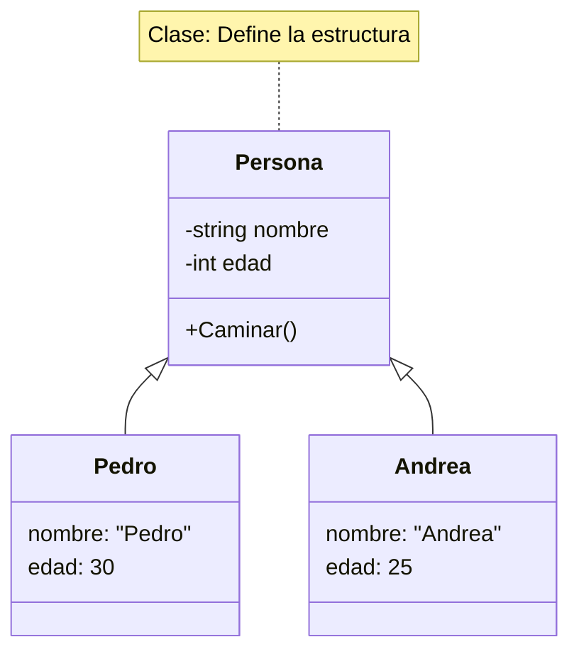

### B. Encapsulamiento y Ocultación de Datos

El encapsulamiento es el proceso de agrupar datos (atributos) y comportamientos (métodos) en una sola unidad, protegiendo el estado interno del objeto de manipulaciones indebidas desde el exterior.

**¿Por qué es vital en el diseño?**

1. **Protección:** Evita que otros objetos pongan valores inválidos (ej: una edad negativa).


2. **Mantenimiento:** Si cambiamos cómo se guarda el dato internamente, el resto del sistema no se entera.


3. **Desacoplamiento:** Reduce la dependencia entre clases.


---

## Ejemplo Práctico: El Analista frente al "Caso de la Biblioteca"

**Enunciado del cliente:** *"Necesitamos un sistema donde los usuarios puedan tomar prestados libros. De cada libro queremos saber el título y si está disponible. El bibliotecario debe poder registrar nuevas adquisiciones."*

### Análisis del Error común (Contraejemplo)

Muchos alumnos intentan modelar la "acción" de prestar como una clase.

* **Error:** Clase `PrestarLibro`.
* **Por qué falla:** "Prestar" es una acción (método), no un objeto con identidad propia en este contexto.

### Diseño Correcto (Buenas Prácticas)

El analista identifica sustantivos (Libro, Usuario) y verbos (Prestar, Registrar).

**Diseño en ASCII:**

```text
+-----------------------+       +-----------------------+
|        Libro          |       |      Bibliotecario    |
+-----------------------+       +-----------------------+
| - titulo: string      |       | + RegistrarLibro()    |
| - disponible: bool    |       +-----------------------+
+-----------------------+
| + MarcarPrestado()    |
+-----------------------+

```

**Diseño en Mermaid:**

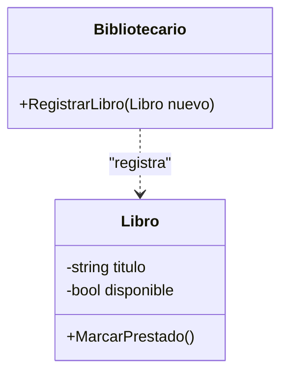

---

# 2. Anatomía de una Clase y Elementos Especiales

Si el diagrama de clases es el plano estructural, la **clase** es el ladrillo fundamental. En este nivel de diseño, dejamos atrás las generalidades y empezamos a definir tipos de datos, niveles de seguridad y comportamientos específicos.

## 2.1. Representación de Clases: Nombre, Atributos y Métodos

En UML, una clase se representa como un rectángulo dividido en tres compartimentos claramente diferenciados. El orden es inalterable:

1. **Superior:** Nombre de la clase (en PascalCase, siguiendo las convenciones de C#).
2. **Medio:** Atributos (el "estado" o datos del objeto).
3. **Inferior:** Operaciones o Métodos (el "comportamiento").

### Sintaxis de los Atributos y Métodos

Para que un programador de C# pueda implementar tu diagrama, la sintaxis debe ser precisa:

* **Atributos:** `visibilidad nombreAtributo : tipoDato [= valorInicial]`
* **Métodos:** `visibilidad nombreMetodo(parámetro : tipo) : tipoRetorno`

**Representación en Formato Texto (ASCII):**

```text
+---------------------------------------+
|              Producto                 |
+---------------------------------------+
| - id: int                             |
| - descripcion: string                 |
| - precio: double = 0.0                |
+---------------------------------------+
| + CalcularIVA(): double               |
| + AplicarDescuento(porcentaje: int)   |
+---------------------------------------+

```

**Representación en Mermaid:**

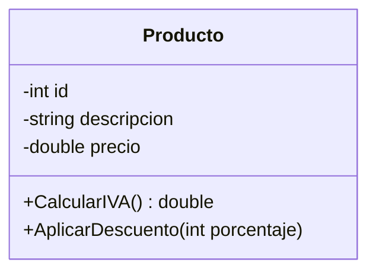

---

## 2.2. Visibilidad y Modificadores de Acceso

La visibilidad es la aplicación práctica del **encapsulamiento**. En C#, esto determina si una variable o método es accesible desde otras clases del proyecto o si permanece oculto.

| Símbolo UML | Modificador C# | Alcance (Visibilidad)                                                     |
| ----------- | -------------- | ------------------------------------------------------------------------- |
| **`+`**     | `public`       | Universal. Cualquier clase puede acceder.                                 |
| **`-`**     | `private`      | Solo accesible dentro de la **misma clase**.                              |
| **`#`**     | `protected`    | Accesible por la clase y sus **clases hijas** (herencia).                 |
| **`~`**     | `internal`     | Accesible por cualquier clase dentro del **mismo ensamblado** (proyecto). |

### El "Contraejemplo" del Mal Encapsulamiento

**Error:** Declarar todos los atributos como públicos (`+`).

* **Consecuencia:** Cualquier parte del código podría poner un `precio = -500` a un producto, rompiendo la lógica de negocio.
* **Solución:** Atributos privados (`-`) y métodos públicos (`+`) para manipularlos de forma controlada.

---

## 2.3. Elementos Avanzados: Estáticos, Abstractos e Interfaces

Para sistemas complejos, C# nos ofrece herramientas que cambian la forma en que los objetos se comportan.

### A. Atributos y Métodos Estáticos (static)

Representan datos o acciones que pertenecen a la **clase en sí**, no a un objeto concreto. En UML se identifican **subrayando** el elemento (lo haremos usando `_` al final en estos apuntes).

* **Uso común:** Contadores de objetos, constantes físicas (PI), o métodos de utilidad (`Math.Sqrt`).

### B. Clases Abstractas e Interfaces

* **Clase Abstracta:** Una clase "a medio hacer" que no puede instanciar objetos. Se escribe en *cursiva*.
* **Interfaz:** Un contrato puro. Solo define "qué" debe hacer un objeto, no "cómo". Se etiqueta con `«interface»`.

**Comparativa en ASCII:**

```text
      «interface»                      Animal
      IControlable                  (Abstracta)
+----------------------+      +-----------------------+
| + Encender()         |      | + Comer()             |
| + Apagar()           |      | + Dormir()            |
+----------------------+      | + Sonido()_           | <--- (Abstracto)
                              +-----------------------+

        Coche                       Calculadora
+----------------------+      +-----------------------+
| - modelo: string     |      | + PI: double_         | <--- (Estático)
+----------------------+      +-----------------------+
| + Encender()         |      | + Sumar(a,b)_         | <--- (Estático)
+----------------------+      +-----------------------+

```

**Comparativa en Mermaid:**

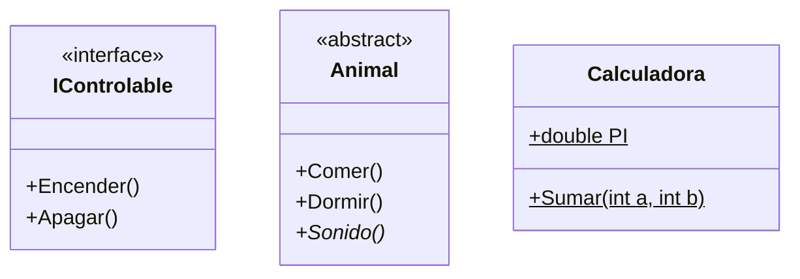

---

## 💡 El Truco del Analista: Cómo detectar visibilidad en el enunciado

Para tus ejercicios, fíjate en estas frases clave:

* *"Los datos de la cuenta son estrictamente confidenciales"*  Atributos **Privados (-)**.
* *"Cualquier clase del sistema puede consultar el catálogo"*  Método **Público (+)**.
* *"Solo las subclases de Vehículo pueden acceder al número de chasis"*  Atributo **Protegido (#)**.
* *"Queremos saber en todo momento cuántas instancias se han creado de la clase Factura"*  Atributo **Estático subrayado**.

---

## Práctica en Rider: Ingeniería Inversa
¿Tienes código C# y quieres ver su diagrama UML automáticamente? ¡Rider lo hace por ti!

1. En **JetBrains Rider**, abre tu proyecto de C#.
2. Haz clic derecho sobre una clase o una carpeta.
3. Selecciona **Diagrams > Show Diagram**.
4. Rider generará un diagrama donde verás los candados (privado), llaves (protegido) y puntos (público) que coinciden con estos símbolos UML.

---

# 3. Relaciones, Estructura e Inyección de Dependencias

En el mundo real, los objetos no viven aislados; colaboran para realizar tareas. En UML, estas colaboraciones se representan mediante líneas que conectan las clases.

## 3.1. Asociación y Multiplicidad

La **Asociación** es la relación más común. Indica una conexión estructural entre dos clases: una clase "conoce" a otra.

* **Multiplicidad:** Indica cuántos objetos de una clase pueden estar vinculados a un objeto de la otra clase. Se anota en los extremos de la línea.
* `1`: Exactamente uno.
* `0..*` o `*`: Muchos (cero o más).
* `1..*`: Al menos uno.


**Ejemplo en ASCII:**

```text
  +---------+             +---------+
  | Cliente | 1         * | Pedido  |
  +---------+------------+---------+

```

**Ejemplo en Mermaid:**

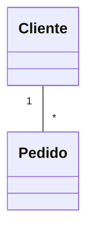

## 3.2. La Navegabilidad e Implementación en C#

Este es un concepto crítico para vuestro futuro en **Rider**. La navegabilidad indica si una clase "sabe de la existencia" de la otra.

* **Bidireccional (Línea simple):** Ambas clases tienen una referencia de la otra.
* **Unidireccional (Flecha `-->`):** Solo la clase origen tiene una referencia de la destino.

**Impacto en el Código C#:**
Si un `Pedido` tiene una flecha hacia `Producto`, en C# la clase `Pedido` **debe** tener un campo o propiedad de tipo `Producto`.

```csharp
public class Pedido {
    private Producto _articulo; // Implementación de la flecha de navegabilidad
}

```

## 3.3. Dependencias Fuertes y Débiles

No todas las relaciones son permanentes. Debemos distinguir entre "conocer a alguien" y "usar a alguien puntualmente".

### A. Dependencia Débil (Uso puntual)

Ocurre cuando una clase usa a otra solo dentro de un método (como parámetro o variable local). En UML se usa una **línea discontinua con flecha**.

### B. Dependencia Fuerte (Estructural)

Ocurre cuando una clase necesita a otra para existir o como parte de su estado permanente. Aquí es donde entra la **Inyección de Dependencias (DI)**.

---

## 3.4. Inyección de Dependencias (DI): Constructor vs Setter

La DI es una técnica donde una clase recibe sus dependencias desde fuera, en lugar de crearlas ella misma con `new`. Esto es vital para el **desacoplamiento**.

### 1. Inyección por Constructor (Fuerte/Obligatoria)

Es la forma más recomendada. La clase no puede ser instanciada si no se le entrega su dependencia.

* **Pros:** El objeto siempre está en un estado válido. Permite usar campos `readonly` en C#.
* **Contras:** Poco flexible si queremos cambiar la dependencia tras crear el objeto.

### 2. Inyección por Setter/Propiedad (Opcional/Flexible)

La dependencia se pasa a través de un método o propiedad pública después de crear el objeto.

* **Pros:** Permite intercambiar la dependencia en "caliente" (tiempo de ejecución).
* **Contras:** **Peligro de NullReferenceException**. Si el programador olvida llamar al setter antes de usar el objeto, el programa fallará.

**Comparativa Visual:**

**En ASCII:**

```text
      INYECCIÓN POR CONSTRUCTOR             INYECCIÓN POR SETTER
   +---------------------------+       +---------------------------+
   |          Coche            |       |          Coche            |
   +---------------------------+       +---------------------------+
   | - _motor: IMotor          |       | - _motor: IMotor          |
   +---------------------------+       +---------------------------+
   | + Coche(motor: IMotor)    |       | + Coche()                 |
   | + Arrancar()              |       | + SetMotor(m: IMotor)     |
   +---------------------------+       | + Arrancar()              |
   +---------------------------+       +---------------------------+

```

**En Mermaid:**

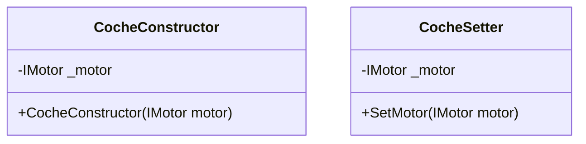

---

## 3.5. Agregación vs. Composición (El Ciclo de Vida)

Ambas son relaciones "Todo-Parte", pero se diferencian en la **dependencia de vida**.

### A. Agregación (Rombo hueco `o--`)

Relación débil. La parte puede existir sin el todo.

* **Ejemplo:** Una `Universidad` y sus `Profesores`. Si la universidad cierra, los profesores siguen existiendo y pueden irse a otra.

### B. Composición (Rombo lleno `*--`)

Relación fuerte. La parte no tiene sentido sin el todo y su vida está ligada a él.

* **Ejemplo:** Un `Libro` y sus `Paginas`. Si destruyes el libro, las páginas (como parte de ese libro) dejan de existir.

---

## ⚠️ Contraejemplo: El error del "New" interno

**Mal diseño (Acoplamiento fuerte):**

```csharp
public class Coche {
    private MotorGasolina _motor;
    public Coche() {
        _motor = new MotorGasolina(); // ERROR: Coche está atado para siempre a Gasolina
    }
}

```

**Buen diseño (Inyección de Dependencias):**

```csharp
public class Coche {
    private IMotor _motor;
    public Coche(IMotor motor) { // Recibe CUALQUIER motor que implemente la interfaz
        _motor = motor;
    }
}

```

---

**Truco para el examen:** Si el enunciado dice: *"Un pedido **consiste en** varias líneas de detalle que se eliminan si el pedido se cancela"*, dibuja una **Composición**.
Si dice: *"Un cliente **tiene** una lista de productos favoritos"*, dibuja una **Agregación** (porque el producto no desaparece si el cliente se da de baja).

---

Tienes toda la razón. Para que el bloque de relaciones sea verdaderamente útil en C#, no podemos pasar por alto las dos flechas más fundamentales: la que define **quién es quién** y la que define **qué sabe hacer cada uno**.

Aquí tienes el punto 3.6 detallado, integrando los conceptos de tus documentos sobre métodos estáticos y la importancia de las interfaces en el diseño moderno.

---

## 3.6. Herencia e Implementación: Jerarquías y Contratos

En C#, la reutilización de código y el polimorfismo se gestionan mediante dos tipos de relaciones que, aunque se parecen visualmente, tienen propósitos radicalmente distintos.

### A. Herencia (Generalización / Especialización)

Representa una relación de **jerarquía estricta**. La clase hija (subclase) hereda todos los atributos y métodos de la clase padre (superclase).

* **Concepto:** "Es un" (Is-a).
* **Símbolo UML:** Línea continua con una **flecha de punta triangular vacía** apuntando al padre.
* **En C#:** Se usa el símbolo de dos puntos `:`.

### B. Implementación (Realización de Interfaz)

Representa un **compromiso de comportamiento**. Una clase no "es" la interfaz, sino que "cumple" con las funciones que la interfaz exige.

* **Concepto:** "Se comporta como" o "Tiene la capacidad de".
* **Símbolo UML:** Línea **discontinua** con una flecha de punta triangular vacía apuntando a la interfaz.
* **En C#:** También se usa `:`, pero la interfaz suele empezar por "I" (ej. `IEntidad`).

---

### Ejemplo Maestro: Sistema de Notificaciones

Imagina un sistema que envía mensajes. Tenemos una base común para todos los mensajes, pero distintas formas de enviarlos.

**Representación en Formato Texto (ASCII):**

```text
          «interface»
          IEnviado
    +-------------------+
    | + Enviar()        | <---------- Contrato (Implementación)
    +-------------------+
             ^
             . (línea puntos)
             .
    +-------------------+             +-----------------------+
    |      Mensaje      |             |     Notificador       |
    +-------------------+             +-----------------------+
    | - contenido: str  |             | + Notificar(e: IEnviado)|
    +-------------------+             +-----------------------+
             ^                                  |
             | (línea continua)                 | (Inyección de
             |                                  |  Dependencia)
    +-------------------+                       |
    |   EmailNotific    | <---------------------+
    +-------------------+
    | - asunto: string  |
    +-------------------+
    | + Enviar()        |
    +-------------------+

```

**Representación en Mermaid:**

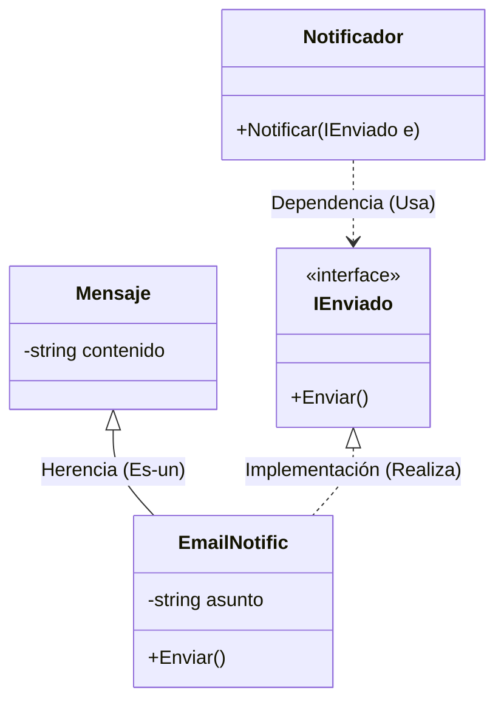

---

### 💡 Análisis del Analista: ¿Herencia o Implementación?

Un error crítico en 1º de DAW es usar herencia para todo. Como profesor, enséñales estas reglas de oro:

1. **¿Comparten datos y lógica interna?** Usa **Herencia**.
* *Ejemplo:* Un `Coche` y una `Moto` comparten `Matricula` y `Color`. Ambos heredan de `Vehiculo`.


2. **¿Solo comparten el nombre de un método pero lo hacen de forma totalmente distinta?** Usa **Interfaz**.
* *Ejemplo:* Un `Boton` y un `Enlace` pueden ser "Clicables", pero lo que ocurre al clicar es totalmente distinto. No heredan de nada común, solo implementan `IClicable`.


### Ejemplo C# basado en tus apuntes (Atributos de Clase):

Si tenemos una jerarquía de herencia, los **atributos estáticos** (como el `contadorPersonas` de tus documentos) se comparten en toda la jerarquía de la clase donde se definen.

```csharp
public abstract class Persona {
    protected static int Contador; // Estático: compartido por todos
    public Persona() { Contador++; }
}

public class Alumno : Persona { // Herencia (Línea continua)
    private string _expediente;
}

```

---

# 4. El Gran Dilema: Herencia vs. Composición

En el diseño de software, la forma en que estructuramos la reutilización de código determina si nuestro sistema será un bloque de hormigón (rígido) o un juego de LEGO (flexible).

## 4.1. Herencia (Generalización): El concepto "Es-un"

La herencia crea una jerarquía donde la subclase adquiere la esencia de la superclase.

* **Uso:** Cuando un objeto es una versión especializada de otro.
* **Riesgo:** Si la jerarquía crece, nos encontramos con comportamientos que no todas las hijas necesitan, pero que heredan por obligación.

## 4.2. Composición/Asociación: El concepto "Tiene-un"

La composición construye funcionalidad mediante la suma de piezas. En lugar de "ser" algo, la clase **"tiene"** una referencia a un objeto que sabe hacer ese algo.

* **Uso:** Cuando queremos que una clase use funcionalidades de otras de forma flexible.
* **Principio:** Favorecer la composición permite cambiar piezas en tiempo de ejecución sin alterar la estructura del objeto principal.

---

## 4.3. Caso de Estudio: El Problema del Motor Híbrido

Imagina que tenemos que modelar diferentes tipos de motores con comportamientos específicos:

1. **Motor Eléctrico:** Tiene `Encender()` y `Recargar()`.
2. **Motor de Explosión:** Tiene `Encender()` y `Repostar()`.
3. **Motor Híbrido:** ¡Necesita hacer las tres cosas!

### El "Callejón sin salida" de la Herencia

Si intentamos resolverlo con herencia pura en C#, chocamos contra un muro:

* Si `MotorHibrido` hereda de `MotorElectrico`, no puede heredar de `MotorExplosion` (C# solo permite heredar de **una** clase).
* Si creamos una clase base `Motor` con todo, el `MotorElectrico` heredaría por error un método `Repostar()` (gasolina) que no puede usar.

### La Solución Maestra: Interfaces y Composición

Dividimos las capacidades en **contratos (interfaces)** y componemos el motor híbrido.

**Representación en Formato Texto (ASCII):**

```text
    «interface»             «interface»
    IElectrico              IExplosion
+----------------+      +----------------+
| + Recargar()   |      | + Repostar()   |
+----------------+      +----------------+
        ^                       ^
        :                       :
        :       +---------------+-------+
        :       |        «interface»    |
        :.......|          IMotor       |
                +-----------------------+
                | + Encender()          |
                +-----------------------+
                          ^ ^ ^
           ...............: | :...............
           :                |                :
   +----------------+  +----------------+  +----------------+
   | MotorElectrico |  | MotorHibrido   |  | MotorExplosion |
   +----------------+  +----------------+  +----------------+
   | + Encender()   |  | + Encender()   |  | + Encender()   |
   | + Recargar()   |  | + Recargar()   |  | + Repostar()   |
   +----------------+  | + Repostar()   |  +----------------+
                       +----------------+

          ^
          : (Inyectado por constructor)
+-----------------------+
|         Coche         |
+-----------------------+
| - _motor: IMotor      | <--- COMPOSICIÓN
+-----------------------+
| + Coche(m: IMotor)    |
| + Viajar()            |
+-----------------------+

```

**Representación en Mermaid:**

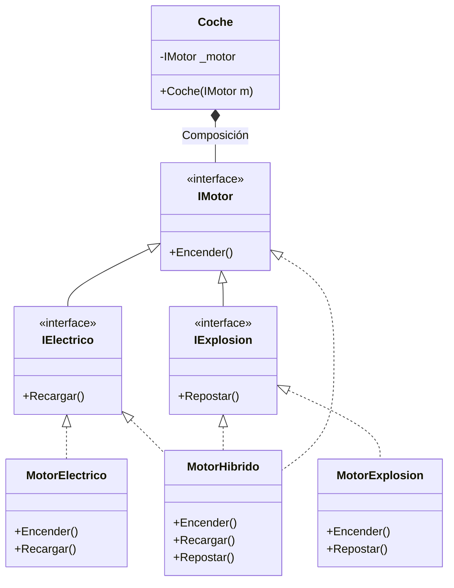

---

## 4.4. Especialización vs. Especificación

Este ejemplo nos enseña la diferencia real:

* **Especialización (Herencia):** El `MotorElectrico` es una especialización de `IMotor`.
* **Especificación (Inyección):** El `Coche` no sabe qué motor tiene, solo especifica que "necesita algo que se encienda" (`IMotor`).

**Ventaja final para el alumno:**
Gracias a este diseño, si mañana inventamos un **Motor de Hidrógeno**, solo tenemos que crear la clase e inyectarla en el `Coche`. El código del `Coche` **no se toca**. Esto es cumplir el principio de "Abierto a la extensión, cerrado a la modificación".

---

## 💡 Truco de "Examen" para detectar este diseño:

Si en el enunciado lees:

> *"El sistema debe permitir combinar capacidades de distintos tipos..."*
> O:
> *"Existen elementos que comparten una base pero tienen funcionalidades cruzadas..."*

**No uses herencia.** Crea interfaces para cada capacidad (`IElectrico`, `IExplosion`) y haz que tus clases las implementen según necesiten. Luego, usa **Inyección de Dependencias** para pasarle el objeto resultante a la clase principal.


---

# 5. Técnicas de Análisis y Trucos (El Método del Analista)

El éxito de un modelo no depende de la herramienta de dibujo, sino de la capacidad del analista para "traducir" el lenguaje humano a una arquitectura técnica sólida.

## 5.1. Análisis Lingüístico Profundo (La Gramática del Software)

La gramática del enunciado es el mapa del software. Debemos categorizar cada palabra para saber dónde colocarla en Rider y cómo representarla en UML.

| Categoría Gramatical       | Traducción Técnica        | Implementación en C# / UML                                                      |
| -------------------------- | ------------------------- | ------------------------------------------------------------------------------- |
| **Sustantivo Común**       | **Clase**                 | `public class Libro { ... }`                                                    |
| **Sustantivo Propio**      | **Instancia (Objeto)**    | `var miLibro = new Libro();` (No se dibuja en el diagrama).                     |
| **Adjetivo / Pertenencia** | **Propiedades o Campos**  | `private string _color;` (Campo) / `public int Edad { get; set; }` (Propiedad). |
| **Adjetivo de Estado**     | **Enumeraciones (Enums)** | `public enum Estado { Pendiente, Pagado }`. Etiqueta `«enumeration»`.           |
| **Verbo de acción**        | **Método (Operación)**    | `public void CalcularIva() { ... }`.                                            |
| **Verbo de estado/unión**  | **Relación**              | Indica una línea de unión (Asociación, Agregación o Composición).               |

---

## 5.2. El Diagnóstico de la Herencia: ¿Identidad o Conveniencia?

La herencia es la relación más rígida. Un error aquí genera "código espagueti" imposible de mantener.

### A. La Prueba de Oro: El Ejemplo del Comercial

Para saber si la herencia es correcta, aplicamos la lógica: **"Un B es siempre un A"**.

* **Ejemplo Correcto:** `Empleado` (Padre)  `Comercial` (Hijo).
* **Razonamiento:** Un comercial **es un** empleado. Si la empresa decide que ya no existen los empleados, el concepto de "comercial" desaparece. El comercial hereda el sueldo base y añade la propiedad `Comision`.


### B. El Contraejemplo (Herencia por "vagancia" de código): Coche y Motor

* **❌ Mala Decisión:** Heredar `Coche` de `Motor`.
* **Error:** El alumno piensa: "Como el motor tiene el método `Arrancar()`, si el coche hereda de motor, el coche ya sabe arrancar".
* **Por qué falla:** Un coche **no es** un motor. Si heredas, el coche adquiere métodos internos del motor (como `InyectarCombustible()`) que no deberían ser accesibles desde el coche. Además, si quieres cambiar a un motor eléctrico, la herencia te obliga a reescribir toda la clase `Coche`.
* **✅ Solución:** El `Coche` **tiene** un `Motor` (Composición).


---

## 5.3. Composición vs. Agregación: El "Vínculo Vital"

1. **Composición (`*--` Rombo Lleno):** Relación de "Propiedad Total".
* **Pista:** "Las partes no tienen sentido sin el todo". Si el contenedor muere, el contenido muere.
* **Ejemplo:** `Casa` y `Habitacion`. Si derribas la casa, las habitaciones dejan de existir.


2. **Agregación (`o--` Rombo Vacío):** Relación de "Colección o Pertenencia".
* **Pista:** "Las partes pueden existir fuera del contenedor".
* **Ejemplo:** `Equipo` y `Jugador`. Si el equipo desaparece, el jugador sigue existiendo y puede irse a otro.


---

## 5.4. Rompiendo Relaciones N:M (La Clase Relación)

Las relaciones de muchos a muchos deben "romperse" en dos relaciones de uno a muchos usando una **Clase Intermedia**.

### Caso A: Inscripción en Cursos (Atributos de la relación)

Un `Alumno` tiene muchos `Cursos` y un `Curso` muchos `Alumnos`. ¿Dónde guardamos la **Nota Final**? No pertenece al alumno solo, ni al curso solo, sino a la **unión** de ambos.

**Diagrama en ASCII:**

```text
  +---------+         +----------------+         +---------+
  | Alumno  | 1     * |  Inscripcion   | * 1     |  Curso  |
  +---------+---------+----------------+---------+---------+
  | - id    |         | - nota: double |         | - id    |
  +---------+         | - fecha: Date  |         +---------+
                      +----------------+

```

**Diagrama en Mermaid:**

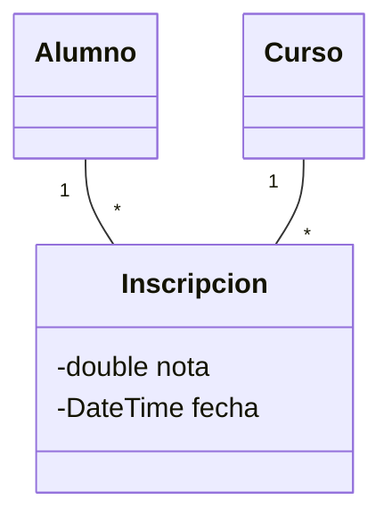

### Caso B: Venta, Producto y el "Precio Congelado"

Un `Producto` puede cambiar de precio con el tiempo. Para que las facturas antiguas no cambien su valor legal, la `LineaVenta` debe "congelar" el precio.

**Diagrama en ASCII:**

```text
  +---------+         +----------------+         +----------+
  |  Venta  | 1     * |   LineaVenta   | * 1     | Producto |
  +---------+---------+----------------+---------+----------+
  | - fecha |         | - cant: int    |         | - nombre |
  +---------+         | - precioVenta  | <-----  | - precio | (Actual)
                      +----------------+ (Copia) +----------+

```

**Diagrama en Mermaid:**

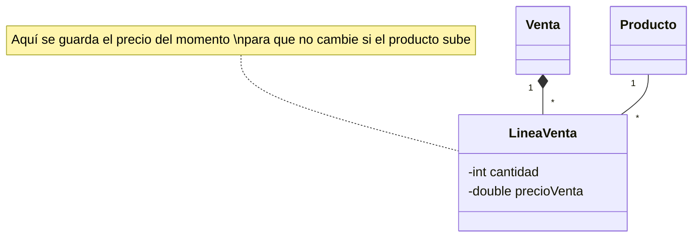

---

## 5.5. Miembros Estáticos y Visibilidad

Basándonos en tus documentos sobre **Atributos de Clase**:

* **Pista de ID Autoincremental:** *"Contar cuántos objetos se han creado"*. El objeto no sabe el total, la **Clase** sí. Usamos `static int contador` (**Subrayado** en UML).
* **Visibilidad:**
* **Privado (-):** Campos donde guardamos el dato (encapsulamiento).
* **Público (+):** Propiedades y métodos de servicio.
* **Protegido (#):** Solo para que las clases hijas vean el dato.


---

## 5.6. Caso Final: El Sistema de Telemetría (Ejemplo de Examen)

**Enunciado:** *"Un Satélite tiene varios Instrumentos. El Sensor Térmico es un tipo de instrumento que permite Calibrar. El Satélite cuenta cuántas fotos ha hecho en total. Recibe un Protocolo de Transmisión al construirse. El Satélite pertenece a una Misión, pero si el satélite falla, la misión continúa."*

**Representación en ASCII:**

```text
      «interface»
      IProtocolo
+--------------------+
| + Transmitir()     | <--- (DI Constructor)
+--------------------+
          ^
          : 
+--------------------+         +--------------------+
|      Satelite      | o-----> |       Misión       |
+--------------------+         +--------------------+
| - totalFotos: int_ |         | - nombre: string   |
+--------------------+         +--------------------+
          *
          | (Composición)
          v
+--------------------+
|    Instrumento     | <--- (Abstracta)
+--------------------+
| + Capturar()       |
+--------------------+
          ^
          | (Herencia)
+--------------------+
|   SensorTermico    |
+--------------------+
| + Calibrar()       |
+--------------------+

```

**Representación en Mermaid:**

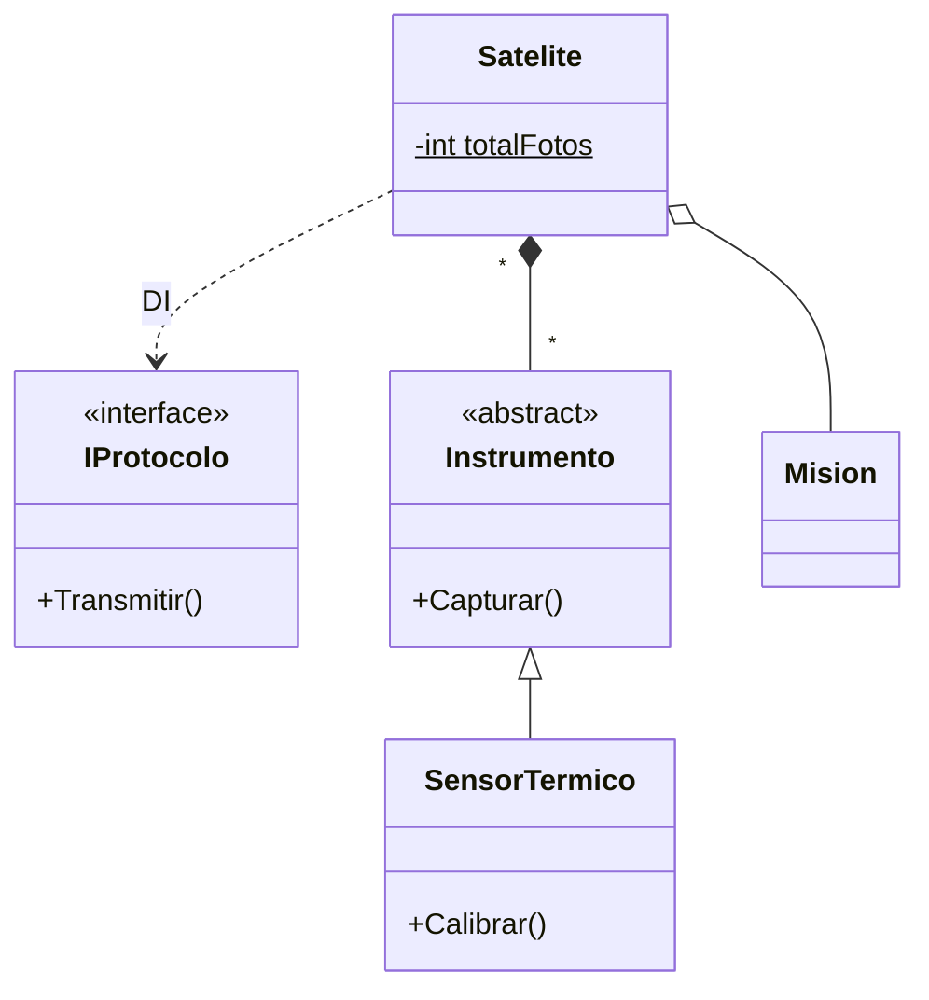

---

# 6. Herramientas de Representación: Del Dibujo al Código

## 6.1. El Estándar Mermaid.js: "Diagram as Code"

[Mermaid](https://mermaid.js.org/syntax/classDiagram.html) no es solo una herramienta de dibujo, es un motor de renderizado que sigue el principio de **Diagram as Code**.

* **Por qué es estándar:** Al ser texto plano, se puede versionar en Git. Si dos desarrolladores cambian el diagrama, Git puede hacer un "merge". Con una imagen o un binario (como Photoshop), esto es imposible.
* **Flujo de trabajo:** El analista escribe el esquema en Markdown, el sistema lo renderiza y el desarrollador lo implementa en Rider.

---

## 6.2. Sintaxis Detallada de Mermaid (Class Diagram)

Para usar Mermaid con éxito, hay que conocer sus reglas de declaración y anotación.

### A. Declaración de Clases y Miembros

Existen dos formas de definir una clase:

1. **Explícita:** Usando la palabra clave `class`.
2. **Implícita:** Mermaid crea la clase automáticamente al detectar una relación.

**Definición de Miembros (Atributos y Métodos):**
Para definir el contenido, usamos llaves `{}` o el símbolo `:` seguido del nombre.

* **Visibilidad:**
* `+` Público
* `-` Privado
* `#` Protegido
* `~` Package/Internal


* **Miembros Estáticos y Abstractos:**
* `$`: Se añade al final para **Métodos o Atributos Estáticos** (aparecerán subrayados).
* `*`: Se añade al final para **Métodos Abstractos** (aparecerán en cursiva).


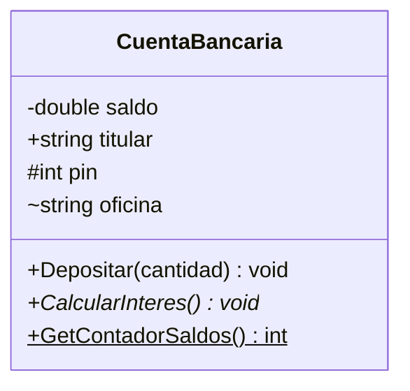

### B. Tipos de Relaciones (Flechas)

Mermaid utiliza una sintaxis de "guiones" para definir la fuerza y el tipo de la conexión:

| Tipo            | Sintaxis | Descripción                                  |
| --------------- | -------- | -------------------------------------------- |
| **Herencia**    | `<       | --`                                          |
| **Composición** | `*--`    | Relación "Todo-Parte" fuerte. Rombo relleno. |
| **Agregación**  | `o--`    | Relación "Todo-Parte" débil. Rombo vacío.    |
| **Asociación**  | `--`     | Conexión simple entre clases.                |
| **Dependencia** | `..>`    | Línea discontinua. Indica uso puntual o DI.  |
| **Realización** | `<       | ..`                                          |

### C. Multiplicidad y Etiquetas

Se colocan entre comillas dobles al principio y al final de la relación:
`ClaseA "1" *-- "many" ClaseB : etiqueta`

---

## 6.3. Anotaciones y Estereotipos (Metadata)

Para indicar que algo no es una clase normal (sino una interfaz o un enum), usamos los **Labels**:

* `<<interface>>`: Para contratos de métodos.
* `<<abstract>>`: Para clases que no se pueden instanciar.
* `<<enumeration>>`: Para listas de constantes.

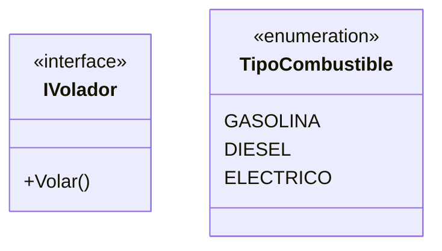

---

## 6.4. Tipos Genéricos (Templates)

En C#, usamos mucho las listas genéricas `List<T>`. Mermaid las representa usando tildes `~`:
`List~Alumno~ alumnos` se renderizará como `List<Alumno>`.

---

## 6.5. Potencia Máxima: Ejemplo de Aplicación Total

Este diagrama incluye **Direccionalidad**, **Genéricos**, **Navegabilidad** y **Clases Relación**.

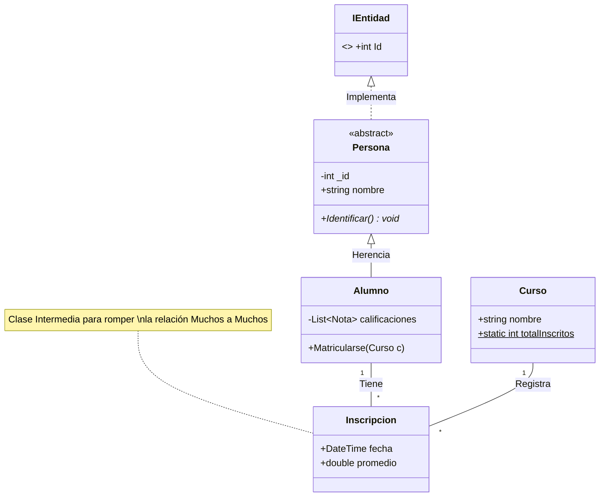

---

## 6.6. Herramientas y Extensiones Profesionales

### Para Visual Studio Code:

1. **Mermaid Chart:** La extensión oficial. Permite editar visualmente y sincronizar con su plataforma. Puedes exportar a PNG, SVG, PDF.
2. **Markdown Preview Mermaid Support:** Imprescindible para ver los diagramas dentro de tus apuntes `.md`.
3. **Draw.io Integration:** Permite usar el motor de Draw.io (manual) dentro de VS Code.
4. **PlantUML:** Extensión para el lenguaje competidor (usa archivos `.puml`).

### Herramientas Visuales (No Code):

* **Draw.io (diagrams.net):** Herramienta gratuita perfecta para bocetos rápidos. Permite exportar en XML. Puedes integrarla en VS Code, GitHub y otras plataformas. https://app.diagrams.net/
* **StarUML.io:** Herramienta **CASE** (Computer Aided Software Engineering). No solo dibuja, genera código C# real a partir de tus diagramas. Es la herramienta que se usa cuando el diseño debe ser 100% riguroso. https://staruml.io/

---

## 6.7. Ejemplo: Sistema de Telemetría Avanzado (SmartCity)

Para cerrar, aplicamos todo en un sistema de sensores urbanos.

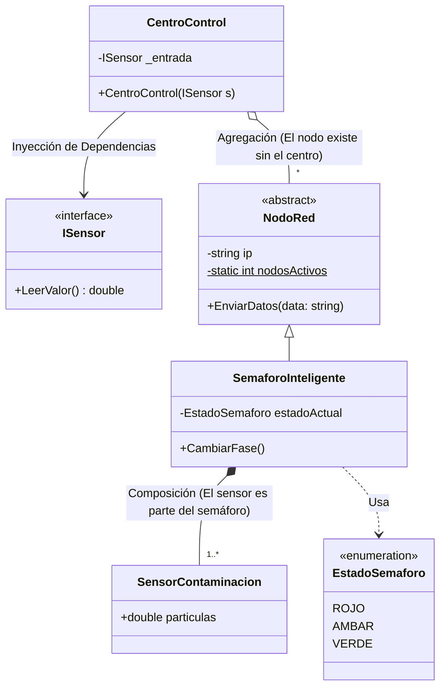

---

# 7. JetBrains Rider: Integración Total y Flujo de Trabajo Real

Rider no solo es un editor de código; es una plataforma de ingeniería que permite visualizar la arquitectura de tu software en tiempo real. Aquí veremos cómo conectar tus diagramas Mermaid con el código y cómo usar la potencia de la ingeniería inversa.

## 7.1. Visualización de Mermaid en Rider

Rider no renderiza Mermaid de forma nativa en el editor de código C#, pero tiene un soporte excepcional mediante el ecosistema de plugins:

1. **Plugin de Mermaid:** Debes instalar el plugin "Mermaid" desde `Settings > Plugins`.
2. **Archivos .md:** Una vez instalado, cualquier bloque de código Mermaid dentro de un archivo Markdown (`.md`) mostrará una **previsualización en tiempo real** en un panel lateral.
3. **Utilidad:** Esto permite que tengas el diagrama abierto a la derecha mientras pica el código a la izquierda, asegurando que cumple con el diseño.

---

## 7.2. Ingeniería Inversa: De Código a Diagrama

Esta es la función más potente. Permite verificar si lo que han programado coincide con lo que pensaron.

* **Cómo generarlo:** Haz clic derecho sobre un proyecto, una carpeta o una clase específica en el explorador de soluciones y selecciona **Diagrams > Show Diagram**.
* **Qué obtenemos:** Rider genera automáticamente un diagrama UML profesional con:
* Relaciones de herencia (flechas blancas).
* Relaciones de uso/asociación (flechas finas).
* Miembros, métodos y sus visibilidades.


* **Interactividad:** Puedes arrastrar clases al diagrama, ocultar métodos privados para limpiar la vista o exportar el resultado como imagen para tus entregas.

---

## 7.3. Ingeniería Directa: ¿De Diagrama a Código?

Es importante aclarar la diferencia entre herramientas:

1. **En Rider:** Rider está enfocado a la **Ingeniería Inversa** y visualización. No permite "dibujar" un cuadrado y que aparezca el archivo `.cs` automáticamente (aunque puedes crear clases desde el diagrama con atajos de teclado).
2. **En Herramientas CASE (como StarUML):** Si el flujo de trabajo requiere que el diagrama genere el código (Ingeniería Directa), se recomienda **StarUML**. En StarUML diseñas el modelo completo y usas el comando `Generate Code` para crear el esqueleto de las clases en C#.

---

## 7.4. El Flujo de Trabajo Definitivo (The Golden Path)

Para que el alumnado trabaje como profesionales, este es el proceso recomendado:

1. **Análisis:** Leer el enunciado y extraer las entidades (Punto 5).
2. **Diseño (Mermaid):** Escribir el diagrama en un archivo `README.md` dentro de la solución de Rider.
3. **Codificación:** Crear las clases en C# siguiendo el diagrama Mermaid.
4. **Validación (Rider Diagrams):** Usar la función **Show Diagram** de Rider sobre el código escrito.
5. **Contraste:** Comparar el diagrama generado por Rider con el diagrama original en Mermaid.
* *¿Faltan flechas?* Quizás olvidaste una relación en el código.
* *¿Hay flechas de más?* Tal vez has acoplado clases que no deberían conocerse.


---

## 7.5. Trucos Pro en Rider para Diagramas

* **Filtros de Visibilidad:** En el panel de diagramas de Rider, puedes activar/desactivar la visualización de campos, propiedades o métodos. Esto es vital en clases complejas para no saturar la vista.
* **Dependencia de Estructura:** Rider permite ver un "Dependency Matrix", que es un diagrama avanzado para ver qué carpetas o namespaces dependen de otros, ideal para detectar **dependencias circulares** (el gran enemigo del punto 5.3).
* **Exportación:** Puedes exportar el diagrama a formato `.uml` (propio de IntelliJ/Rider) o como imagen `PNG/SVG` para incluirlo en la documentación oficial del proyecto.

---

### Resumen final:

> "Usa **Mermaid** para planificar y documentar. Usa **Rider** para programar y verificar que tu código es tan limpio y ordenado como tu diagrama."


---

# 8. Principios SOLID: Contraejemplos y Soluciones

El diseño orientado a objetos profesional se basa en identificar "olores de código" (malas prácticas) y aplicar refactorizaciones basadas en estos cinco principios.

---

## 8.1. S: Single Responsibility (Responsabilidad Única)

**"Una clase debe tener una sola razón para cambiar"**.

### ❌ El Error (Clase Dios)

Una clase que gestiona los datos de un `Informe`, pero también sabe cómo formatearlo para pantalla y cómo guardarlo en un archivo. Si el formato de guardado cambia, la clase `Informe` se ve afectada innecesariamente.

* **Mermaid (Mal):**

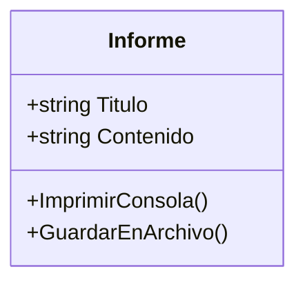

* **ASCII (Mal):**
`[ Informe (Datos + Impresión + Persistencia) ]`

### ✅ La Solución (Especialización)

Separamos la lógica de datos de la lógica de servicios.

* **Mermaid (Bien):**

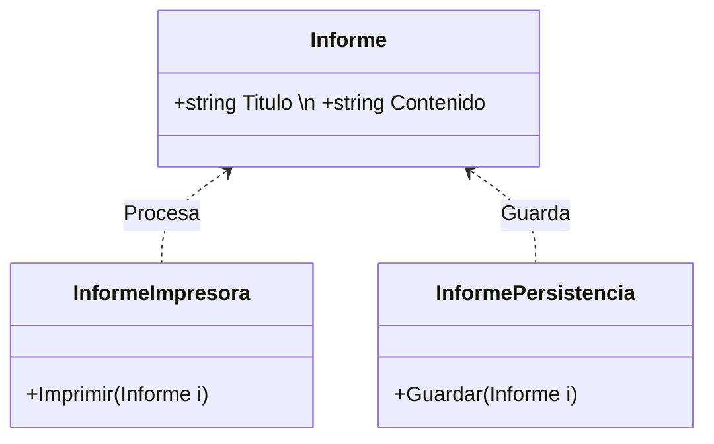

* **ASCII (Bien):**
`[ Informe ] <--- [ InformeImpresora ]`
`      ^--------- [ InformePersistencia ]`

---

## 8.2. O: Open/Closed (Abierto/Cerrado)

**"Abierto para extensión, cerrado para modificación"**.

### ❌ El Error (El "if" infinito)

Si queremos añadir un nuevo tipo de descuento, tenemos que entrar en la clase `CalculadoraDescuentos` y añadir otro `else if`. Esto rompe el código cada vez que el negocio crece.

* **Mermaid (Mal):**

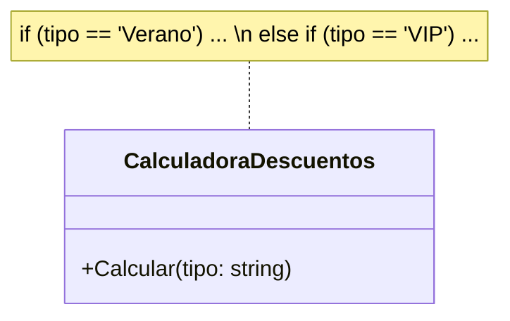

* **ASCII (Mal):**
`[ Calculadora ] --(Depende de Strings y IFs)--> [ Lógica interna rígida ]`

### ✅ La Solución (Abstracción)

Creamos una interfaz o clase abstracta. Para un nuevo descuento, solo creamos una nueva clase.

* **Mermaid (Bien):**

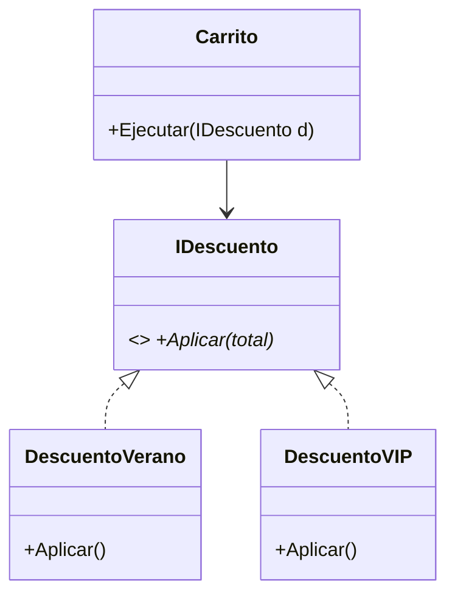

* **ASCII (Bien):**
`[ Carrito ] --> [ IDescuento ] <|.. [ Verano ]`
`                               <|.. [ VIP ]`

---

## 8.3. L: Liskov Substitution (Sustitución de Liskov)

**"Las clases hijas deben poder sustituir a sus padres sin romper el sistema"**.

### ❌ El Error (El Pingüino que no vuela)

Si heredas `Pinguino` de `Ave`, y el padre tiene el método `Volar()`, el programa fallará cuando intentes hacer volar a todos los pájaros de una lista.

* **Mermaid (Mal):**

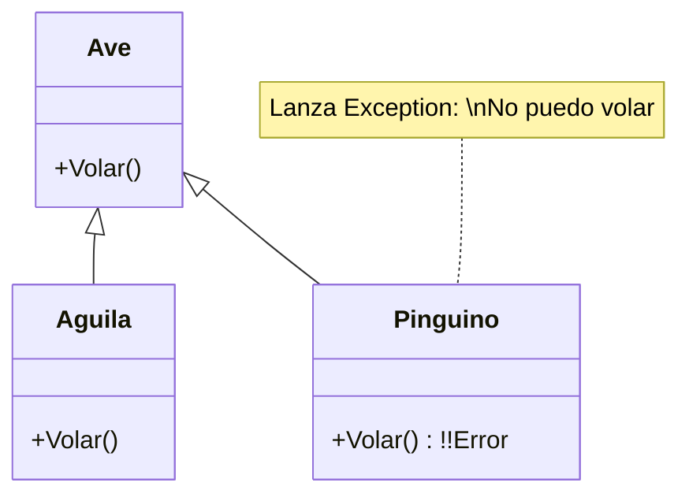

* **ASCII (Mal):**
`[ Ave (Vuela) ] <|-- [ Aguila (OK) ]`
`                <|-- [ Pinguino (CRASH) ]`

### ✅ La Solución (Jerarquía por Capacidades)

Separamos las aves por sus capacidades reales mediante interfaces o subclases intermedias.

* **Mermaid (Bien):**

```mermaid
classDiagram
    class Ave { +Comer() }
    class IAveVoladora { <<interface>> +Volar() }
    class Aguila { +Comer() \n +Volar() }
    class Pinguino { +Comer() \n +Nadar() }
    Ave <|-- Aguila
    Ave <|-- Pinguino
    IAveVoladora <|.. Aguila

```

* **ASCII (Bien):**
`      [ Ave ]`
`      /     \`
`[ Aguila ] [ Pinguino ]`
`    |`
`[ IVoladora ]`

---

## 8.4. I: Interface Segregation (Segregación de Interfaces)

**"Mejor muchas interfaces pequeñas que una sola muy grande"**.

### ❌ El Error (Interfaz Gorda)

Una interfaz `ITrabajador` que obliga a un `Robot` a implementar el método `Comer()`.

* **Mermaid (Mal):**

```mermaid
classDiagram
    class ITrabajador { <<interface>> +Trabajar() \n +Comer() }
    class Robot { +Trabajar() \n +Comer() !!Innecesario }
    ITrabajador <|.. Robot

```

* **ASCII (Mal):**
`[ I-TrabajoYComida ] <|.. [ Robot (Método Comer vacío) ]`

### ✅ La Solución (Interfaces Atómicas)

Dividimos las responsabilidades. El robot solo implementa lo que realmente hace.

* **Mermaid (Bien):**

```mermaid
classDiagram
    class ITrabajador { +Trabajar() }
    class IAlimentable { +Comer() }
    class Humano { +Trabajar() \n +Comer() }
    class Robot { +Trabajar() }
    ITrabajador <|.. Humano
    IAlimentable <|.. Humano
    ITrabajador <|.. Robot

```

* **ASCII (Bien):**
`[ ITrabajador ] <|.. [ Robot ]`
`[ IAlimentable ] <|.. [ Humano ]`
`      ^                   |`
`      +-------------------+`

---

## 8.5. D: Dependency Inversion (Inversión de Dependencias)

**"Depende de interfaces, no de clases concretas"**.

### ❌ El Error (Soldado a la tecnología)

Un `SistemaNotificacion` que instancia directamente un `ServicioEmail`. Si queremos cambiar a WhatsApp, tenemos que modificar el sistema entero.

* **Mermaid (Mal):**

```mermaid
classDiagram
    class ServicioEmail { +Enviar() }
    class Notificador { -ServicioEmail _e }
    Notificador --> ServicioEmail

```

* **ASCII (Mal):**
`[ Notificador ] ----> [ ServicioEmail (Concreto) ]`

### ✅ La Solución (Inyección de Dependencia)

El notificador pide "algo que sepa enviar mensajes", sin importar qué sea.

* **Mermaid (Bien):**

```mermaid
classDiagram
    class IMensajeria { <<interface>> +Enviar()* }
    class Email { +Enviar() }
    class WhatsApp { +Enviar() }
    class Notificador { -IMensajeria _m \n +Notificador(IMensajeria m) }
    IMensajeria <|.. Email
    IMensajeria <|.. WhatsApp
    Notificador --> IMensajeria

```

* **ASCII (Bien):**
`[ Notificador ] --> [ IMensajeria ] <|.. [ Email ]`
`                                    <|.. [ WhatsApp ]`

---

Este es el **Examen Final Integrador de Arquitectura de Software**. Está diseñado para forzar al alumno a tomar decisiones críticas y evitar caer en las "trampas" de diseño más comunes.

---

# 9. El Sistema de Gestión de Flotas Intergalácticas (StarFleet Manager)

## 9.1. El Enunciado

"La Flota necesita un sistema para gestionar sus **Naves**. Existen dos tipos de naves: **Cazas de Combate** y **Cargueros**. Todas las naves tienen un número de serie único, un nombre y una función para `Despegar()`.

Los **Cazas** pueden además `Disparar()`, mientras que los **Cargueros** tienen una capacidad de carga y pueden `CargarMercancía()`. Se sabe que el sistema debe contar en todo momento cuántas naves totales hay en la flota.

Para funcionar, cada Nave debe tener un **Motor**. El motor es una pieza crítica: si la nave se destruye, el motor también. Existen motores de **Plasma** y de **Antimateria**. Al construir la nave, se le debe asignar un tipo de motor, pero el sistema debe permitir cambiar el modelo de motor en el futuro sin rediseñar la nave.

Las Naves realizan **Misiones**. Una Nave puede participar en muchas Misiones, y una Misión puede tener muchas Naves asignadas. De cada participación, nos interesa saber el **Rol** de la nave en esa misión (ej. 'Explorador', 'Escolta') y la **Fecha de Inicio**.

Por último, el sistema debe enviar **Notificaciones** al Almirantazgo cada vez que una nave despega. Actualmente se usa Email, pero en el futuro se usará Holograma."

---

## 9.2. Análisis Párrafo por Párrafo (Detección de Errores y Soluciones)

### Párrafo 1: Las Naves (Herencia y Miembros Estáticos)

* **Análisis:** "Cazas y Cargueros son tipos de Naves".
* **❌ Error común:** Hacer `Nave` como clase normal.
* **✅ Solución:** `Nave` debe ser **Abstracta** (no existe una nave "genérica" en el aire). El contador de naves totales debe ser un atributo **Estático** (`static int _totalNaves$`).
* **SOLID:** Cumplimos **OCP** (Abierto/Cerrado) al permitir crear nuevos tipos de naves (ej. 'Explorador') heredando de `Nave`.

### Párrafo 2: Comportamientos Específicos (Liskov e Interfaces)

* **Análisis:** "Cazas disparan, Cargueros cargan".
* **❌ Error común:** Poner `Disparar()` en la clase padre `Nave` y que el Carguero lance una excepción.
* **✅ Solución (Liskov):** Creamos una interfaz `IAtacante` para el método `Disparar()`. Solo el Caza la implementa.

### Párrafo 3: El Motor (Composición e Inyección de Dependencias)

* **Análisis:** "Si la nave muere, el motor muere" + "Cambiar motor sin rediseñar".
* **❌ Error común:** Que la `Nave` herede de `Motor` o que instancie el motor dentro del constructor (`_motor = new MotorPlasma()`).
* **✅ Solución (DIP):** Usar **Composición** (rombo negro) y **Inyección de Dependencias**. La `Nave` depende de una interfaz `IMotor`. El motor se pasa por constructor.

### Párrafo 4: Misiones (Muchos a Muchos)

* **Análisis:** "Nave - Misión (N:M) con atributos adicionales (Rol, Fecha)".
* **❌ Error común:** Listas directas de Misiones en Nave y Naves en Misión.
* **✅ Solución:** Crear la clase intermedia **AsignacionMision** que rompa la relación y guarde el `Rol` y la `Fecha`.

### Párrafo 5: Notificaciones (DIP y OCP)

* **Análisis:** "Hoy Email, mañana Holograma".
* **❌ Error común:** Escribir `EmailService.Send()` dentro del método `Despegar()`.
* **✅ Solución:** La Nave recibe un `INotificador` por inyección de dependencias.

---

## 9.3. Diagrama de Clases Final (Propuesta Correcta)

### Representación en Mermaid

```mermaid
classDiagram
    class INotificador { <<interface>> +Enviar(msg) }
    class IMotor { <<interface>> +Propulsar() }

    class Nave {
        <<abstract>>
        -string numSerie
        -static int _totalNaves$
        -IMotor motor
        -INotificador notificador
        +Despegar()
    }

    class Caza { +Disparar() }
    class Carguero { -int capacidad \n +Cargar() }

    class IAtacante { <<interface>> +Disparar() }

    class AsignacionMision {
        -string rol
        -DateTime fechaInicio
    }

    class Mision { -string nombre }

    %% Relaciones
    Nave <|-- Caza
    Nave <|-- Carguero
    IAtacante <|.. Caza
    
    Nave "1" *-- "1" IMotor : Composición (DIP)
    IMotor <|.. MotorPlasma
    IMotor <|.. MotorAntimateria

    Nave "1" -- "*" AsignacionMision
    Mision "1" -- "*" AsignacionMision
    
    Nave --> INotificador : DI (Inyección)
    INotificador <|.. ServicioEmail
    INotificador <|.. ServicioHolograma

```

### Representación en ASCII

```text
      [ <<Interface>> ]          [ <<Interface>> ]
      [  INotificador ]          [     IMotor    ]
             ^                          ^
             :                          :
[ Nave (Abstracta) ] *----------> [ IMotor ]
[ - totalNaves$    ] (Composición)      ^
       ^     ^                          |
       |     +------- [ Carguero ]      +-- [ MotorPlasma ]
       |                                +-- [ MotorAntimateria ]
[ Caza ] <|.. [ <<Interface>> IAtacante ]
       |
       +---- [ AsignacionMision ] ----> [ Mision ]
             (Rol, Fecha)

```

---

## 9.4. Análisis de Aplicación SOLID en la Solución

1. **S (Responsabilidad Única):** La `Nave` solo se encarga de su lógica de vuelo. El envío de mensajes lo delega a `INotificador` y la propulsión a `IMotor`.
2. **O (Abierto/Cerrado):** Podemos añadir un `MotorElectrico` simplemente implementando la interfaz `IMotor`, sin tocar una sola línea de la clase `Nave`.
3. **L (Sustitución de Liskov):** No forzamos al `Carguero` a tener un método `Disparar()`. La capacidad de ataque está segregada.
4. **I (Segregación de Interfaces):** `IAtacante` es una interfaz específica. Si hubiera naves que solo reparan, crearíamos `IReparador`.
5. **D (Inversión de Dependencias):** La `Nave` no sabe qué motor tiene (Plasma o Antimateria), solo sabe que tiene "algo" que cumple el contrato `IMotor`.

---

## 9.5. Implementación StarFleet Manager 

```csharp
using System;
using System.Collections.Generic;

// ==========================================
// TOP-LEVEL STATEMENTS (Lógica de ejecución)
// ==========================================

// 1. Configuración de dependencias (Instanciación)
IMotor motorPlasma = new MotorPlasma();
INotificador servicioHolograma = new ServicioHolograma();

// 2. Creación de naves usando inyección de dependencias
var miCaza = new Caza("X-WING-01", "Rojo 5", motorPlasma, servicioHolograma);
var miCarguero = new Carguero("MILL-FALC", "Halcón Milenario", motorPlasma, servicioHolograma, 500);

// 3. Uso de funcionalidades
miCaza.Despegar();
miCaza.Disparar();

miCarguero.CargarMercancia();

// 4. Gestión de Misiones (Muchos a Muchos)
Mision yavin = new() { Nombre = "Batalla de Yavin" };
AsignacionMision asignacion = new(miCaza, yavin, "Escolta");

Console.WriteLine($"\nAsignación: {asignacion.NaveAsignada.Nombre} como {asignacion.Rol} en {asignacion.MisionAsignada.Nombre}");
Console.WriteLine($"Naves totales registradas: {Nave.TotalNaves}");

// ==========================================
// DEFINICIÓN DE CLASES Y CONTRATOS
// ==========================================

public interface INotificador { 
    void Enviar(string m); 
}
public interface IMotor { 
    void Propulsar(); 
}
public interface IAtacante { 
    void Disparar(); 
}

// NAVE: Ejemplo de Primary Constructor vs Constructor Tradicional
// El Primary Constructor (string numSerie, ...) inyecta los parámetros en toda la clase.
public abstract class Nave(string numSerie, string nombre, IMotor motor, INotificador notificador)
{
    /* --- FORMA TRADICIONAL (C# 11 hacia atrás) ---
       private readonly IMotor _motor;
       private readonly INotificador _notificador;
       public string NumSerie { get; }
       public string Nombre { get; set; }

       public Nave(string numSerie, string nombre, IMotor motor, INotificador notificador) {
           NumSerie = numSerie;
           Nombre = nombre;
           _motor = motor;
           _notificador = notificador;
           _totalNaves++;
       }
    */

    // --- FORMA MODERNA (C# 12+) ---
    // Los campos se pueden inicializar directamente desde los parámetros del Primary Constructor
    public string NumSerie { get; } = numSerie;
    public string Nombre { get; set; } = nombre;
    
    private static int _totalNaves = 0;
    public static int TotalNaves => _totalNaves;

    // Bloque de inicialización para miembros estáticos
    static Nave() { } 
    
    // Al no tener un constructor explícito, usamos un truco de C# para contar:
    // En este caso, el contador se incrementa en las clases hijas o mediante un inicializador.
    private bool _counted = IncrementCounter();
    private static bool IncrementCounter() { 
        _totalNaves++; return true; 
    }

    public virtual void Despegar()
    {
        motor.Propulsar(); // 'motor' viene directamente del Primary Constructor
        notificador.Enviar($"Nave {Nombre} iniciando ignición.");
    }
}

// CAZA: Hereda y pasa parámetros al constructor base
public class Caza(string ns, string nom, IMotor m, INotificador n) 
    : Nave(ns, nom, m, n), IAtacante
{
    public void Disparar() => Console.WriteLine($"{Nombre} disparando ráfagas de láser.");
}

// CARGUERO: Añade parámetros propios al Primary Constructor
public class Carguero(string ns, string nom, IMotor m, INotificador n, int capacidad) 
    : Nave(ns, nom, m, n)
{
    public int Capacidad { get; } = capacidad;
    public void CargarMercancia() => Console.WriteLine($"{Nombre} cargando {Capacidad} toneladas.");
}

// IMPLEMENTACIONES CONCRETAS (MOTORES Y NOTIFICACIONES)
public class MotorPlasma : IMotor { 
    public void Propulsar() => Console.WriteLine(">>> Motor de Plasma zumbando."); 
}
public class ServicioHolograma : INotificador { 
    public void Enviar(string m) => Console.WriteLine($"[PROYECCIÓN 3D]: {m}"); 
}

// MUCHOS A MUCHOS: Clase Relación
public class Mision { 
    public string Nombre { get; init; } = ""; 
}

public class AsignacionMision(Nave nave, Mision mision, string rol)
{
    public Nave NaveAsignada { get; } = nave;
    public Mision MisionAsignada { get; } = mision;
    public string Rol { get; } = rol;
    public DateTime FechaInicio { get; } = DateTime.Now;
}

```

---

### Análisis técnico de la sintaxis C#

1. **Primary Constructors (Constructores Primarios):** Fíjate en `public class Caza(string ns, ...)`. Ya no necesitamos declarar campos privados `_motor` y asignar `this._motor = motor`. El parámetro `motor` está disponible en toda la clase automáticamente.
2. **Top-Level Statements:** El código empieza directamente con la lógica (instanciar el motor, crear la nave). No hay `class Program { static void Main() }`. Esto es el estándar en aplicaciones de consola modernas.
3. **Target-typed new (`new()`):** En la línea `Mision yavin = new()`, el compilador ya sabe que es una misión por el tipo de la izquierda.
4. **Read-only auto-properties:** Al usar `public string NumSerie { get; } = numSerie;`, la propiedad es de solo lectura y se asigna en el momento de la construcción.

### ¿Cómo ver esto en el Diagrama UML?

Aunque el código sea más corto, **el diagrama de clases resultante en Rider o Mermaid es el mismo**. El lenguaje cambia (es más eficiente), pero la arquitectura (la relación entre las cajas) permanece igual.

## 9.6. Aplicando Factory 
El patrón **Factory (Fábrica)** es un patrón de diseño creacional que soluciona el problema de instanciar objetos concretos sin tener que especificar la clase exacta en el código cliente. Es especialmente útil cuando la creación de objetos es compleja o cuando queremos abstraer el proceso de creación.

En lugar de hacer `new Caza(...)` por todo nuestro programa, le pedimos a una "Fábrica" que cree la nave por nosotros.

### 1. ¿Por qué usar un Factory en nuestro sistema?

1. **Desacoplamiento:** El programa principal no necesita saber cómo se construye un Caza o un Carguero, ni qué dependencias (motores, notuladores) requiere.
2. **Abstracción:** Si mañana el `Caza` necesita un tercer parámetro en su constructor, solo lo cambiamos en la Fábrica, no en 50 sitios del código.
3. **Control:** La fábrica puede decidir, según un parámetro, qué tipo de objeto devolver.

---

### 2. Implementación en C#

Vamos a crear una `NaveFactory` que centralice la creación. Usaremos un `enum` para evitar errores de escritura al pedir naves.

```csharp
using System;

// ==========================================
// TOP-LEVEL STATEMENTS
// ==========================================

// 1. Configuramos la fábrica con los servicios que usarán todas las naves
// Centralizamos aquí las dependencias (DIP)
IMotor motorComun = new MotorPlasma();
INotificador notificadorComun = new ServicioHolograma();
NaveFactory fabrica = new(motorComun, notificadorComun);

// 2. ¡Ya no usamos 'new Caza' o 'new Carguero'! 
// Delegamos la responsabilidad a la fábrica.
var miCaza = fabrica.CrearNave(TipoNave.Caza, "X-WING-PRO", "Líder Rojo");
var miCarguero = fabrica.CrearNave(TipoNave.Carguero, "HEAVY-SHIP", "Transporte Alpha", 1000);

miCaza?.Despegar();
miCarguero?.Despegar();

// ==========================================
// DEFINICIÓN DEL PATRÓN FACTORY
// ==========================================

public enum TipoNave { Caza, Carguero }

// La fábrica usa un Primary Constructor para recibir las dependencias comunes
public class NaveFactory(IMotor motorDefault, INotificador notificadorDefault)
{
    /* --- COMENTARIO PARA EL ALUMNO: Constructor Tradicional ---
    private readonly IMotor _motor;
    private readonly INotificador _notificador;
    public NaveFactory(IMotor m, INotificador n) {
        _motor = m; _notificador = n;
    }
    */

    public Nave? CrearNave(TipoNave tipo, string numSerie, string nombre, int capacidad = 0)
    {
        return tipo switch
        {
            TipoNave.Caza => new Caza(numSerie, nombre, motorDefault, notificadorDefault),
            TipoNave.Carguero => new Carguero(numSerie, nombre, motorDefault, notificadorDefault, capacidad),
            _ => throw new ArgumentException("Tipo de nave no reconocido")
        };
    }
}

```

---

### 3. Representación en Mermaid

El patrón Factory añade una nueva clase que "conoce" a todas las demás para poder crearlas. En UML se representa con una flecha de **Dependencia** (línea discontinua) hacia las clases que instancia.

```mermaid
classDiagram
    class NaveFactory {
        -IMotor motorDefault
        -INotificador notificadorDefault
        +CrearNave(tipo, numSerie, nombre) Nave
    }
    
    class Nave { <<abstract>> }
    class Caza
    class Carguero

    NaveFactory ..> Caza : Instancia
    NaveFactory ..> Carguero : Instancia
    Nave <|-- Caza
    Nave <|-- Carguero
    
    note for NaveFactory "Centraliza la creación \ny la inyección de dependencias"

```

### 4. Representación en ASCII

```text
[ Cliente ] 
     |
     v
[ NaveFactory ] --( crea )--> [ Caza ] ----|> [ Nave ]
     |           --( crea )--> [ Carguero ] --|> [ Nave ]
     |
     +--> [ IMotor ] (Inyecta en las naves)

```

---

### 5. Análisis SOLID del Factory

* **S (Responsabilidad Única):** Hemos quitado al `Program` (cliente) la responsabilidad de saber configurar naves. Ahora solo la tiene la `NaveFactory`.
* **D (Inversión de Dependencias):** La fábrica inyecta el motor y el notificador automáticamente. El cliente ni siquiera sabe que las naves necesitan un motor para ser creadas.
* **Encapsulamiento:** Si el día de mañana queremos que todos los `Cazas` salgan con un `MotorAntimateria` por defecto, solo cambiamos una línea dentro de la fábrica.


## Autor

Codificado con :sparkling_heart: por [José Luis González Sánchez](https://twitter.com/JoseLuisGS_)

[](https://twitter.com/JoseLuisGS_)
[](https://github.com/joseluisgs)
[](https://github.com/joseluisgs)


### Contacto

<p>
  Cualquier cosa que necesites házmelo saber por si puedo ayudarte 💬.
</p>
<p>
 <a href="https://joseluisgs.dev" target="_blank">
        
    </a>  &nbsp;&nbsp;
    <a href="https://github.com/joseluisgs" target="_blank">
        
    </a> &nbsp;&nbsp;
        <a href="https://twitter.com/JoseLuisGS_" target="_blank">
        
    </a> &nbsp;&nbsp;
    <a href="https://www.linkedin.com/in/joseluisgonsan" target="_blank">
        
    </a>  &nbsp;&nbsp;
    <a href="https://g.dev/joseluisgs" target="_blank">
        
    </a>  &nbsp;&nbsp;
<a href="https://www.youtube.com/@joseluisgs" target="_blank">
        
    </a>  
</p>

## Licencia de uso

Este repositorio y todo su contenido está licenciado bajo licencia **Creative Commons**, si desea saber más, vea
la [LICENSE](https://joseluisgs.dev/docs/license/). Por favor si compartes, usas o modificas este proyecto cita a su
autor, y usa las mismas condiciones para su uso docente, formativo o educativo y no comercial.

<a rel="license" href="http://creativecommons.org/licenses/by-nc-sa/4.0/"></a><br /><span xmlns:dct="http://purl.org/dc/terms/" property="dct:title">
JoseLuisGS</span>
by <a xmlns:cc="http://creativecommons.org/ns#" href="https://joseluisgs.dev/" property="cc:attributionName" rel="cc:attributionURL">
José Luis González Sánchez</a> is licensed under
a <a rel="license" href="http://creativecommons.org/licenses/by-nc-sa/4.0/">Creative Commons
Reconocimiento-NoComercial-CompartirIgual 4.0 Internacional License</a>.<br />Creado a partir de la obra
en <a xmlns:dct="http://purl.org/dc/terms/" href="https://github.com/joseluisgs" rel="dct:source">https://github.com/joseluisgs</a>.
