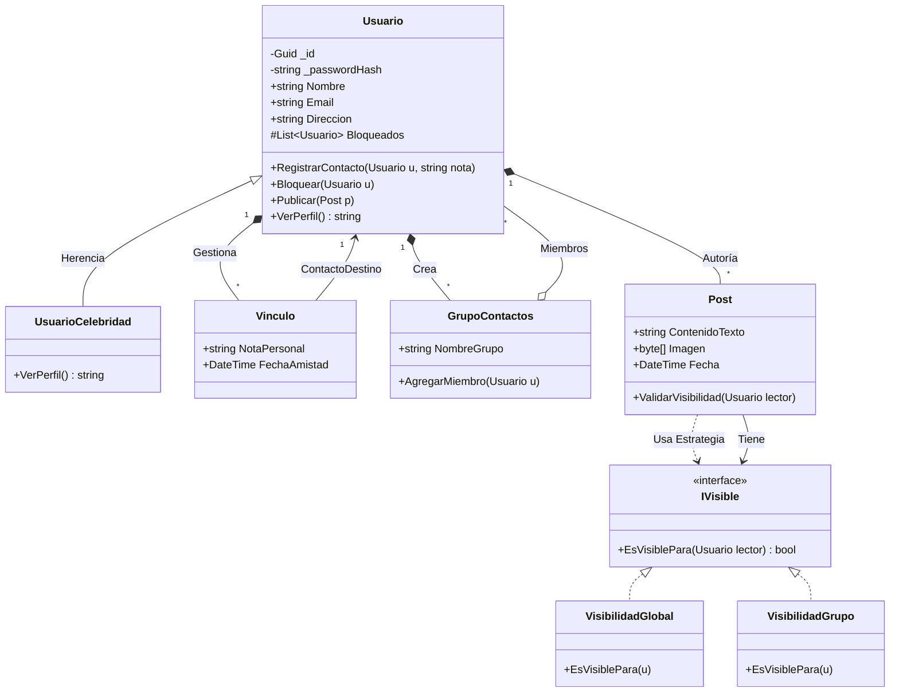

# Ejercicio 01: El Ecosistema de la Red Social "ConnectX"

## 1. Enunciado

La junta directiva de la multinacional *ConnectX* requiere un rediseño total de su núcleo de datos para soportar nuevos perfiles de usuario y políticas de privacidad europeas.

El sistema debe gestionar una base de usuarios donde la seguridad es primordial. Todo usuario debe autenticarse mediante un identificador único y un sistema de encriptación de contraseñas. Se almacena información básica: nombre completo, dirección física, foto de perfil y correo electrónico, el cual debe ser único por política de sistema.

Debido a la ley de protección de datos, surge una distinción crítica: los **Usuarios Celebridad**. Cuando un usuario tiene este rango, el sistema debe encapsular y ocultar automáticamente su email, dirección y teléfono de cualquier consulta pública o visualización de perfil estándar.

La red se basa en "vínculos de confianza". Un usuario gestiona una lista de contactos (que son, en esencia, otros usuarios). Para cada vínculo, el usuario puede redactar un comentario descriptivo personal que solo él puede ver. Estos contactos pueden organizarse en estructuras de **Grupos de Contacto** (con nombre propio). Un mismo usuario puede pertenecer a varios grupos del mismo dueño. Además, para mitigar el acoso, existe una lista de **Bloqueos** que impide interacciones.

El sistema de publicaciones permite insertar texto e imágenes. Al publicar, el usuario debe decidir la **Visibilidad** (Interfaz `IVisible`): el post puede ser global, restringido a grupos específicos o a una lista blanca de individuos seleccionados.

---

## 2. Análisis y Diseño

### Entidades Principales
*   **Usuario:** Clase base. Contiene los datos personales.
*   **UsuarioCelebridad:** Especialización de Usuario. Modifica el comportamiento de acceso a datos sensibles (Polimorfismo).
*   **Grupo:** Conjunto de usuarios creado por un usuario propietario.
*   **Post:** Contenido generado por el usuario.
*   **Vinculo:** (Clase Relación) Representa la conexión entre dos usuarios, permitiendo añadir un "comentario personal" que el enunciado solicita.

### Relaciones Clave
*   **Herencia:** `UsuarioCelebridad` hereda de `Usuario`.
*   **Relación Reflexiva:** Un Usuario tiene contactos (otros Usuarios). Al tener un dato extra ("comentario"), usamos una clase intermedia `Vinculo`.
*   **Composición/Agregación:** Un Usuario *tiene* Grupos. Un Usuario *crea* Posts.
*   **Interfaces:** `IVisible` para gestionar la lógica de quién puede ver qué.

### Principios SOLID Aplicados
*   **OCP (Open/Closed):** La visibilidad se maneja vía interfaz, permitiendo crear nuevas reglas de visibilidad (ej: "SoloFamilia") sin cambiar la clase Post.
*   **LSP (Liskov):** La Celebridad es un Usuario, pero restringe la salida de datos. Se debe manejar con cuidado para no romper clientes que esperen siempre un email válido.

---

## 3. Diagrama de Clases (Mermaid)

