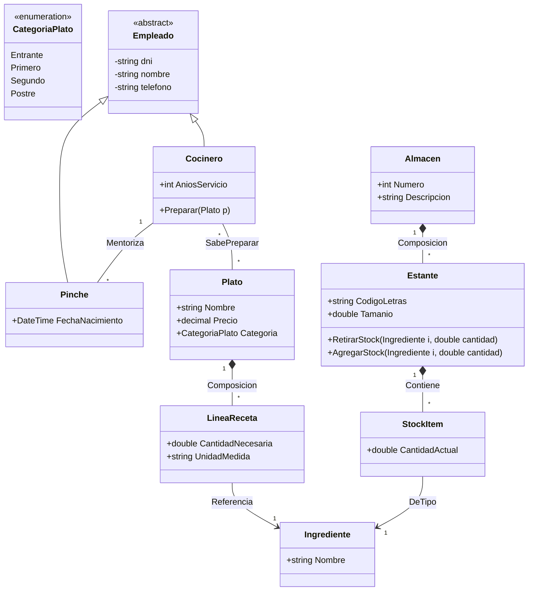
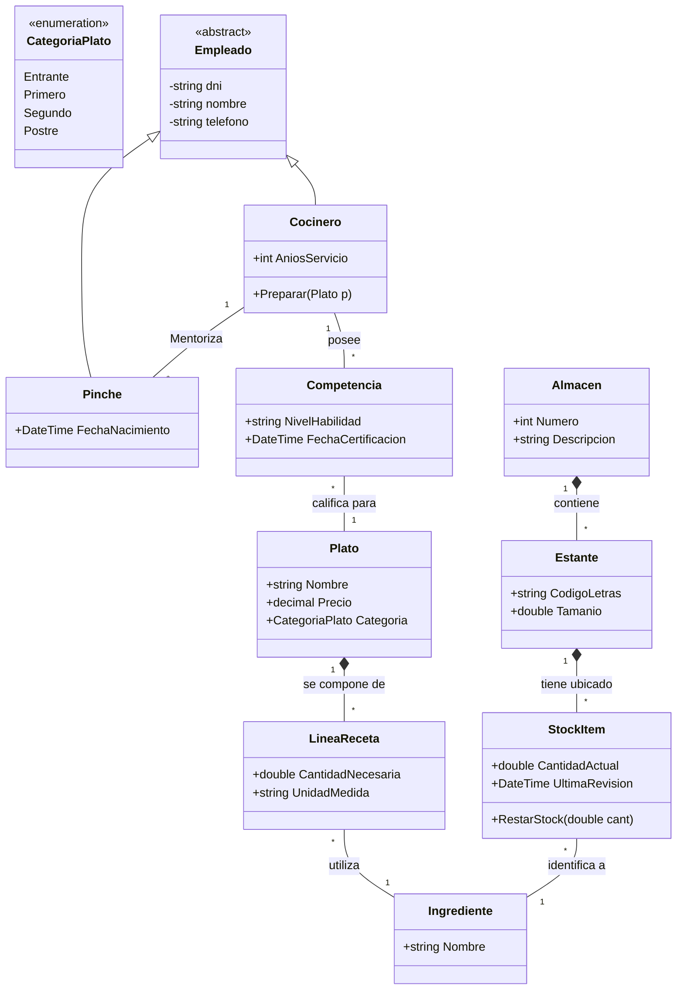

# Ejercicio 02: Sistema de Gestión Gastronómica "GourmetOS"

## 1. Enunciado

Una prestigiosa cadena de restaurantes de alta cocina necesita modelar su flujo de trabajo, desde el control de personal hasta la trazabilidad de ingredientes en almacén.

El personal de *GourmetOS* es diverso. Todos los empleados registran su DNI, SS, teléfonos (fijo y móvil) y nombre completo. Los **Cocineros** son la élite y de ellos se computan sus años de servicio. Por otro lado, los **Pinches** (de quienes se anota la fecha de nacimiento) siempre deben estar bajo la tutela y cargo directo de un Cocinero mentor; un pinche no puede operar sin un superior asignado.

La lógica de producción reside en los **Platos**. Cada plato tiene un nombre único y un precio. Deben clasificarse mediante un `Enum` de categorías: Entrante, Primero, Segundo o Postre. Un plato se compone de diversos ingredientes. Es vital la precisión: de cada ingrediente necesitamos saber la cantidad exacta para ese plato específico.

Los ingredientes se encuentran en **Almacenes** (con nombre, número y descripción). Un Almacén se **compone** de **Estantes**, identificados por dos letras y un tamaño. El sistema debe realizar un control de stock en tiempo real: si un pinche retira dos ajos de un estante, el sistema debe descontarlos inmediatamente de ese estante específico. Finalmente, no todo cocinero tiene la habilidad para cada plato; el sistema debe mapear qué cocineros son capaces de preparar cada receta.

---

## 2. Análisis y Diseño

### Entidades Principales
*   **Empleado:** Clase base abstracta.
*   **Cocinero:** Empleado cualificado. Puede tener Pinches a su cargo.
*   **Pinche:** Empleado en formación. Requiere un Mentor (Cocinero).
*   **Plato:** La unidad de producción.
*   **Ingrediente:** Materia prima.
*   **Almacen/Estante:** Estructura física de inventario.

### Relaciones Clave
*   **Jerarquía de Personal:** Herencia simple (`Empleado` -> `Cocinero`, `Pinche`).
*   **Tutoría:** Relación 1:N entre Cocinero (Mentor) y Pinche.
*   **Receta (Plato-Ingrediente):** Relación N:M con atributo "Cantidad". Usamos clase intermedia `LineaReceta`.
*   **Habilidad (Cocinero-Plato):** Relación N:M simple (un cocinero sabe hacer muchos platos).
*   **Inventario (Almacen-Estante):** Composición fuerte. El estante no existe sin almacén.
*   **Stock (Estante-Ingrediente):** Asociación con cantidad (Stock real).

### Consideraciones de Diseño
*   **Validación de Mentor:** Un Pinche no debería poder instanciarse sin un Cocinero asignado (Inyección en constructor).
*   **Gestión de Stock:** Los métodos para retirar ingredientes deben estar sincronizados o ser atómicos para evitar inconsistencias, aunque en este diseño nos centramos en la estructura de clases.

---

## 3. Diagrama de Clases (Mermaid)

## 4. Rompiendo Relaciones N:M

Para romper las relaciones **Muchos a Muchos (N:M)** en un modelo de datos o de clases, la técnica estándar es introducir una **entidad asociativa** (o clase intermedia). Esto permite transformar una relación compleja en dos relaciones de tipo **1:N** (uno a muchos), lo cual es fundamental para la implementación en bases de datos relacionales y mejora la trazabilidad de los atributos.

---

### 4.1. Relación Cocinero - Plato (La Habilidad)

**Situación original:** Un cocinero puede preparar muchos platos, y un plato puede ser preparado por muchos cocineros diferentes (N:M).

**La solución:** Creamos la entidad **`Competencia`** (o "Especialización").

* **Estructura:**
* Un **Cocinero** tiene muchas `Competencias`.
* Un **Plato** está vinculado a muchas `Competencias`.
* La `Competencia` une a un cocinero específico con un plato específico.

**Justificación:**
Al usar una clase intermedia como `Competencia`, podemos añadir información adicional que antes no tenía lugar, como la **fecha de certificación** (cuándo aprendió el cocinero a hacer ese plato) o el **nivel de maestría** (aprendiz, experto, maestro).

---

## 4.2. Relación Estante - Ingrediente (El Stock)

**Situación original:** Un estante puede contener muchos tipos de ingredientes, y un ingrediente (como el "Ajo") puede estar repartido en varios estantes (N:M).

**La solución:** Refinamos la entidad **`StockItem`** (ya sugerida en tu esquema, pero aquí la formalizamos como el puente).

* **Estructura:**
* Un **Estante** tiene varias líneas de `StockItem`.
* Un **Ingrediente** aparece en varios `StockItem` (uno por cada estante donde esté guardado).

**Justificación:**
Es la única forma de realizar el **control de stock en tiempo real** que pide el enunciado. Si el pinche retira "dos ajos", el sistema no descuenta del concepto general "Ajo", sino del `StockItem` que vincula al `Estante A1` con el ingrediente `Ajo`. Permite saber exactamente cuánta cantidad hay en cada ubicación física.

---

## 4.3. Relación Plato - Ingrediente (La Receta)

**Situación original:** Un plato requiere muchos ingredientes y un ingrediente puede usarse en muchos platos (N:M).

**La solución:** Se utiliza **`LineaReceta`** (ya presente en tu análisis, pero clave para romper la N:M).

* **Estructura:**
* Un **Plato** tiene muchas `LineasReceta`.
* Un **Ingrediente** pertenece a muchas `LineasReceta`.

**Justificación:**
La relación N:M pura no permitiría decir "cuánta" cantidad de ingrediente lleva el plato. La clase `LineaReceta` actúa como el contenedor del atributo **Cantidad** y **Unidad de Medida** (ej: 200g, 2 unidades, 1 pizca).

---

## 4.4. Diagrama de Clases Actualizado

---

### Resumen de cambios técnicos

| Relación Original     | Clase Intermedia | Nueva Estructura                          | Beneficio                               |
| --------------------- | ---------------- | ----------------------------------------- | --------------------------------------- |
| Cocinero ↔ Plato      | **Competencia**  | Cocinero (1:N) Competencia (N:1) Plato    | Permite registrar niveles de habilidad. |
| Plato ↔ Ingrediente   | **LineaReceta**  | Plato (1:N) LineaReceta (N:1) Ingrediente | Permite definir cantidades por plato.   |
| Estante ↔ Ingrediente | **StockItem**    | Estante (1:N) StockItem (N:1) Ingrediente | Permite trazabilidad física del stock.  |

