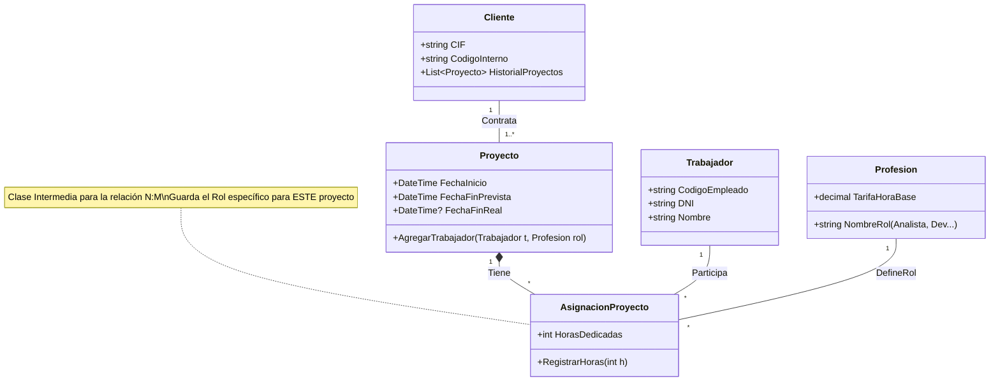

# Ejercicio 03: Consultoría de Software "AgileFactory"

## 1. Enunciado

Una factoría de software desea automatizar el control de proyectos para empresas externas, optimizando el uso de sus recursos humanos.

La empresa gestiona clientes corporativos de los que almacena CIF, dirección, teléfono y un código interno. Los **Proyectos** son el eje central: tienen una fecha de inicio, una fecha prevista de finalización y una fecha de finalización real (que a menudo difiere de la prevista).

El modelo de trabajo es dinámico. Un **Trabajador** (con código, DNI y nombre) puede participar en múltiples proyectos. Lo complejo es que su **Rol** (Analista, Jefe de Proyecto, Programador) no es fijo: en un proyecto puede ser el líder y en otro un simple programador. Se debe registrar exactamente cuántas horas ha dedicado cada trabajador a cada proyecto según su rol. A todas las empresas clientes se les ha realizado al menos un proyecto. El sistema debe permitir definir profesiones nuevas (como "Administrador de Diseño") aunque no tengan trabajadores asignados todavía.

---

## 2. Análisis y Diseño

### Entidades Principales
*   **Cliente:** Empresa que contrata.
*   **Proyecto:** Unidad de trabajo temporal.
*   **Trabajador:** Recurso humano.
*   **RolProfesional:** Catálogo de roles disponibles (tabla auxiliar o clase separada, no solo un Enum, ya que dice "definir profesiones nuevas").
*   **AsignacionProyecto:** (Clase Relación) Vincula Trabajador + Proyecto + Rol + Horas.

### Relaciones Clave
*   **Cliente - Proyecto:** 1:N. Un cliente tiene muchos proyectos.
*   **Trabajador - Proyecto:** N:M Compleja.
    *   Un trabajador está en muchos proyectos.
    *   Un proyecto tiene muchos trabajadores.
    *   **Atributos de enlace:** Rol desempeñado y Horas dedicadas.
    *   *Solución:* Clase intermedia `AsignacionProyecto`.

### Consideraciones
*   El enunciado dice "definir profesiones nuevas aunque no tengan trabajadores". Esto sugiere que el Rol es una Entidad por sí misma (`TipoProfesion`), no un simple Enum hardcodeado.
*   Fechas: Uso de `DateTime?` (nullable) para la fecha de fin real, ya que al crear el proyecto aún no ha terminado.

---

## 3. Diagrama de Clases (Mermaid)



```