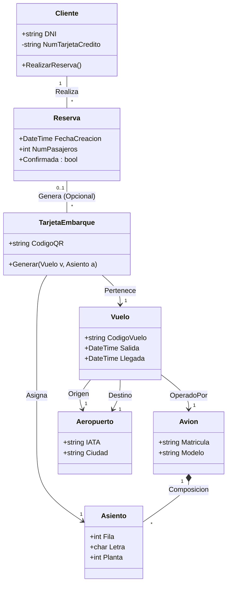

# Ejercicio 04: Central de Reservas Aéreas "SkyHigh"

## 1. Enunciado

Una aerolínea internacional busca un modelo robusto para gestionar el flujo desde la reserva inicial hasta el asiento físico en el avión.

Los clientes inician el proceso realizando una **Reserva**. En esta fase, se indican los datos personales (DNI, nombre, dirección) y una **Tarjeta de Crédito** que quedará vinculada permanentemente al perfil del cliente. Una reserva puede contemplar varias plazas, pero el asiento no se garantiza hasta el **Check-in**.

Al emitir la **Tarjeta de Embarque**, el sistema asigna un **Asiento** específico, definido por fila, columna y planta del avión. Existe una regla flexible: se pueden emitir tarjetas de embarque incluso si el cliente no tenía reserva previa (ventas de mostrador). Cada tarjeta es estrictamente individual.

El **Vuelo** vincula un código único, horarios de salida/llegada y dos **Aeropuertos** (Origen y Destino), los cuales tienen su propio código, ciudad y país. Cada vuelo es operado por un **Avión** concreto (con código y plazas totales), aunque un avión realizará muchos vuelos a lo largo de su vida útil.

---

## 2. Análisis y Diseño

### Entidades Principales
*   **Cliente:** Datos personales y método de pago.
*   **Reserva:** Intención de compra (puede tener N plazas, pero sin asiento asignado aún).
*   **TarjetaEmbarque:** El documento final (Check-in). Vincula Pasajero + Vuelo + Asiento.
*   **Vuelo:** La instancia temporal de un viaje (Ruta + Horario).
*   **Avion:** Recurso físico.
*   **Asiento:** Parte del Avión.
*   **Aeropuerto:** Ubicación.

### Relaciones Clave
*   **Reserva vs TarjetaEmbarque:**
    *   Una Reserva puede generar N Tarjetas de Embarque (ej: familia viaja junta).
    *   Una Tarjeta de Embarque *puede* venir de una Reserva (0..1), pero también crearse en mostrador (null). Relación opcional.
*   **Vuelo - Aeropuerto:** Relación doble (Origen y Destino).
*   **Avion - Asiento:** Composición estricta.
*   **Vuelo - Avion:** Asociación (Un vuelo usa un avión).

### Lógica de Negocio
*   El asiento se asigna en `TarjetaEmbarque`, no en `Reserva`.
*   El cliente guarda tarjeta de crédito (Encapsulamiento de datos sensibles).

---

## 3. Diagrama de Clases (Mermaid)

