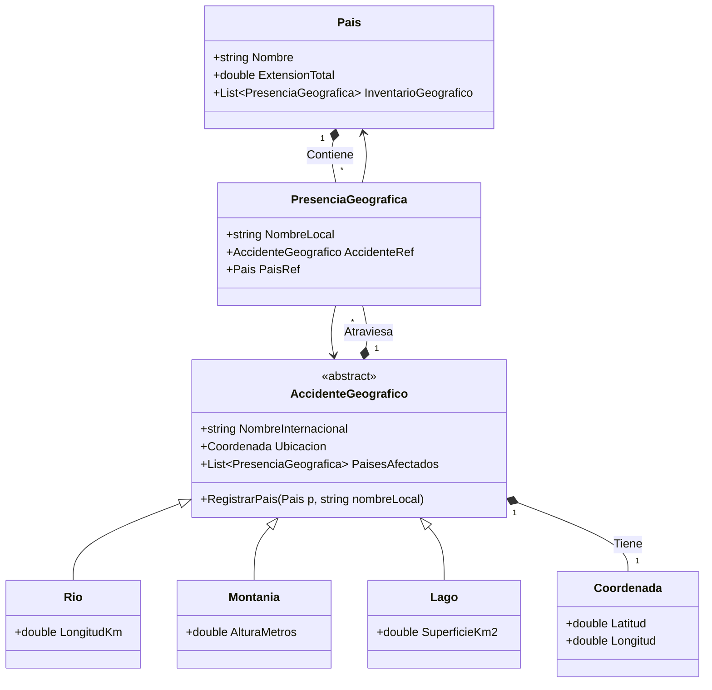

# Ejercicio 05: Atlas de Accidentes Geográficos

## 1. Enunciado

Una organización científica internacional requiere un sistema para catalogar la orografía mundial y su relación con las fronteras políticas.

El sistema debe clasificar tres tipos de accidentes: **Ríos, Lagos y Montañas**. Todos heredan una base común: nombre y posición geográfica (coordenadas horizontales y verticales según el eje terrestre). Sin embargo, cada uno posee métricas especializadas que deben implementarse mediante una interfaz de medición o herencia específica: los ríos registran su longitud, las montañas su altura máxima y los lagos su extensión superficial.

A nivel geopolítico, se almacenan los **Países** con su nombre, extensión y población. Un accidente geográfico no entiende de fronteras: un río puede atravesar tres países distintos, y un país puede albergar múltiples montañas. El sistema debe permitir esta relación "muchos a muchos", registrando además **con qué nombre local se conoce al accidente en ese país** (ej: Everest en internacional, Sagarmatha en Nepal).

---

## 2. Análisis y Diseño

### Entidades Principales
*   **AccidenteGeografico:** Clase base abstracta. Contiene Nombre Internacional y Coordenadas.
*   **Rio / Lago / Montaña:** Especializaciones.
*   **Pais:** Entidad política.
*   **PresenciaGeografica:** (Clase Relación) Rompe la N:M. Vincula País + Accidente y añade el atributo `NombreLocal`.

### Relaciones Clave
*   **Herencia:** `AccidenteGeografico` <|-- `Rio`, `Lago`, `Montaña`.
*   **Relación N:M (Refactorizada):** 
    *   Un Accidente tiene presencia en muchos países.
    *   Un País tiene presencia de muchos accidentes.
    *   **Clase Intermedia:** `PresenciaGeografica`.

### Polimorfismo
*   Cada tipo tiene una métrica distinta implementada como propiedad específica.

---

## 3. Diagrama de Clases (Mermaid)

